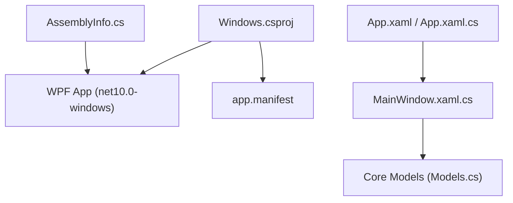
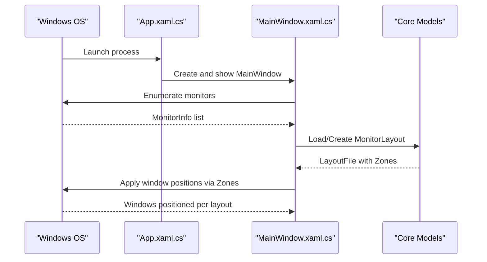
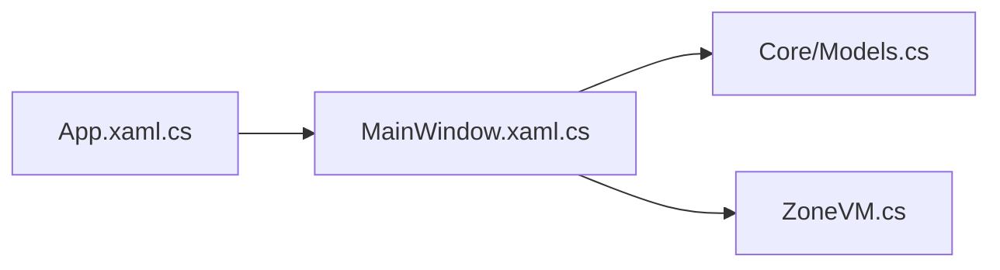

# Configuration & Deployment

<cite>
**Referenced Files in This Document**
- [Windows.csproj](file://Vindows/Windows.csproj)
- [app.manifest](file://Vindows/app.manifest)
- [AssemblyInfo.cs](file://Vindows/AssemblyInfo.cs)
- [App.xaml](file://Vindows/App.xaml)
- [App.xaml.cs](file://Vindows/App.xaml.cs)
- [MainWindow.xaml.cs](file://Vindows/MainWindow.xaml.cs)
- [ZoneVM.cs](file://Vindows/ZoneVM.cs)
- [Models.cs](file://Vindows/Core/Models.cs)
</cite>

## Table of Contents
1. [Introduction](#introduction)
2. [Project Structure](#project-structure)
3. [Core Components](#core-components)
4. [Architecture Overview](#architecture-overview)
5. [Detailed Component Analysis](#detailed-component-analysis)
6. [Dependency Analysis](#dependency-analysis)
7. [Performance Considerations](#performance-considerations)
8. [Troubleshooting Guide](#troubleshooting-guide)
9. [Conclusion](#conclusion)
10. [Appendices](#appendices)

## Introduction
This document provides configuration and deployment guidance for the Vindows application, a .NET 10 WPF desktop tool that manages window layouts across monitors. It focuses on build settings, Windows application manifest behavior, release packaging, CI/CD setup, distribution, environment requirements, dependency management, code signing, installer creation, and update mechanisms.

## Project Structure
The project is a single WPF application targeting .NET 10 with modern SDK-style project configuration. The key elements are:
- Project file defines output type, target framework, nullable reference types, implicit usings, WPF enablement, and the Windows application manifest path.
- Application manifest configures DPI awareness for high-DPI scenarios.
- Assembly metadata sets WPF theme resource locations.
- Application entry point initializes the WPF application and starts the main window.

**Diagram sources**
- [Windows.csproj:1-13](file://Vindows/Windows.csproj#L1-L13)
- [app.manifest:1-10](file://Vindows/app.manifest#L1-L10)
- [AssemblyInfo.cs:1-11](file://Vindows/AssemblyInfo.cs#L1-L11)
- [App.xaml:1-10](file://Vindows/App.xaml#L1-L10)
- [App.xaml.cs:1-14](file://Vindows/App.xaml.cs#L1-L14)
- [MainWindow.xaml.cs:1-205](file://Vindows/MainWindow.xaml.cs#L1-L205)
- [Models.cs:1-61](file://Vindows/Core/Models.cs#L1-L61)

**Section sources**
- [Windows.csproj:1-13](file://Vindows/Windows.csproj#L1-L13)
- [app.manifest:1-10](file://Vindows/app.manifest#L1-L10)
- [AssemblyInfo.cs:1-11](file://Vindows/AssemblyInfo.cs#L1-L11)
- [App.xaml:1-10](file://Vindows/App.xaml#L1-L10)
- [App.xaml.cs:1-14](file://Vindows/App.xaml.cs#L1-L14)
- [MainWindow.xaml.cs:1-205](file://Vindows/MainWindow.xaml.cs#L1-L205)
- [Models.cs:1-61](file://Vindows/Core/Models.cs#L1-L61)

## Core Components
- Build configuration:
  - Output type set to a Windows executable.
  - Target framework set to .NET 10 for Windows.
  - Nullable reference types enabled for safer code.
  - Implicit usings enabled to reduce boilerplate imports.
  - WPF enabled for UI support.
  - Application manifest referenced for DPI awareness and compatibility.
- Application manifest:
  - Configures PerMonitorV2 DPI awareness so coordinates and window positioning work correctly on multi-monitor setups with varying DPIs.
- Assembly metadata:
  - Declares WPF theme resource locations for generic and theme-specific resources.
- Application entry:
  - WPF application class with startup URI pointing to the main window.

**Section sources**
- [Windows.csproj:1-13](file://Vindows/Windows.csproj#L1-L13)
- [app.manifest:1-10](file://Vindows/app.manifest#L1-L10)
- [AssemblyInfo.cs:1-11](file://Vindows/AssemblyInfo.cs#L1-L11)
- [App.xaml:1-10](file://Vindows/App.xaml#L1-L10)
- [App.xaml.cs:1-14](file://Vindows/App.xaml.cs#L1-L14)

## Architecture Overview
At runtime, the WPF application initializes the main window, enumerates monitors, loads or creates layouts, and applies window placements based on configured zones. The core data models define monitor information, zones, and layout structures used throughout the app.

**Diagram sources**
- [App.xaml.cs:1-14](file://Vindows/App.xaml.cs#L1-L14)
- [MainWindow.xaml.cs:1-205](file://Vindows/MainWindow.xaml.cs#L1-L205)
- [Models.cs:1-61](file://Vindows/Core/Models.cs#L1-L61)

## Detailed Component Analysis

### Build Settings and WPF Enablement
- Target framework: net10.0-windows ensures compatibility with Windows-only APIs and WPF features available in .NET 10.
- Nullable reference types: Improves null-safety by enabling compile-time checks; aligns with modern C# practices.
- Implicit usings: Reduces explicit using statements for common namespaces, simplifying source files.
- WPF enablement: UseWPF flag includes WPF SDK references and enables XAML compilation and runtime support.
- Application manifest: Links app.manifest to configure DPI awareness and other Windows-specific behaviors.

Recommendations:
- Keep TargetFramework pinned to net10.0-windows to avoid breaking changes when upgrading.
- Maintain Nullable enabled to catch potential null-reference issues early.
- Ensure app.manifest remains updated if DPI or compatibility requirements change.

**Section sources**
- [Windows.csproj:1-13](file://Vindows/Windows.csproj#L1-L13)
- [app.manifest:1-10](file://Vindows/app.manifest#L1-L10)

### Windows Application Manifest Settings
- DPI Awareness: PerMonitorV2 ensures accurate pixel-based calculations and correct window positioning across monitors with different DPIs.
- Compatibility modes: If future versions require specific Windows version compatibility, add appropriate compatibility settings in the manifest.
- Elevation requirements: For this project, no elevation is declared in the manifest. If elevation becomes necessary, use a separate manifest or configure the installer to request admin rights during installation only.

Guidance:
- Avoid requesting elevation at runtime unless absolutely required; prefer installer-level elevation where possible.
- Validate DPI behavior on mixed-DPI environments after any UI changes.

**Section sources**
- [app.manifest:1-10](file://Vindows/app.manifest#L1-L10)

### Application Entry and Startup Flow
- The WPF application class sets the startup URI to the main window, ensuring the UI initializes automatically.
- The main window orchestrates monitor enumeration, layout loading/saving, and applying window placements.

Operational notes:
- Ensure the startup URI remains valid and points to the correct XAML file.
- Handle exceptions during initialization to prevent silent failures on startup.

**Section sources**
- [App.xaml:1-10](file://Vindows/App.xaml#L1-L10)
- [App.xaml.cs:1-14](file://Vindows/App.xaml.cs#L1-L14)
- [MainWindow.xaml.cs:1-205](file://Vindows/MainWindow.xaml.cs#L1-L205)

### Data Models and Layout Logic
- MonitorInfo captures device name, display name, bounds, and work area for each physical monitor.
- Zone represents a percentage-based region within a monitor’s work area, optionally bound to a process name.
- MonitorLayout groups columns, rows, gap, and zones for a given monitor.
- WindowInfo describes open windows with handle, title, and process name.
- LayoutFile serializes monitor layouts for persistence.

Design considerations:
- Using required properties enforces initialization constraints.
- Percentage-based zones simplify scaling across different resolutions and DPIs.
- ProcessName binding allows automatic placement of matching applications into designated zones.

**Section sources**
- [Models.cs:1-61](file://Vindows/Core/Models.cs#L1-L61)

### View Model for Zones
- ZoneVM exposes zone details and selected process name with property change notifications for UI binding.
- Provides formatted size text for display purposes.

Usage:
- Bind UI controls to SelectedProcess to assign applications to zones.
- Update UI promptly via PropertyChanged events.

**Section sources**
- [ZoneVM.cs:1-31](file://Vindows/ZoneVM.cs#L1-L31)

## Dependency Analysis
Internal dependencies:
- MainWindow depends on Core models for monitor and layout data.
- ZoneVM wraps Core Zone to expose UI-friendly properties.
- App entry point wires up the main window lifecycle.

External dependencies:
- .NET 10 runtime for Windows.
- WPF framework for UI rendering and XAML support.
- Windows APIs for monitor enumeration and window management (via Core).

**Diagram sources**
- [App.xaml.cs:1-14](file://Vindows/App.xaml.cs#L1-L14)
- [MainWindow.xaml.cs:1-205](file://Vindows/MainWindow.xaml.cs#L1-L205)
- [Models.cs:1-61](file://Vindows/Core/Models.cs#L1-L61)
- [ZoneVM.cs:1-31](file://Vindows/ZoneVM.cs#L1-L31)

**Section sources**
- [App.xaml.cs:1-14](file://Vindows/App.xaml.cs#L1-L14)
- [MainWindow.xaml.cs:1-205](file://Vindows/MainWindow.xaml.cs#L1-L205)
- [Models.cs:1-61](file://Vindows/Core/Models.cs#L1-L61)
- [ZoneVM.cs:1-31](file://Vindows/ZoneVM.cs#L1-L31)

## Performance Considerations
- DPI-aware layout calculations: PerMonitorV2 ensures precise pixel math; validate performance on high-DPI multi-monitor setups.
- Minimize repeated UI redraws: Cache computed zone rectangles and avoid unnecessary canvas updates.
- Efficient window enumeration: Batch operations when refreshing open windows to reduce overhead.
- Persist layouts efficiently: Serialize only necessary fields and avoid excessive I/O during frequent saves.

[No sources needed since this section provides general guidance]

## Troubleshooting Guide
Common build issues:
- Missing .NET 10 SDK: Install the .NET 10 SDK for Windows to resolve target framework errors.
- WPF not recognized: Ensure UseWPF is enabled and the Windows SDK is installed; verify Visual Studio workload includes “Desktop development with .NET”.
- Nullable warnings: Review nullable annotations and initialize required properties to maintain strict null safety.
- DPI-related UI glitches: Confirm app.manifest contains PerMonitorV2; test on multiple monitors with different DPIs.

Runtime issues:
- Incorrect window placement: Verify zone percentages and gaps; ensure work area excludes taskbar and docked panels.
- Process name mismatches: Check process names assigned to zones; case-insensitive matching may be needed depending on OS behavior.

Environment requirements:
- Operating system: Windows (required by WPF and Win32 APIs).
- Runtime: .NET 10 runtime for Windows.
- Tools: Visual Studio or compatible IDE with .NET 10 SDK and WPF workload.

**Section sources**
- [Windows.csproj:1-13](file://Vindows/Windows.csproj#L1-L13)
- [app.manifest:1-10](file://Vindows/app.manifest#L1-L10)

## Conclusion
Vindows is a .NET 10 WPF application configured for modern development practices, including nullable reference types, implicit usings, and DPI-aware behavior. The project structure is straightforward, with clear separation between UI, view models, and core data models. For production deployments, focus on robust packaging, code signing, installer creation, and update mechanisms tailored to Windows desktop applications.

[No sources needed since this section summarizes without analyzing specific files]

## Appendices

### Building Release Packages
Steps:
- Restore packages and build in Release mode for net10.0-windows.
- Publish self-contained or framework-dependent executables as needed.
- Include all required assets and configuration files in the output directory.

Best practices:
- Pin the .NET SDK version in your build environment to ensure reproducibility.
- Validate outputs on clean machines to confirm no missing dependencies.

[No sources needed since this section provides general guidance]

### Setting Up CI/CD Pipelines
Recommended pipeline stages:
- Setup: Install .NET 10 SDK and Windows SDK.
- Build: Restore, build, and run unit tests (if any).
- Package: Publish artifacts and create installers.
- Sign: Code-sign binaries and installers.
- Publish: Upload artifacts to a repository or artifact store.

Notes:
- Use matrix builds to test on multiple Windows versions if needed.
- Cache NuGet packages to speed up builds.

[No sources needed since this section provides general guidance]

### Distributing the Application
Options:
- Self-contained publish folder for direct deployment.
- Installer packages (MSI or EXE) for user-friendly installation.
- ClickOnce for simplified updates (note limitations with elevated privileges).

Distribution channels:
- Internal corporate repositories.
- Public package managers or software distribution platforms.

[No sources needed since this section provides general guidance]

### Environment Requirements and Dependency Management
Requirements:
- Windows operating system.
- .NET 10 runtime for Windows.
- WPF-enabled development environment.

Dependency management:
- No external NuGet packages are evident in the project file; rely on framework-provided APIs.
- Keep the .NET SDK updated to receive security fixes and improvements.

[No sources needed since this section provides general guidance]

### Code Signing
Guidance:
- Sign the executable and any installer packages using a trusted code signing certificate.
- Automate signing in CI/CD pipelines using secure credential storage.
- Validate signatures post-build to ensure integrity.

[No sources needed since this section provides general guidance]

### Installer Creation
Approaches:
- WiX Toolset for MSI installers with custom actions if elevation is required during installation.
- Inno Setup or similar tools for simpler EXE installers.
- Ensure installer handles prerequisites (e.g., .NET runtime) and performs proper cleanup on uninstall.

[No sources needed since this section provides general guidance]

### Update Mechanisms
Strategies:
- Self-update logic within the application to download and apply updates.
- External updater service to manage downloads and restarts.
- ClickOnce for automatic updates (with caveats around elevation and offline scenarios).

Security considerations:
- Verify update signatures before applying.
- Use HTTPS for all update downloads.

[No sources needed since this section provides general guidance]