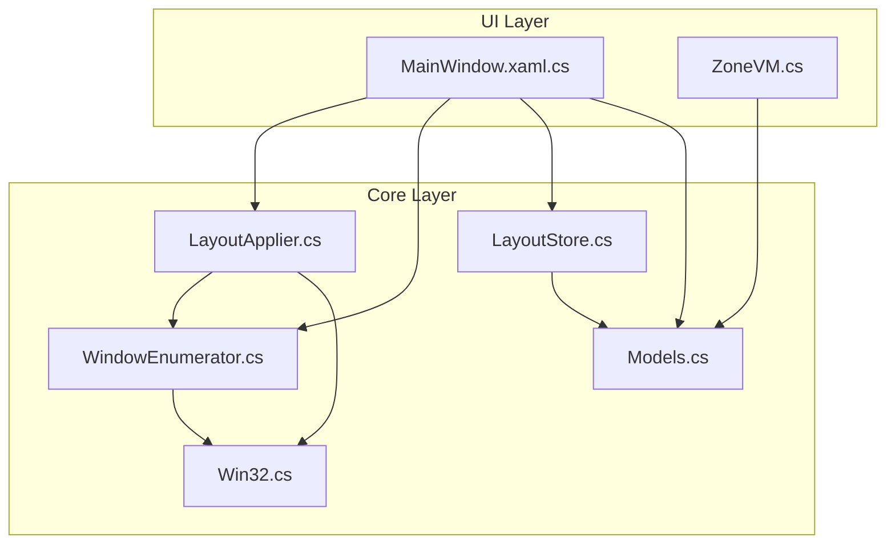
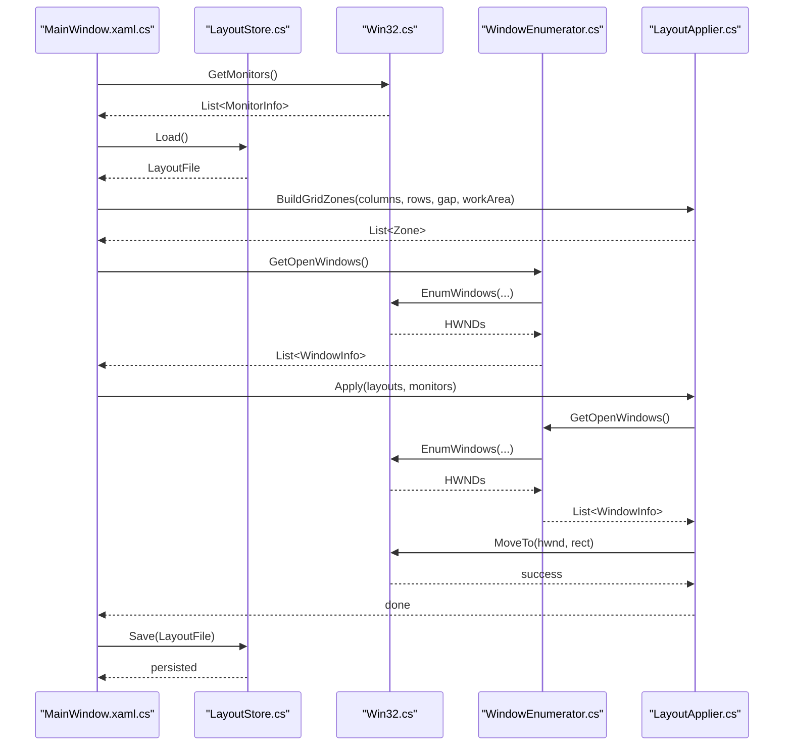
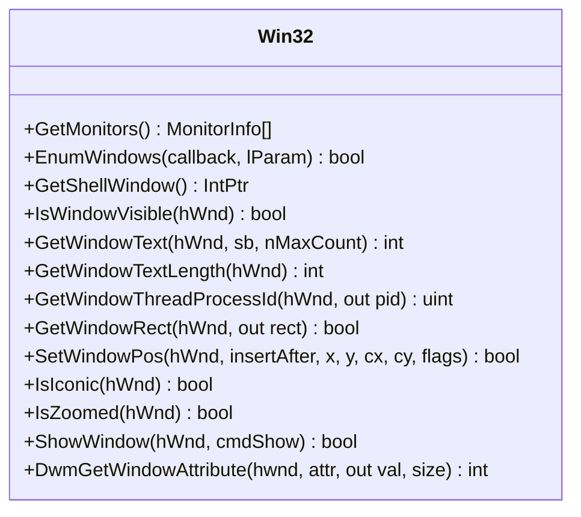
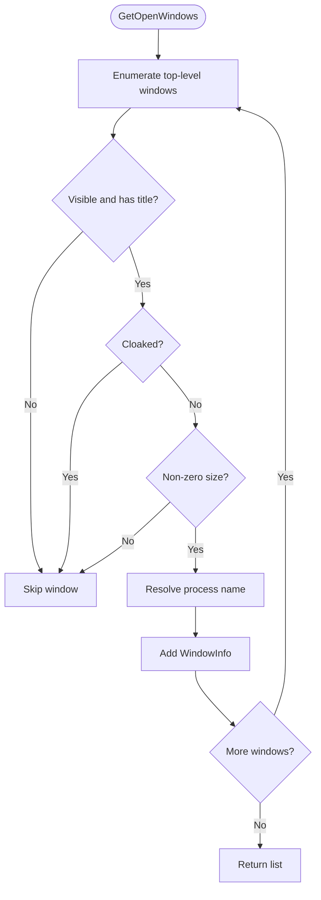
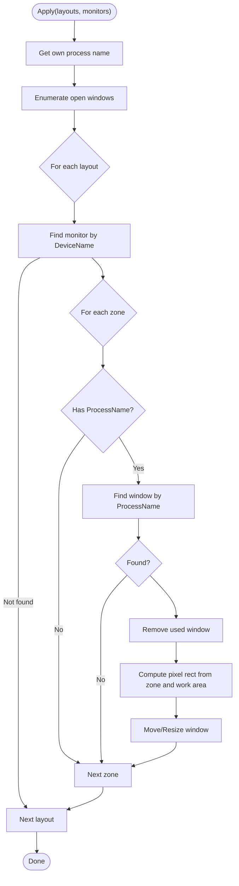
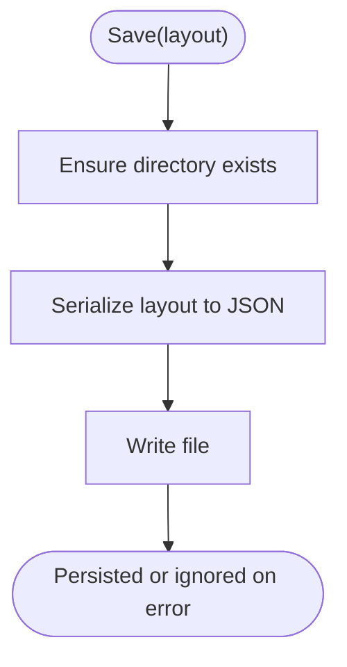
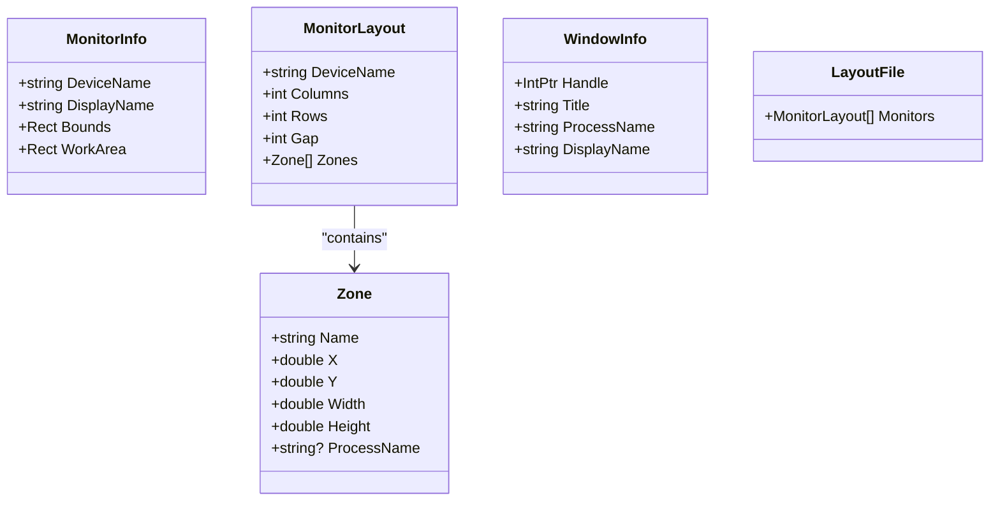
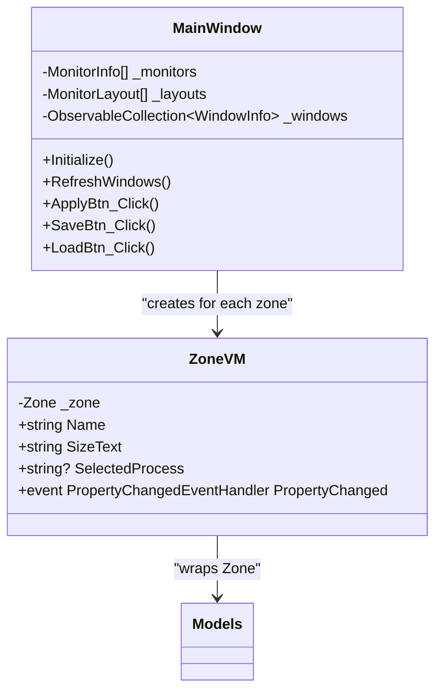
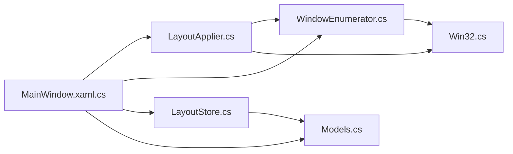

# Core Architecture

<cite>
**Referenced Files in This Document**
- [LayoutApplier.cs](file://Vindows/Core/LayoutApplier.cs)
- [WindowEnumerator.cs](file://Vindows/Core/WindowEnumerator.cs)
- [Win32.cs](file://Vindows/Core/Win32.cs)
- [LayoutStore.cs](file://Vindows/Core/LayoutStore.cs)
- [Models.cs](file://Vindows/Core/Models.cs)
- [MainWindow.xaml.cs](file://Vindows/MainWindow.xaml.cs)
- [ZoneVM.cs](file://Vindows/ZoneVM.cs)
</cite>

## Table of Contents
1. Introduction
2. Project Structure
3. Core Components
4. Architecture Overview
5. Detailed Component Analysis
6. Dependency Analysis
7. Performance Considerations
8. Troubleshooting Guide
9. Conclusion

## Introduction
This document describes the layered architecture and component interactions of the Vindows core system. It explains how the MVVM pattern is implemented with clear separation between UI, business logic, and data layers, and documents the main components: LayoutApplier for grid calculations and window placement, WindowEnumerator for process discovery, Win32 wrapper for system integration, and LayoutStore for persistence. It also details the end-to-end data flow from monitor detection through window enumeration to layout application, including component relationships, dependency injection patterns, and extension points.

## Project Structure
The project is organized into a Core layer that encapsulates system integration and domain logic, and an application layer that implements the UI and MVVM view models.

- Core layer (Vindows/Core):
  - Win32.cs: P/Invoke wrappers for Windows APIs to enumerate monitors and windows and to move/resize windows.
  - Models.cs: Domain models representing monitors, zones, layouts, and open windows.
  - WindowEnumerator.cs: Discovers visible top-level windows suitable for tiling.
  - LayoutApplier.cs: Computes zone rectangles and applies window placements based on layouts.
  - LayoutStore.cs: Persists layouts to JSON under %APPDATA%\Vindows\layout.json.
- Application layer (Vindows):
  - MainWindow.xaml.cs: WPF window implementing MVVM view and orchestrating core services.
  - ZoneVM.cs: View model binding a Zone to the UI with property change notifications.

**Diagram sources**
- [MainWindow.xaml.cs:1-205](file://Vindows/MainWindow.xaml.cs#L1-L205)
- [ZoneVM.cs:1-31](file://Vindows/ZoneVM.cs#L1-L31)
- [LayoutApplier.cs:1-92](file://Vindows/Core/LayoutApplier.cs#L1-L92)
- [WindowEnumerator.cs:1-57](file://Vindows/Core/WindowEnumerator.cs#L1-L57)
- [Win32.cs:1-123](file://Vindows/Core/Win32.cs#L1-L123)
- [LayoutStore.cs:1-41](file://Vindows/Core/LayoutStore.cs#L1-L41)
- [Models.cs:1-61](file://Vindows/Core/Models.cs#L1-L61)

**Section sources**
- [MainWindow.xaml.cs:1-205](file://Vindows/MainWindow.xaml.cs#L1-L205)
- [LayoutApplier.cs:1-92](file://Vindows/Core/LayoutApplier.cs#L1-L92)
- [WindowEnumerator.cs:1-57](file://Vindows/Core/WindowEnumerator.cs#L1-L57)
- [Win32.cs:1-123](file://Vindows/Core/Win32.cs#L1-L123)
- [LayoutStore.cs:1-41](file://Vindows/Core/LayoutStore.cs#L1-L41)
- [Models.cs:1-61](file://Vindows/Core/Models.cs#L1-L61)
- [ZoneVM.cs:1-31](file://Vindows/ZoneVM.cs#L1-L31)

## Core Components
- Win32: Provides low-level access to Windows APIs for monitor enumeration and window manipulation. It exposes typed structures and constants used by higher layers.
- Models: Defines immutable or value-like types for MonitorInfo, Zone, MonitorLayout, WindowInfo, and LayoutFile. These are the primary data contracts across layers.
- WindowEnumerator: Enumerates visible top-level windows, filters out hidden/system/UWP-cloaked windows, and returns WindowInfo instances.
- LayoutApplier: Builds grid-based zones, converts percentage-based zones to pixel coordinates, and moves/resizes windows according to assigned processes per zone.
- LayoutStore: Loads and saves layouts as JSON, handling missing files and permission errors gracefully.
- MainWindow (MVVM View): Orchestrates initialization, monitor/layout management, window refresh, preview rendering, and applying/saving layouts.
- ZoneVM (MVVM ViewModel): Binds a Zone to the UI and notifies changes when the selected process for a zone is updated.

**Section sources**
- [Win32.cs:1-123](file://Vindows/Core/Win32.cs#L1-L123)
- [Models.cs:1-61](file://Vindows/Core/Models.cs#L1-L61)
- [WindowEnumerator.cs:1-57](file://Vindows/Core/WindowEnumerator.cs#L1-L57)
- [LayoutApplier.cs:1-92](file://Vindows/Core/LayoutApplier.cs#L1-L92)
- [LayoutStore.cs:1-41](file://Vindows/Core/LayoutStore.cs#L1-L41)
- [MainWindow.xaml.cs:1-205](file://Vindows/MainWindow.xaml.cs#L1-L205)
- [ZoneVM.cs:1-31](file://Vindows/ZoneVM.cs#L1-L31)

## Architecture Overview
The system follows a layered architecture:
- UI Layer (WPF): MainWindow handles user interactions and binds to ZoneVM instances. It orchestrates core operations.
- Business Logic Layer (Core): LayoutApplier computes layouts and applies them; WindowEnumerator discovers windows; LayoutStore persists configurations.
- System Integration Layer (Core): Win32 wraps OS APIs for enumerating monitors/windows and manipulating window positions.

Data flows from monitor detection to window placement:
1. Detect monitors via Win32.GetMonitors.
2. Load or create layouts per monitor using LayoutStore and LayoutApplier.BuildGridZones.
3. Refresh available windows via WindowEnumerator.GetOpenWindows.
4. User assigns processes to zones; UI updates via ZoneVM.
5. Apply layouts via LayoutApplier.Apply, which uses WindowEnumerator and Win32 to move windows.
6. Persist final state via LayoutStore.Save.

**Diagram sources**
- [MainWindow.xaml.cs:27-38](file://Vindows/MainWindow.xaml.cs#L27-L38)
- [MainWindow.xaml.cs:177-183](file://Vindows/MainWindow.xaml.cs#L177-L183)
- [LayoutApplier.cs:10-35](file://Vindows/Core/LayoutApplier.cs#L10-L35)
- [WindowEnumerator.cs:10-21](file://Vindows/Core/WindowEnumerator.cs#L10-L21)
- [Win32.cs:40-67](file://Vindows/Core/Win32.cs#L40-L67)
- [Win32.cs:73-122](file://Vindows/Core/Win32.cs#L73-L122)
- [LayoutStore.cs:15-39](file://Vindows/Core/LayoutStore.cs#L15-L39)

## Detailed Component Analysis

### Win32 Wrapper
- Responsibilities:
  - Enumerate monitors and extract bounds/work areas.
  - Enumerate top-level windows and query visibility, titles, process IDs, and geometry.
  - Provide constants and helpers for window manipulation (restore, set position).
- Key behaviors:
  - Uses DWM attribute checks to filter cloaked UWP windows.
  - Exposes RECT and MONITORINFOEX structures for interop.
- Extension points:
  - Additional attributes or flags can be added to support new window features.

**Diagram sources**
- [Win32.cs:1-123](file://Vindows/Core/Win32.cs#L1-L123)

**Section sources**
- [Win32.cs:1-123](file://Vindows/Core/Win32.cs#L1-L123)

### WindowEnumerator
- Responsibilities:
  - Discover visible, non-shell windows with titles, excluding cloaked UWP windows.
  - Map HWNDs to WindowInfo with handle, title, and process name.
- Processing logic:
  - Enumerates all top-level windows, skips shell window, validates visibility and size, retrieves process name safely.
- Error handling:
  - Gracefully ignores inaccessible processes and invalid windows.

**Diagram sources**
- [WindowEnumerator.cs:10-55](file://Vindows/Core/WindowEnumerator.cs#L10-L55)
- [Win32.cs:73-122](file://Vindows/Core/Win32.cs#L73-L122)

**Section sources**
- [WindowEnumerator.cs:1-57](file://Vindows/Core/WindowEnumerator.cs#L1-L57)

### LayoutApplier
- Responsibilities:
  - Build uniform grid zones based on columns, rows, and gap relative to monitor work area.
  - Convert percentage-based zones to pixel coordinates.
  - Apply layouts by matching zones to open windows by process name and moving them accordingly.
- Data flow:
  - For each monitor layout, find the corresponding monitor, iterate zones, match open windows by process name, compute pixel rectangle, and move the window.
- Edge cases:
  - Skips zones without assigned process names.
  - Ensures windows are restored before resizing if minimized or maximized.

**Diagram sources**
- [LayoutApplier.cs:10-58](file://Vindows/Core/LayoutApplier.cs#L10-L58)
- [WindowEnumerator.cs:10-21](file://Vindows/Core/WindowEnumerator.cs#L10-L21)
- [Win32.cs:97-122](file://Vindows/Core/Win32.cs#L97-L122)

**Section sources**
- [LayoutApplier.cs:1-92](file://Vindows/Core/LayoutApplier.cs#L1-L92)

### LayoutStore
- Responsibilities:
  - Load and save layouts to JSON at a well-known path under %APPDATA%.
  - Handle missing files and write permission errors gracefully.
- Design decisions:
  - Indented JSON for readability.
  - Silent failure on save to keep UI responsive even if permissions are insufficient.

**Diagram sources**
- [LayoutStore.cs:28-39](file://Vindows/Core/LayoutStore.cs#L28-L39)

**Section sources**
- [LayoutStore.cs:1-41](file://Vindows/Core/LayoutStore.cs#L1-L41)

### Models
- Purpose:
  - Define domain entities for monitors, zones, layouts, and windows.
  - Provide consistent contracts between UI and core layers.
- Key types:
  - MonitorInfo: Physical monitor metadata and work area.
  - Zone: Percentage-based region with optional process assignment.
  - MonitorLayout: Grid configuration and zones per monitor.
  - WindowInfo: Open window identity and handle.
  - LayoutFile: Root container for monitor layouts.

**Diagram sources**
- [Models.cs:5-60](file://Vindows/Core/Models.cs#L5-L60)

**Section sources**
- [Models.cs:1-61](file://Vindows/Core/Models.cs#L1-L61)

### MVVM Implementation
- View: MainWindow.xaml.cs manages UI state, interacts with core services, and renders previews.
- ViewModel: ZoneVM wraps a Zone and exposes SelectedProcess with INotifyPropertyChanged for two-way binding.
- Model: Core Models define data structures shared across layers.
- Separation:
  - UI does not call Win32 directly; it delegates to core services.
  - Core services remain UI-agnostic and operate on Models.

**Diagram sources**
- [MainWindow.xaml.cs:10-205](file://Vindows/MainWindow.xaml.cs#L10-L205)
- [ZoneVM.cs:6-31](file://Vindows/ZoneVM.cs#L6-L31)
- [Models.cs:18-54](file://Vindows/Core/Models.cs#L18-L54)

**Section sources**
- [MainWindow.xaml.cs:1-205](file://Vindows/MainWindow.xaml.cs#L1-L205)
- [ZoneVM.cs:1-31](file://Vindows/ZoneVM.cs#L1-L31)

## Dependency Analysis
- Coupling:
  - MainWindow depends on Core services (Win32, WindowEnumerator, LayoutApplier, LayoutStore) but not on Win32 internals beyond public methods.
  - LayoutApplier depends on WindowEnumerator and Win32 for window discovery and manipulation.
  - WindowEnumerator depends on Win32 for OS-level enumeration and filtering.
  - LayoutStore depends only on .NET IO and JSON serialization.
- Cohesion:
  - Each component has a single responsibility: Win32 (interop), WindowEnumerator (discovery), LayoutApplier (placement logic), LayoutStore (persistence), Models (data contracts), UI (interaction).
- External dependencies:
  - Windows API via P/Invoke for monitor/window operations.
  - .NET JSON serializer for persistence.

**Diagram sources**
- [MainWindow.xaml.cs:1-205](file://Vindows/MainWindow.xaml.cs#L1-L205)
- [LayoutApplier.cs:1-92](file://Vindows/Core/LayoutApplier.cs#L1-L92)
- [WindowEnumerator.cs:1-57](file://Vindows/Core/WindowEnumerator.cs#L1-L57)
- [Win32.cs:1-123](file://Vindows/Core/Win32.cs#L1-L123)
- [LayoutStore.cs:1-41](file://Vindows/Core/LayoutStore.cs#L1-L41)
- [Models.cs:1-61](file://Vindows/Core/Models.cs#L1-L61)

**Section sources**
- [MainWindow.xaml.cs:1-205](file://Vindows/MainWindow.xaml.cs#L1-L205)
- [LayoutApplier.cs:1-92](file://Vindows/Core/LayoutApplier.cs#L1-L92)
- [WindowEnumerator.cs:1-57](file://Vindows/Core/WindowEnumerator.cs#L1-L57)
- [Win32.cs:1-123](file://Vindows/Core/Win32.cs#L1-L123)
- [LayoutStore.cs:1-41](file://Vindows/Core/LayoutStore.cs#L1-L41)
- [Models.cs:1-61](file://Vindows/Core/Models.cs#L1-L61)

## Performance Considerations
- Window enumeration cost:
  - Enumerating windows occurs on UI actions; ensure it is not invoked excessively. Batch operations where possible.
- Layout application complexity:
  - Apply iterates over layouts and zones, performing window lookups by process name. For large numbers of windows/zones, consider caching or indexing by process name to reduce repeated scans.
- UI responsiveness:
  - Avoid blocking the UI thread during heavy operations. The current design performs minimal work on the UI thread and delegates to core services.
- Persistence:
  - JSON serialization is lightweight for typical layout sizes. If layouts grow significantly, consider incremental saving or compression.

[No sources needed since this section provides general guidance]

## Troubleshooting Guide
- No windows applied:
  - Verify that zones have valid ProcessName assignments and that those processes are running. Check that WindowEnumerator includes the target windows (visible, titled, non-cloaked).
- Windows not moving:
  - Ensure the target windows are not system or protected windows. Confirm Win32 calls succeed and that windows are restored before resizing.
- Layout not persisting:
  - Check file permissions for %APPDATA%\Vindows. LayoutStore silently ignores write errors; verify the directory exists and is writable.
- Preview mismatch:
  - Ensure the preview canvas has a valid size before drawing. Redraw on size changes.

**Section sources**
- [WindowEnumerator.cs:23-55](file://Vindows/Core/WindowEnumerator.cs#L23-L55)
- [LayoutApplier.cs:45-58](file://Vindows/Core/LayoutApplier.cs#L45-L58)
- [LayoutStore.cs:15-39](file://Vindows/Core/LayoutStore.cs#L15-L39)
- [MainWindow.xaml.cs:91-138](file://Vindows/MainWindow.xaml.cs#L91-L138)

## Conclusion
The Vindows core system employs a clean layered architecture with clear separation of concerns: UI (MainWindow and ZoneVM), business logic (LayoutApplier), system integration (Win32), and persistence (LayoutStore). Data flows consistently from monitor detection to window enumeration and layout application, with well-defined interfaces and minimal coupling. The modular design supports extension points such as additional window filters, enhanced grid strategies, and alternative persistence backends. By adhering to these patterns, the system remains maintainable, testable, and extensible.