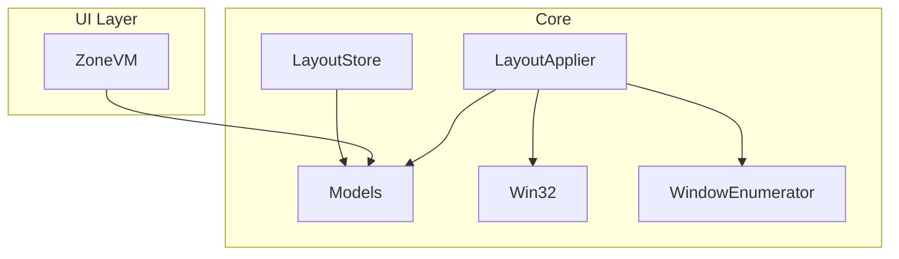
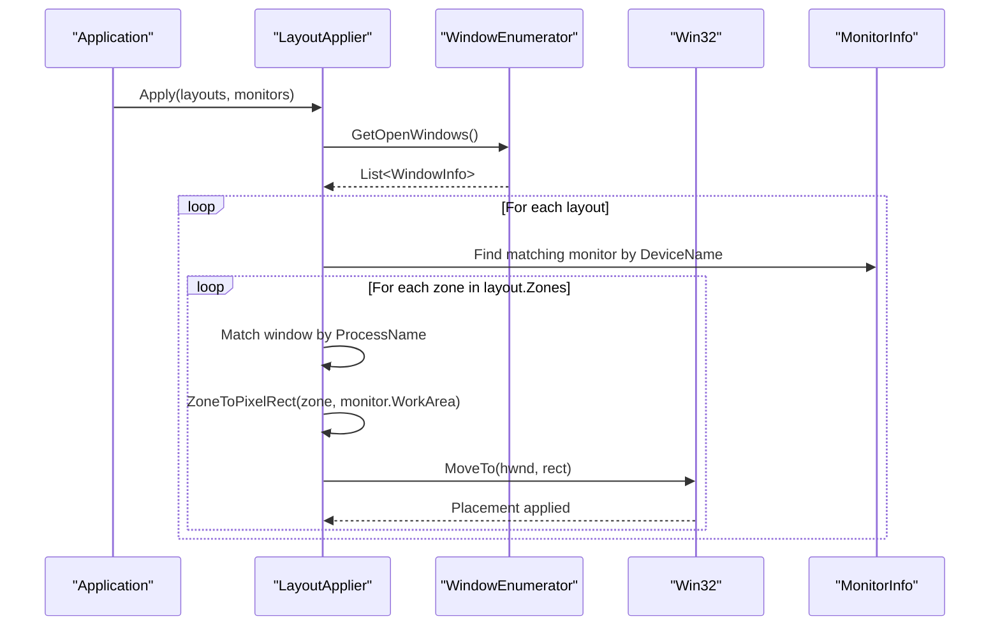
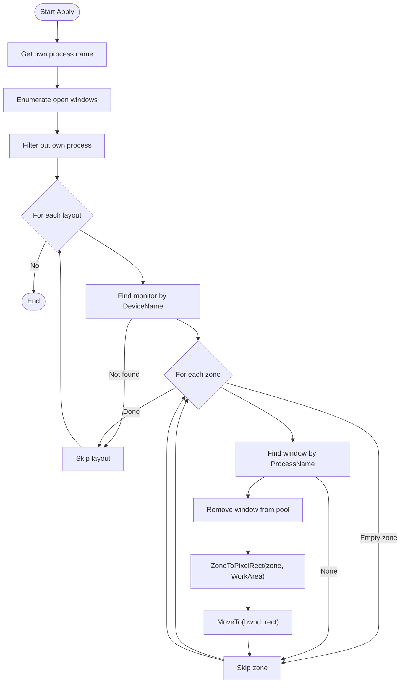
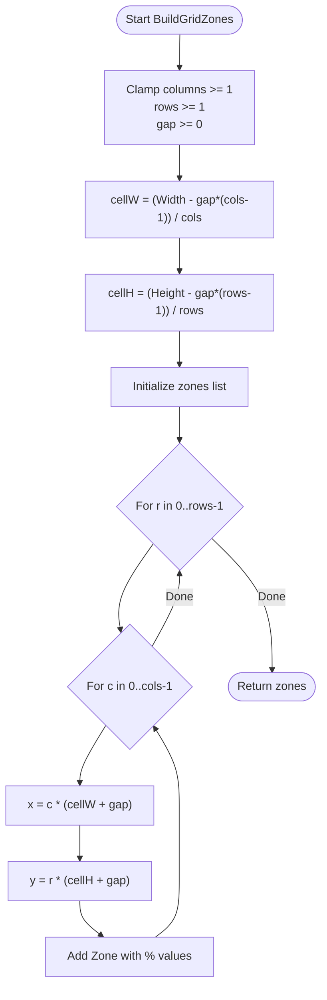
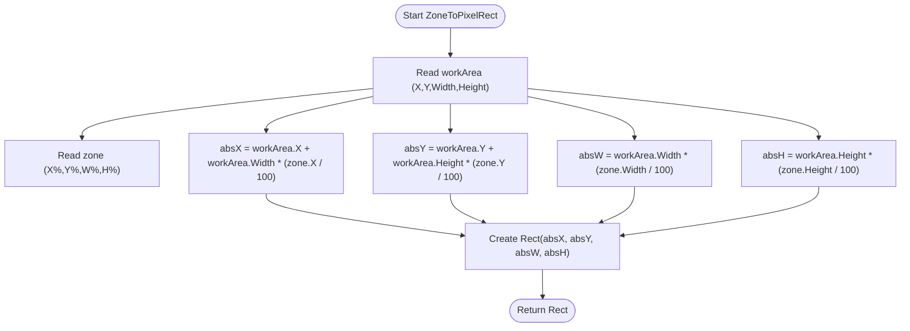
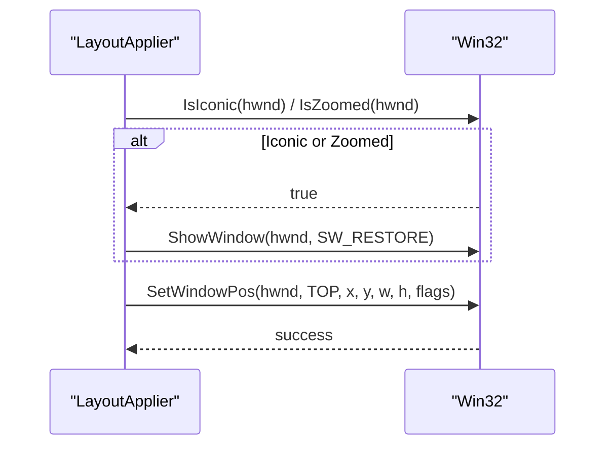
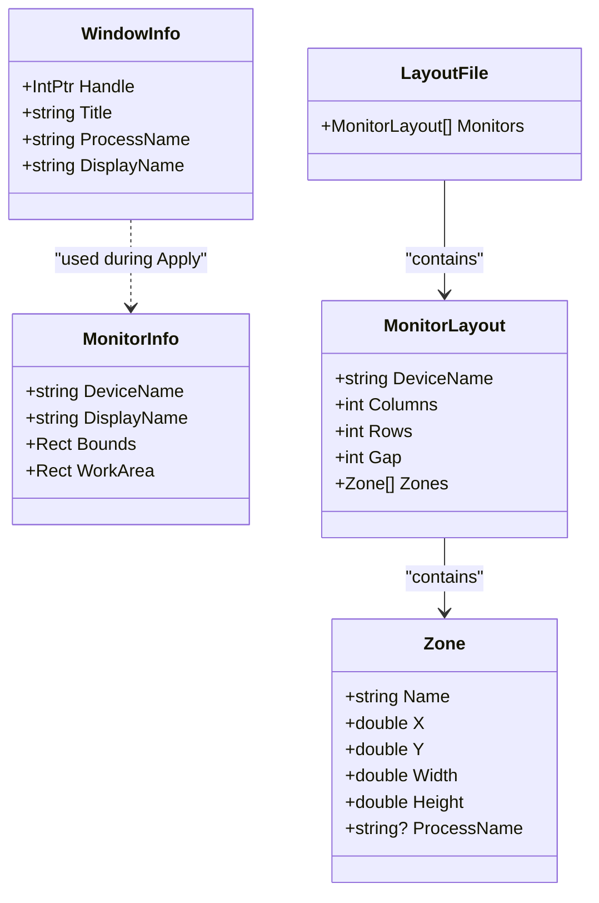
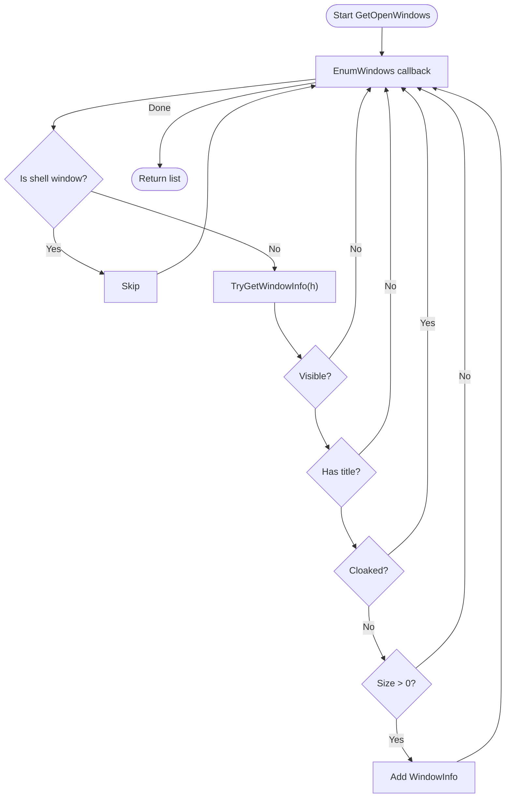
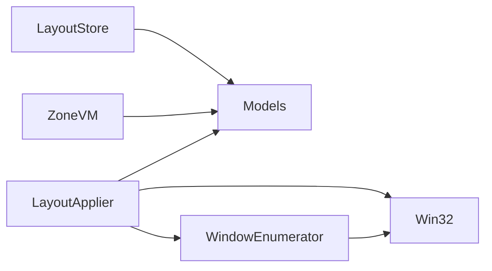

# Layout Management System

<cite>
**Referenced Files in This Document**
- [LayoutApplier.cs](file://Vindows/Core/LayoutApplier.cs)
- [Models.cs](file://Vindows/Core/Models.cs)
- [Win32.cs](file://Vindows/Core/Win32.cs)
- [WindowEnumerator.cs](file://Vindows/Core/WindowEnumerator.cs)
- [LayoutStore.cs](file://Vindows/Core/LayoutStore.cs)
- [ZoneVM.cs](file://Vindows/ZoneVM.cs)
</cite>

## Table of Contents
1. [Introduction](#introduction)
2. [Project Structure](#project-structure)
3. [Core Components](#core-components)
4. [Architecture Overview](#architecture-overview)
5. [Detailed Component Analysis](#detailed-component-analysis)
6. [Dependency Analysis](#dependency-analysis)
7. [Performance Considerations](#performance-considerations)
8. [Troubleshooting Guide](#troubleshooting-guide)
9. [Conclusion](#conclusion)

## Introduction
This document explains the layout management system’s grid-based window positioning algorithms with a focus on the LayoutApplier class. It details how percentage-based zone coordinates are converted to physical pixel rectangles, how uniform grids are generated with configurable columns, rows, and gaps, and how windows are matched to zones and placed on monitors’ work areas. The goal is to make the system understandable for both technical and non-technical readers while providing precise references to the source code.

## Project Structure
The layout system resides primarily under Vindows/Core and includes:
- Models that define monitors, zones, layouts, and windows
- A Win32 interop layer for enumerating monitors and manipulating windows
- A window enumerator that filters usable top-level windows
- The LayoutApplier that computes and applies placements
- A persistence helper for saving/loading layouts
- A view model for UI binding of zones

**Diagram sources**
- [LayoutApplier.cs:1-92](file://Vindows/Core/LayoutApplier.cs#L1-L92)
- [Models.cs:1-61](file://Vindows/Core/Models.cs#L1-L61)
- [Win32.cs:1-123](file://Vindows/Core/Win32.cs#L1-L123)
- [WindowEnumerator.cs:1-57](file://Vindows/Core/WindowEnumerator.cs#L1-L57)
- [LayoutStore.cs:1-41](file://Vindows/Core/LayoutStore.cs#L1-L41)
- [ZoneVM.cs:1-31](file://Vindows/ZoneVM.cs#L1-L31)

**Section sources**
- [LayoutApplier.cs:1-92](file://Vindows/Core/LayoutApplier.cs#L1-L92)
- [Models.cs:1-61](file://Vindows/Core/Models.cs#L1-L61)
- [Win32.cs:1-123](file://Vindows/Core/Win32.cs#L1-L123)
- [WindowEnumerator.cs:1-57](file://Vindows/Core/WindowEnumerator.cs#L1-L57)
- [LayoutStore.cs:1-41](file://Vindows/Core/LayoutStore.cs#L1-L41)
- [ZoneVM.cs:1-31](file://Vindows/ZoneVM.cs#L1-L31)

## Core Components
- LayoutApplier: Central orchestrator for computing and applying window placements across monitors using percentage-based zones.
- Models: Data structures for MonitorInfo (monitor bounds and work area), Zone (percentage-based region), MonitorLayout (grid parameters per monitor), WindowInfo (visible window metadata), and LayoutFile (root container).
- Win32: P/Invoke wrappers for monitor enumeration and window manipulation.
- WindowEnumerator: Enumerates visible, usable top-level windows and extracts process names and handles.
- LayoutStore: Persists layouts to JSON in the user’s application data folder.
- ZoneVM: View model exposing zone properties for UI binding.

Key responsibilities:
- Generate uniform grids of zones with configurable columns, rows, and gap
- Convert percentage-based zone coordinates to absolute pixel rectangles relative to each monitor’s work area
- Match open windows to zones by process name and apply placement via Win32 APIs

**Section sources**
- [LayoutApplier.cs:10-90](file://Vindows/Core/LayoutApplier.cs#L10-L90)
- [Models.cs:6-60](file://Vindows/Core/Models.cs#L6-L60)
- [Win32.cs:40-122](file://Vindows/Core/Win32.cs#L40-L122)
- [WindowEnumerator.cs:10-55](file://Vindows/Core/WindowEnumerator.cs#L10-L55)
- [LayoutStore.cs:6-39](file://Vindows/Core/LayoutStore.cs#L6-L39)
- [ZoneVM.cs:6-29](file://Vindows/ZoneVM.cs#L6-L29)

## Architecture Overview
At runtime, the system:
1. Enumerates monitors and builds their work areas
2. Builds or loads layouts defining zones per monitor
3. Enumerates open windows and filters out irrelevant ones
4. For each monitor layout, iterates zones and matches them to windows by process name
5. Converts zone percentages to pixel rectangles based on the monitor’s work area
6. Applies window placement using Win32 APIs

**Diagram sources**
- [LayoutApplier.cs:10-58](file://Vindows/Core/LayoutApplier.cs#L10-L58)
- [WindowEnumerator.cs:10-21](file://Vindows/Core/WindowEnumerator.cs#L10-L21)
- [Win32.cs:97-120](file://Vindows/Core/Win32.cs#L97-L120)
- [Models.cs:6-16](file://Vindows/Core/Models.cs#L6-L16)

## Detailed Component Analysis

### LayoutApplier Class Architecture
LayoutApplier is a static utility class responsible for:
- Applying layouts across monitors by iterating zones and matching windows
- Converting percentage-based zones to pixel rectangles relative to monitor work areas
- Moving and resizing windows safely through Win32 calls
- Building uniform grids of zones with configurable columns, rows, and gaps

It encapsulates all placement logic without UI dependencies, making it reusable and testable.

**Section sources**
- [LayoutApplier.cs:6-90](file://Vindows/Core/LayoutApplier.cs#L6-L90)

#### Apply Method Workflow
The Apply method performs the following steps:
- Captures the current process name to exclude the app itself from placement
- Enumerates open windows and filters out the current process
- Iterates each monitor layout and finds the corresponding monitor by device name
- For each zone in the layout:
  - Skips empty zones (no process assigned)
  - Finds the first available window whose process matches the zone’s process
  - Removes the used window from the pool to avoid reassignment
  - Converts the zone to a pixel rectangle based on the monitor’s work area
  - Moves the window to the computed rectangle

**Diagram sources**
- [LayoutApplier.cs:10-58](file://Vindows/Core/LayoutApplier.cs#L10-L58)

**Section sources**
- [LayoutApplier.cs:10-58](file://Vindows/Core/LayoutApplier.cs#L10-L58)

#### BuildGridZones Method
BuildGridZones generates a uniform grid of zones within a monitor’s work area:
- Normalizes inputs: ensures at least one column and row; gap cannot be negative
- Computes cell width and height by subtracting total gap space and dividing by number of columns/rows
- Iterates rows and columns to compute each zone’s position and size
- Expresses positions and sizes as percentages of the work area to enable resolution-independent layouts

Mathematical notes:
- Cell width = (workArea.Width - gap × (columns - 1)) / columns
- Cell height = (workArea.Height - gap × (rows - 1)) / rows
- Zone x = c × (cellW + gap)
- Zone y = r × (cellH + gap)
- Zone X% = x / workArea.Width × 100
- Zone Y% = y / workArea.Height × 100
- Zone Width% = cellW / workArea.Width × 100
- Zone Height% = cellH / workArea.Height × 100

**Diagram sources**
- [LayoutApplier.cs:60-90](file://Vindows/Core/LayoutApplier.cs#L60-L90)

**Section sources**
- [LayoutApplier.cs:60-90](file://Vindows/Core/LayoutApplier.cs#L60-L90)

#### ZoneToPixelRect Conversion Algorithm
ZoneToPixelRect converts percentage-based zone coordinates into absolute pixel rectangles relative to a monitor’s work area:
- Uses the monitor’s work area origin (X, Y) and dimensions (Width, Height)
- Calculates absolute left/top by adding work area offsets to percentage-derived offsets
- Calculates absolute width/height by scaling zone percentages to work area dimensions

Formula summary:
- absX = workArea.X + workArea.Width × (zone.X / 100)
- absY = workArea.Y + workArea.Height × (zone.Y / 100)
- absW = workArea.Width × (zone.Width / 100)
- absH = workArea.Height × (zone.Height / 100)

**Diagram sources**
- [LayoutApplier.cs:37-43](file://Vindows/Core/LayoutApplier.cs#L37-L43)

**Section sources**
- [LayoutApplier.cs:37-43](file://Vindows/Core/LayoutApplier.cs#L37-L43)

#### MoveTo Window Placement
MoveTo ensures safe window placement:
- Restores minimized or maximized windows before moving
- Rounds coordinates and enforces minimum size of 1 pixel
- Calls SetWindowPos with flags to avoid z-order changes and activation

**Diagram sources**
- [LayoutApplier.cs:45-58](file://Vindows/Core/LayoutApplier.cs#L45-L58)
- [Win32.cs:97-120](file://Vindows/Core/Win32.cs#L97-L120)

**Section sources**
- [LayoutApplier.cs:45-58](file://Vindows/Core/LayoutApplier.cs#L45-L58)
- [Win32.cs:97-120](file://Vindows/Core/Win32.cs#L97-L120)

### Models and Data Flow
- MonitorInfo provides Bounds and WorkArea for each monitor, enabling accurate placement within taskbar-free regions
- Zone stores percentage-based geometry and optional process assignment
- MonitorLayout groups Zones and defines grid parameters (Columns, Rows, Gap)
- WindowInfo captures window handle, title, and process name for matching
- LayoutFile is the root container for multi-monitor layouts

**Diagram sources**
- [Models.cs:6-60](file://Vindows/Core/Models.cs#L6-L60)

**Section sources**
- [Models.cs:6-60](file://Vindows/Core/Models.cs#L6-L60)

### Window Enumeration and Filtering
WindowEnumerator collects visible, usable top-level windows:
- Skips shell window
- Filters invisible windows, windows without titles, cloaked windows, and zero-size windows
- Extracts process name and window handle for later matching

**Diagram sources**
- [WindowEnumerator.cs:10-55](file://Vindows/Core/WindowEnumerator.cs#L10-L55)

**Section sources**
- [WindowEnumerator.cs:10-55](file://Vindows/Core/WindowEnumerator.cs#L10-L55)

### Persistence and UI Binding
- LayoutStore serializes and deserializes LayoutFile to JSON in the user’s ApplicationData directory, with graceful error handling
- ZoneVM exposes zone properties for UI binding, including computed size text and selected process

**Section sources**
- [LayoutStore.cs:6-39](file://Vindows/Core/LayoutStore.cs#L6-L39)
- [ZoneVM.cs:6-29](file://Vindows/ZoneVM.cs#L6-L29)

## Dependency Analysis
The system exhibits clear separation of concerns:
- LayoutApplier depends on Models for data, Win32 for OS interactions, and WindowEnumerator for window discovery
- Models are pure data structures with no external dependencies
- Win32 encapsulates all P/Invoke calls
- WindowEnumerator depends only on Win32
- LayoutStore depends on standard I/O and JSON serialization
- ZoneVM depends on Models for UI binding

**Diagram sources**
- [LayoutApplier.cs:1-92](file://Vindows/Core/LayoutApplier.cs#L1-L92)
- [Models.cs:1-61](file://Vindows/Core/Models.cs#L1-L61)
- [Win32.cs:1-123](file://Vindows/Core/Win32.cs#L1-L123)
- [WindowEnumerator.cs:1-57](file://Vindows/Core/WindowEnumerator.cs#L1-L57)
- [LayoutStore.cs:1-41](file://Vindows/Core/LayoutStore.cs#L1-L41)
- [ZoneVM.cs:1-31](file://Vindows/ZoneVM.cs#L1-L31)

**Section sources**
- [LayoutApplier.cs:1-92](file://Vindows/Core/LayoutApplier.cs#L1-L92)
- [Models.cs:1-61](file://Vindows/Core/Models.cs#L1-L61)
- [Win32.cs:1-123](file://Vindows/Core/Win32.cs#L1-L123)
- [WindowEnumerator.cs:1-57](file://Vindows/Core/WindowEnumerator.cs#L1-L57)
- [LayoutStore.cs:1-41](file://Vindows/Core/LayoutStore.cs#L1-L41)
- [ZoneVM.cs:1-31](file://Vindows/ZoneVM.cs#L1-L31)

## Performance Considerations
- Grid generation is O(columns × rows), which is typically small and negligible
- Window enumeration is O(N) over top-level windows; filtering adds constant-time checks per window
- Matching windows to zones uses linear search per zone; consider pre-indexing windows by process name if many windows/zones exist
- Percentage-to-pixel conversion is O(1) per zone
- Win32 calls are relatively expensive; batching or minimizing redundant calls can improve performance

[No sources needed since this section provides general guidance]

## Troubleshooting Guide
Common issues and resolutions:
- No windows placed: Ensure zones have valid ProcessName entries and that matching windows are visible and not cloaked
- Windows not respecting work area: Verify that ZoneToPixelRect uses the correct monitor’s WorkArea and that layouts target the right DeviceName
- Gaps causing overflow: Confirm gap values do not exceed monitor dimensions; BuildGridZones normalizes inputs but extreme gaps may reduce cell sizes to near-zero
- Permission errors when saving layouts: LayoutStore silently ignores write failures; ensure the application has write access to the ApplicationData directory

**Section sources**
- [LayoutApplier.cs:10-58](file://Vindows/Core/LayoutApplier.cs#L10-L58)
- [LayoutApplier.cs:37-90](file://Vindows/Core/LayoutApplier.cs#L37-L90)
- [WindowEnumerator.cs:23-55](file://Vindows/Core/WindowEnumerator.cs#L23-L55)
- [LayoutStore.cs:15-39](file://Vindows/Core/LayoutStore.cs#L15-L39)

## Conclusion
The layout management system provides a robust, percentage-based approach to grid-driven window placement. LayoutApplier centralizes the algorithmic core, converting logical zones into precise pixel rectangles aligned with each monitor’s work area. The design separates concerns cleanly, supports multi-monitor setups, and integrates seamlessly with Win32 APIs for reliable window manipulation. With configurable grids and gap handling, it offers flexible and predictable window arrangements suitable for productivity-focused workflows.