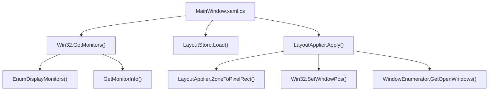
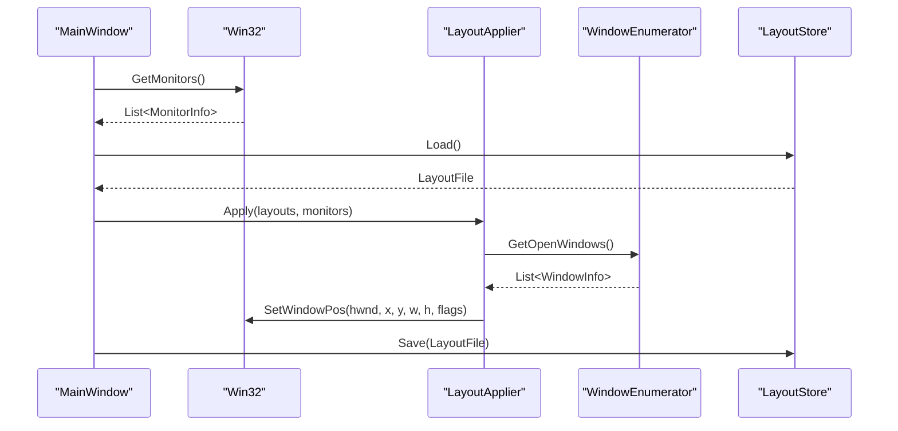
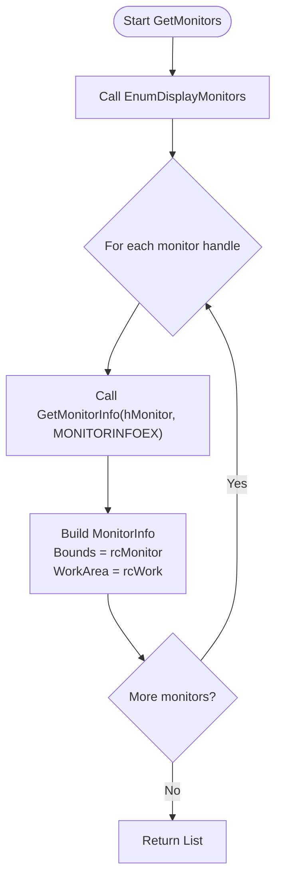
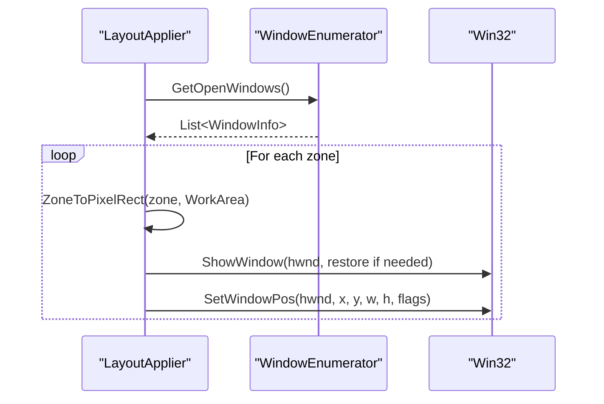
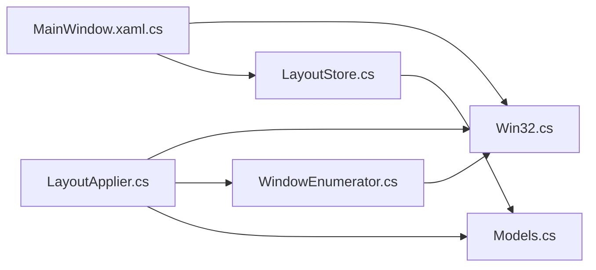

# Monitor Management System

<cite>
**Referenced Files in This Document**
- [Win32.cs](file://Windows/Core/Win32.cs)
- [Models.cs](file://Windows/Core/Models.cs)
- [LayoutApplier.cs](file://Windows/Core/LayoutApplier.cs)
- [WindowEnumerator.cs](file://Windows/Core/WindowEnumerator.cs)
- [LayoutStore.cs](file://Windows/Core/LayoutStore.cs)
- [MainWindow.xaml.cs](file://Windows/MainWindow.xaml.cs)
</cite>

## Table of Contents
1. [Introduction](#introduction)
2. [Project Structure](#project-structure)
3. [Core Components](#core-components)
4. [Architecture Overview](#architecture-overview)
5. [Detailed Component Analysis](#detailed-component-analysis)
6. [Dependency Analysis](#dependency-analysis)
7. [Performance Considerations](#performance-considerations)
8. [Troubleshooting Guide](#troubleshooting-guide)
9. [Conclusion](#conclusion)
10. [Appendices](#appendices)

## Introduction
This document explains the monitor management system’s multi-monitor detection and geometry calculation capabilities. It focuses on how connected displays are enumerated via Win32 APIs, how monitor geometry (bounds and work areas) is computed, and how these values drive window placement across multiple displays. The documentation also covers edge cases such as disconnected monitors, varying DPI settings, and virtual display adapters.

## Project Structure
The monitor management logic resides primarily in the Core namespace:
- Win32.cs provides P/Invoke wrappers for Windows API calls to enumerate monitors and retrieve their geometry.
- Models.cs defines data structures representing monitors, zones, layouts, and windows.
- LayoutApplier.cs calculates zone rectangles from percentages relative to a monitor’s work area and applies window placements.
- WindowEnumerator.cs enumerates visible top-level windows suitable for placement.
- LayoutStore.cs persists monitor layouts to JSON.
- MainWindow.xaml.cs orchestrates UI interactions, loading layouts, and applying them.

**Diagram sources**
- [MainWindow.xaml.cs:27-38](file://Windows/MainWindow.xaml.cs#L27-L38)
- [Win32.cs:40-67](file://Windows/Core/Win32.cs#L40-L67)
- [LayoutApplier.cs:9-35](file://Windows/Core/LayoutApplier.cs#L9-L35)
- [WindowEnumerator.cs:9-21](file://Windows/Core/WindowEnumerator.cs#L9-L21)
- [LayoutStore.cs:15-26](file://Windows/Core/LayoutStore.cs#L15-L26)

**Section sources**
- [MainWindow.xaml.cs:27-38](file://Windows/MainWindow.xaml.cs#L27-L38)
- [Win32.cs:40-67](file://Windows/Core/Win32.cs#L40-L67)
- [LayoutApplier.cs:9-35](file://Windows/Core/LayoutApplier.cs#L9-L35)
- [WindowEnumerator.cs:9-21](file://Windows/Core/WindowEnumerator.cs#L9-L21)
- [LayoutStore.cs:15-26](file://Windows/Core/LayoutStore.cs#L15-L26)

## Core Components
- Win32.GetMonitors: Enumerates all connected monitors using EnumDisplayMonitors and GetMonitorInfo, returning a list of MonitorInfo with device names, bounds, and work areas.
- MonitorInfo: Represents a physical monitor with DeviceName, DisplayName, Bounds (full monitor rectangle), and WorkArea (excluding taskbar and system UI).
- LayoutApplier: Converts percentage-based Zone definitions into pixel coordinates within a monitor’s WorkArea and moves windows accordingly.
- WindowEnumerator: Collects visible, non-cloaked top-level windows with titles, excluding shell and minimized/UWP hidden windows.
- LayoutStore: Loads/saves monitor layout configurations to a JSON file under the user’s ApplicationData folder.

**Section sources**
- [Win32.cs:12-67](file://Windows/Core/Win32.cs#L12-L67)
- [Models.cs:5-16](file://Windows/Core/Models.cs#L5-L16)
- [LayoutApplier.cs:9-58](file://Windows/Core/LayoutApplier.cs#L9-L58)
- [WindowEnumerator.cs:9-55](file://Windows/Core/WindowEnumerator.cs#L9-L55)
- [LayoutStore.cs:6-39](file://Windows/Core/LayoutStore.cs#L6-L39)

## Architecture Overview
The system follows a layered approach:
- Data layer: Win32 P/Invokes expose low-level Windows APIs for monitor enumeration and window manipulation.
- Model layer: Models define domain objects like MonitorInfo, Zone, MonitorLayout, and WindowInfo.
- Service layer: LayoutApplier computes geometry and applies window positions; WindowEnumerator discovers candidate windows.
- Persistence layer: LayoutStore serializes/deserializes layouts to JSON.
- UI layer: MainWindow coordinates initialization, user input, preview rendering, and applying layouts.

**Diagram sources**
- [MainWindow.xaml.cs:27-38](file://Windows/MainWindow.xaml.cs#L27-L38)
- [Win32.cs:40-67](file://Windows/Core/Win32.cs#L40-L67)
- [LayoutApplier.cs:9-35](file://Windows/Core/LayoutApplier.cs#L9-L35)
- [WindowEnumerator.cs:9-21](file://Windows/Core/WindowEnumerator.cs#L9-L21)
- [LayoutStore.cs:15-26](file://Windows/Core/LayoutStore.cs#L15-L26)

## Detailed Component Analysis

### Win32.GetMonitors Implementation
- Uses EnumDisplayMonitors to iterate over all connected monitors.
- For each monitor handle, calls GetMonitorInfo with MONITORINFOEX to retrieve:
  - rcMonitor: Full monitor bounds in physical pixels.
  - rcWork: Work area excluding taskbars and other system UI elements.
  - szDevice: Device name string.
- Constructs MonitorInfo entries with:
  - DeviceName from szDevice.
  - DisplayName derived from device index and resolution (width × height).
  - Bounds calculated from rcMonitor.
  - WorkArea calculated from rcWork.

**Diagram sources**
- [Win32.cs:40-67](file://Windows/Core/Win32.cs#L40-L67)

**Section sources**
- [Win32.cs:12-67](file://Windows/Core/Win32.cs#L12-L67)

### MonitorInfo Data Structure
- DeviceName: Unique identifier for the monitor device.
- DisplayName: Human-readable label including index and resolution.
- Bounds: Rect representing the full monitor area in physical pixels.
- WorkArea: Rect representing the usable area excluding taskbars and system UI.

These properties enable precise window placement relative to both the entire screen and the usable workspace.

**Section sources**
- [Models.cs:5-16](file://Windows/Core/Models.cs#L5-L16)

### Work Area Calculation and Taskbar Exclusion
- WorkArea is provided by the OS via GetMonitorInfo’s rcWork field.
- This excludes taskbars, docked toolbars, and other system UI, ensuring windows do not overlap critical UI elements.
- All zone calculations in LayoutApplier use WorkArea as the base coordinate space.

**Section sources**
- [Win32.cs:18-27](file://Windows/Core/Win32.cs#L18-L27)
- [Win32.cs:48-59](file://Windows/Core/Win32.cs#L48-L59)
- [LayoutApplier.cs:37-43](file://Windows/Core/LayoutApplier.cs#L37-L43)

### Multi-Display Setup Scenarios
- Single monitor: One MonitorInfo entry; zones fill its WorkArea.
- Dual monitors side-by-side: Two MonitorInfo entries; each has independent Bounds and WorkArea.
- Mixed resolutions/DPI: Each monitor’s Bounds and WorkArea reflect its native resolution; zones are percentage-based so they scale correctly per monitor.
- Virtual display adapters: Treated as regular monitors by EnumDisplayMonitors; appear as additional entries with their own geometry.

Examples:
- Detecting monitors at startup populates the UI with available devices and default grid layouts.
- Applying a 2×2 grid on a 4K monitor yields four equal zones within the WorkArea.
- Assigning different processes to zones ensures each window is placed precisely on its target monitor.

**Section sources**
- [MainWindow.xaml.cs:27-38](file://Windows/MainWindow.xaml.cs#L27-L38)
- [LayoutApplier.cs:60-90](file://Windows/Core/LayoutApplier.cs#L60-L90)

### Edge Cases
- Disconnected monitors: If a monitor disappears between enumeration and application, matching by DeviceName prevents errors; unmatched layouts are skipped.
- DPI changes: Since zones are defined as percentages of WorkArea, scaling DPI does not break placement; absolute pixel coordinates are only used when moving windows.
- Virtual adapters: Appear as normal monitors; behavior is identical to physical displays.
- Hidden or cloaked windows: WindowEnumerator filters out invisible or cloaked windows to avoid placing windows where they cannot be seen.

**Section sources**
- [LayoutApplier.cs:17-21](file://Windows/Core/LayoutApplier.cs#L17-L21)
- [WindowEnumerator.cs:23-55](file://Windows/Core/WindowEnumerator.cs#L23-L55)

### Window Placement Flow
- For each layout zone, find an open window belonging to the specified process.
- Convert zone percentages to pixel coordinates based on the target monitor’s WorkArea.
- Restore minimized or maximized windows before resizing/moving.
- Use SetWindowPos to place the window without changing focus order.

**Diagram sources**
- [LayoutApplier.cs:9-58](file://Windows/Core/LayoutApplier.cs#L9-L58)
- [WindowEnumerator.cs:9-21](file://Windows/Core/WindowEnumerator.cs#L9-L21)
- [Win32.cs:97-103](file://Windows/Core/Win32.cs#L97-L103)

**Section sources**
- [LayoutApplier.cs:9-58](file://Windows/Core/LayoutApplier.cs#L9-L58)
- [WindowEnumerator.cs:9-21](file://Windows/Core/WindowEnumerator.cs#L9-L21)
- [Win32.cs:97-103](file://Windows/Core/Win32.cs#L97-L103)

## Dependency Analysis
- MainWindow depends on Win32 for monitor enumeration and on LayoutStore for persistence.
- LayoutApplier depends on Win32 for window manipulation and on WindowEnumerator for discovering windows.
- Models provide shared types consumed across components.

**Diagram sources**
- [MainWindow.xaml.cs:27-38](file://Windows/MainWindow.xaml.cs#L27-L38)
- [LayoutApplier.cs:9-58](file://Windows/Core/LayoutApplier.cs#L9-L58)
- [WindowEnumerator.cs:9-21](file://Windows/Core/WindowEnumerator.cs#L9-L21)
- [LayoutStore.cs:15-26](file://Windows/Core/LayoutStore.cs#L15-L26)
- [Models.cs:5-16](file://Windows/Core/Models.cs#L5-L16)

**Section sources**
- [MainWindow.xaml.cs:27-38](file://Windows/MainWindow.xaml.cs#L27-L38)
- [LayoutApplier.cs:9-58](file://Windows/Core/LayoutApplier.cs#L9-L58)
- [WindowEnumerator.cs:9-21](file://Windows/Core/WindowEnumerator.cs#L9-L21)
- [LayoutStore.cs:15-26](file://Windows/Core/LayoutStore.cs#L15-L26)
- [Models.cs:5-16](file://Windows/Core/Models.cs#L5-L16)

## Performance Considerations
- Monitor enumeration is lightweight and performed once at startup; caching results avoids repeated P/Invoke overhead.
- Zone-to-pixel conversion uses simple arithmetic and is O(1) per zone.
- Window placement iterates over zones and windows; complexity is proportional to the number of zones and windows.
- Avoid frequent refresh cycles; batch operations when possible to minimize SetWindowPos calls.

[No sources needed since this section provides general guidance]

## Troubleshooting Guide
- No monitors detected: Ensure EnumDisplayMonitors returns handles; verify that monitors are enabled and drivers are installed.
- WorkArea equals Bounds: Indicates no taskbar or system UI exclusion; check OS settings or third-party tools modifying the taskbar.
- Windows not moving: Confirm windows are visible and not cloaked; ensure process names match exactly (case-insensitive comparison is used).
- DPI-related misplacement: Zones are percentage-based; if issues persist, validate that WorkArea reflects current DPI scaling and re-enumerate monitors after DPI changes.
- Virtual adapter anomalies: Treat as normal monitors; if unexpected, disconnect/reconnect to force re-enumeration.

**Section sources**
- [Win32.cs:40-67](file://Windows/Core/Win32.cs#L40-L67)
- [WindowEnumerator.cs:23-55](file://Windows/Core/WindowEnumerator.cs#L23-L55)
- [LayoutApplier.cs:17-21](file://Windows/Core/LayoutApplier.cs#L17-L21)

## Conclusion
The monitor management system leverages Windows APIs to detect and measure connected displays, computes usable work areas excluding system UI, and applies percentage-based zone layouts to position windows accurately across multi-monitor setups. Its design separates concerns into clear layers, enabling robust handling of edge cases like DPI changes, virtual adapters, and disconnected monitors while maintaining simplicity and performance.

[No sources needed since this section summarizes without analyzing specific files]

## Appendices

### Example: Monitor Configuration Detection
- At startup, the app enumerates monitors and loads saved layouts.
- Default grids are generated per monitor if none exist.
- The UI lists monitors and allows selecting one to configure zones.

**Section sources**
- [MainWindow.xaml.cs:27-38](file://Windows/MainWindow.xaml.cs#L27-L38)
- [MainWindow.xaml.cs:40-50](file://Windows/MainWindow.xaml.cs#L40-L50)

### Example: Resolution Handling and Multi-Display Scenarios
- Each monitor’s Bounds and WorkArea reflect its native resolution.
- Zones are defined as percentages of WorkArea, ensuring consistent sizing regardless of resolution.
- Applying a 2×2 grid on a high-DPI 4K monitor yields four equally sized zones within the usable area.

**Section sources**
- [Win32.cs:48-59](file://Windows/Core/Win32.cs#L48-L59)
- [LayoutApplier.cs:60-90](file://Windows/Core/LayoutApplier.cs#L60-L90)