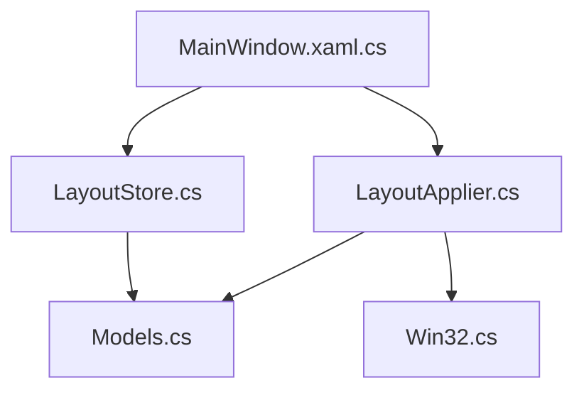
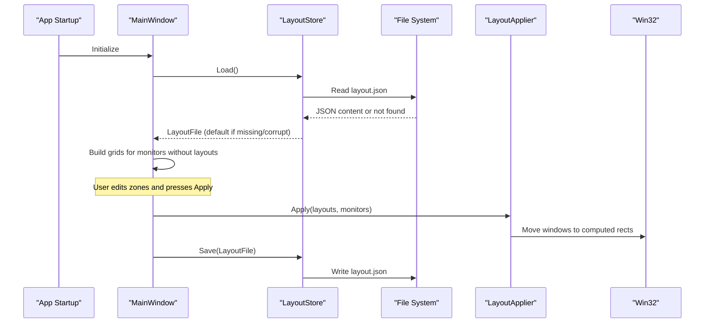
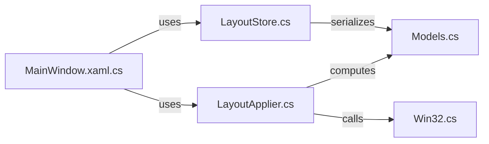

# Persistence Layer

<cite>
**Referenced Files in This Document**
- [LayoutStore.cs](file://Vindows/Core/LayoutStore.cs)
- [Models.cs](file://Vindows/Core/Models.cs)
- [LayoutApplier.cs](file://Vindows/Core/LayoutApplier.cs)
- [MainWindow.xaml.cs](file://Vindows/MainWindow.xaml.cs)
- [Win32.cs](file://Vindows/Core/Win32.cs)
</cite>

## Table of Contents
1. [Introduction](#introduction)
2. [Project Structure](#project-structure)
3. [Core Components](#core-components)
4. [Architecture Overview](#architecture-overview)
5. [Detailed Component Analysis](#detailed-component-analysis)
6. [Dependency Analysis](#dependency-analysis)
7. [Performance Considerations](#performance-considerations)
8. [Troubleshooting Guide](#troubleshooting-guide)
9. [Conclusion](#conclusion)
10. [Appendices](#appendices)

## Introduction
This document explains the persistence layer responsible for storing and retrieving window layout configurations as JSON files on disk. The central component is LayoutStore, which serializes MonitorLayout objects into a structured JSON file located under the user’s application data directory. It provides robust loading and saving operations with graceful error handling for missing or corrupted files, and integrates with the UI to apply layouts across monitors.

## Project Structure
The persistence-related code resides in the Core namespace and is consumed by the main window UI:
- Models define the data structures serialized to JSON (MonitorLayout, Zone, LayoutFile).
- LayoutStore handles JSON serialization/deserialization and file I/O.
- MainWindow orchestrates loading, applying, and saving layouts based on user actions.
- LayoutApplier computes zone rectangles and moves windows according to stored layouts.
- Win32 provides low-level OS interactions for enumerating monitors and moving windows.

**Diagram sources**
- [MainWindow.xaml.cs:27-38](file://Vindows/MainWindow.xaml.cs#L27-L38)
- [LayoutStore.cs:15-39](file://Vindows/Core/LayoutStore.cs#L15-L39)
- [LayoutApplier.cs:10-35](file://Vindows/Core/LayoutApplier.cs#L10-L35)
- [Models.cs:31-60](file://Vindows/Core/Models.cs#L31-L60)
- [Win32.cs:40-67](file://Vindows/Core/Win32.cs#L40-L67)

**Section sources**
- [LayoutStore.cs:1-41](file://Vindows/Core/LayoutStore.cs#L1-L41)
- [Models.cs:1-61](file://Vindows/Core/Models.cs#L1-L61)
- [MainWindow.xaml.cs:1-205](file://Vindows/MainWindow.xaml.cs#L1-L205)
- [LayoutApplier.cs:1-92](file://Vindows/Core/LayoutApplier.cs#L1-L92)
- [Win32.cs:1-123](file://Vindows/Core/Win32.cs#L1-L123)

## Core Components
- LayoutStore: Static class that manages JSON-based layout persistence. It defines the file path under %APPDATA%\Vindows\layout.json, loads layouts from disk, and saves them back.
- Models: Defines the data model used for serialization:
  - MonitorInfo: Physical monitor details and work area.
  - Zone: Percentage-based screen region with optional process assignment.
  - MonitorLayout: Grid configuration per monitor (columns, rows, gap) plus zones.
  - LayoutFile: Root container holding multiple MonitorLayout entries.
- LayoutApplier: Computes pixel rectangles from percentage zones and applies window placement using Win32 APIs.
- MainWindow: Loads layouts at startup, allows users to edit grid/zones, applies layouts, and persists changes.

Key responsibilities:
- File path resolution using Environment.SpecialFolder.ApplicationData.
- Safe deserialization returning an empty default when the file is missing or invalid.
- Safe serialization creating directories as needed and ignoring write failures silently.

**Section sources**
- [LayoutStore.cs:9-39](file://Vindows/Core/LayoutStore.cs#L9-L39)
- [Models.cs:6-60](file://Vindows/Core/Models.cs#L6-L60)
- [LayoutApplier.cs:10-58](file://Vindows/Core/LayoutApplier.cs#L10-L58)
- [MainWindow.xaml.cs:27-38](file://Vindows/MainWindow.xaml.cs#L27-L38)

## Architecture Overview
The persistence layer integrates with the UI and OS layers to manage window layouts:
- On app start, MainWindow loads existing layouts via LayoutStore.Load() and initializes UI state.
- Users can modify grid settings and assign processes to zones; changes are held in memory until saved.
- When applying or saving, MainWindow calls LayoutStore.Save() to persist current layouts to disk.
- Applying layouts uses LayoutApplier to compute target rectangles and move windows accordingly.

**Diagram sources**
- [MainWindow.xaml.cs:27-38](file://Vindows/MainWindow.xaml.cs#L27-L38)
- [LayoutStore.cs:15-39](file://Vindows/Core/LayoutStore.cs#L15-L39)
- [LayoutApplier.cs:10-58](file://Vindows/Core/LayoutApplier.cs#L10-L58)
- [Win32.cs:40-67](file://Vindows/Core/Win32.cs#L40-L67)

## Detailed Component Analysis

### LayoutStore: JSON Persistence
Responsibilities:
- Define persistent file path under %APPDATA%\Vindows\layout.json.
- Load(): Deserialize JSON into LayoutFile; return default empty structure if file is missing or malformed.
- Save(): Serialize LayoutFile to JSON; create parent directory if necessary; ignore write errors gracefully.

Error handling:
- Missing file: Returns a new LayoutFile with no monitors.
- Corrupted JSON: Deserialization failure returns a new LayoutFile.
- Write permission issues: Save catches exceptions and continues without throwing.

Thread safety considerations:
- LayoutStore is static and performs synchronous file I/O. There is no explicit locking, so concurrent calls may race on file access. In practice, the UI triggers Save/Load from the UI thread; however, if background threads call these methods, consider adding synchronization around file operations to prevent partial writes or reads.

Optimization opportunities:
- Use async file I/O to avoid blocking the UI thread during large layout files.
- Add checksum or versioning to detect corruption early and trigger migration.
- Implement atomic writes (write to temp file then rename) to reduce risk of partial files.

**Section sources**
- [LayoutStore.cs:9-39](file://Vindows/Core/LayoutStore.cs#L9-L39)

### Data Model: Models
Structure overview:
- MonitorInfo: Device name, display name, bounds, and work area (physical pixels).
- Zone: Percentage-based rectangle within a monitor’s work area, with optional ProcessName assignment.
- MonitorLayout: Per-monitor grid (Columns, Rows, Gap) and list of Zones.
- LayoutFile: Root object containing a list of MonitorLayout entries.

Complexity:
- Serialization cost scales linearly with number of monitors and zones.
- Memory footprint proportional to total zones across all monitors.

Usage in persistence:
- LayoutFile is the root type serialized to JSON.
- MonitorLayout and Zone fields map directly to JSON properties.

**Section sources**
- [Models.cs:6-60](file://Vindows/Core/Models.cs#L6-L60)

### LayoutApplier: Applying Stored Layouts
Responsibilities:
- Compute pixel rectangles from percentage-based zones relative to monitor work areas.
- Enumerate open windows and match them to assigned processes.
- Move windows to target positions using Win32 APIs.

Algorithm highlights:
- ZoneToPixelRect converts percentages to absolute coordinates based on WorkArea.
- BuildGridZones generates uniform grid zones with configurable columns, rows, and gaps.
- Apply iterates through layouts and zones, finds matching windows, and moves them.

Integration with persistence:
- After Save(), subsequent Load() will restore these exact placements.
- Changes to Columns/Rows/Gap affect future zone calculations and persisted layouts.

**Section sources**
- [LayoutApplier.cs:10-90](file://Vindows/Core/LayoutApplier.cs#L10-L90)

### UI Integration: MainWindow
Responsibilities:
- Load initial layouts at startup via LayoutStore.Load().
- Create default grids for monitors lacking layouts.
- Provide controls to adjust grid parameters and assign processes to zones.
- Apply layouts and persist changes via LayoutStore.Save().

Flow:
- Initialize: Load layouts, populate monitors, refresh windows list.
- Apply: Call LayoutApplier.Apply with current layouts and monitors, then save.
- Save: Persist current in-memory layouts to disk.

**Section sources**
- [MainWindow.xaml.cs:27-38](file://Vindows/MainWindow.xaml.cs#L27-L38)
- [MainWindow.xaml.cs:177-189](file://Vindows/MainWindow.xaml.cs#L177-L189)

## Dependency Analysis
High-level dependencies:
- MainWindow depends on LayoutStore for persistence and LayoutApplier for applying layouts.
- LayoutStore depends on .NET JSON serializer and file system APIs.
- LayoutApplier depends on Win32 for OS-level window management.
- All components depend on Models for data representation.

**Diagram sources**
- [MainWindow.xaml.cs:27-38](file://Vindows/MainWindow.xaml.cs#L27-L38)
- [LayoutStore.cs:15-39](file://Vindows/Core/LayoutStore.cs#L15-L39)
- [LayoutApplier.cs:10-58](file://Vindows/Core/LayoutApplier.cs#L10-L58)
- [Models.cs:31-60](file://Vindows/Core/Models.cs#L31-L60)
- [Win32.cs:40-67](file://Vindows/Core/Win32.cs#L40-L67)

**Section sources**
- [MainWindow.xaml.cs:1-205](file://Vindows/MainWindow.xaml.cs#L1-L205)
- [LayoutStore.cs:1-41](file://Vindows/Core/LayoutStore.cs#L1-L41)
- [LayoutApplier.cs:1-92](file://Vindows/Core/LayoutApplier.cs#L1-L92)
- [Models.cs:1-61](file://Vindows/Core/Models.cs#L1-L61)
- [Win32.cs:1-123](file://Vindows/Core/Win32.cs#L1-L123)

## Performance Considerations
- File I/O: Current implementation uses synchronous read/write. For large numbers of monitors/zones, consider asynchronous I/O to keep the UI responsive.
- JSON size: Number of zones grows with grid dimensions; ensure reasonable defaults and limit extreme values to avoid large payloads.
- Window enumeration: Applied during layout execution; minimize redundant calls by caching open windows between operations.
- Directory creation: Ensure directory exists before writing; already handled but could be optimized by checking existence once.

[No sources needed since this section provides general guidance]

## Troubleshooting Guide
Common issues and resolutions:
- Missing layout file: Load() returns a default empty layout; ensure first run creates a valid file after saving.
- Corrupted JSON: Load() catches exceptions and returns default; verify file integrity and recreate if necessary.
- Permission errors: Save() ignores write failures; check user permissions for %APPDATA%\Vindows and ensure the folder is writable.
- No windows moved: Verify that zone.ProcessName matches running processes and that LayoutApplier.Apply is invoked with correct layouts and monitors.

Operational tips:
- Inspect status text in MainWindow to confirm file path and operation results.
- Re-run “Apply” after refreshing windows to ensure assignments are up-to-date.
- Validate grid parameters (columns ≥ 1, rows ≥ 1, gap 0..100) to avoid unexpected behavior.

**Section sources**
- [LayoutStore.cs:15-39](file://Vindows/Core/LayoutStore.cs#L15-L39)
- [MainWindow.xaml.cs:148-169](file://Vindows/MainWindow.xaml.cs#L148-L169)
- [MainWindow.xaml.cs:177-189](file://Vindows/MainWindow.xaml.cs#L177-L189)

## Conclusion
The persistence layer centers on LayoutStore, providing reliable JSON-based storage for window layouts under %APPDATA%\Vindows\layout.json. It offers safe load/save semantics with robust error handling for missing or corrupted files. The data model cleanly represents per-monitor grids and zones, while LayoutApplier translates percentage-based zones into actual window placements. Integrating with MainWindow ensures users can configure and apply layouts interactively. Future enhancements could include async I/O, atomic writes, versioned schemas, and backup/migration strategies to support evolving layout formats.

[No sources needed since this section summarizes without analyzing specific files]

## Appendices

### JSON Schema Structure
Root object:
- Monitors: Array of MonitorLayout entries.

MonitorLayout:
- DeviceName: String identifying the physical monitor.
- Columns: Integer grid columns.
- Rows: Integer grid rows.
- Gap: Integer spacing between zones in pixels.
- Zones: Array of Zone objects.

Zone:
- Name: Human-readable label.
- X, Y, Width, Height: Percentages relative to monitor work area.
- ProcessName: Optional process executable name to assign to the zone.

Example schema outline:
- LayoutFile { Monitors: [MonitorLayout...] }
- MonitorLayout { DeviceName: string, Columns: int, Rows: int, Gap: int, Zones: [Zone...] }
- Zone { Name: string, X: double, Y: double, Width: double, Height: double, ProcessName?: string }

**Section sources**
- [Models.cs:31-60](file://Vindows/Core/Models.cs#L31-L60)

### Backup Mechanisms
Current implementation does not create backups. Recommended approach:
- Before writing, copy the existing layout.json to a timestamped backup file.
- On successful write, retain a limited number of recent backups.
- On write failure, attempt recovery from the latest backup.

[No sources needed since this section proposes enhancements not present in current code]

### Migration Strategies
For format changes:
- Introduce a version field in LayoutFile to track schema versions.
- On Load(), detect version and migrate older formats to the current schema.
- Preserve compatibility by mapping legacy fields to new structures.
- Log migration steps for auditability.

[No sources needed since this section proposes enhancements not present in current code]

### Thread Safety and Concurrent Access
Current behavior:
- LayoutStore is static and uses synchronous file I/O without locks.
- MainWindow invokes Save/Load from the UI thread.

Recommendations:
- If background threads need to access LayoutStore, introduce a lock around file operations to prevent race conditions.
- Consider using a dedicated persistence service with async I/O and internal synchronization.
- Avoid concurrent writes; queue updates if multiple components might save simultaneously.

**Section sources**
- [LayoutStore.cs:15-39](file://Vindows/Core/LayoutStore.cs#L15-L39)
- [MainWindow.xaml.cs:177-189](file://Vindows/MainWindow.xaml.cs#L177-L189)