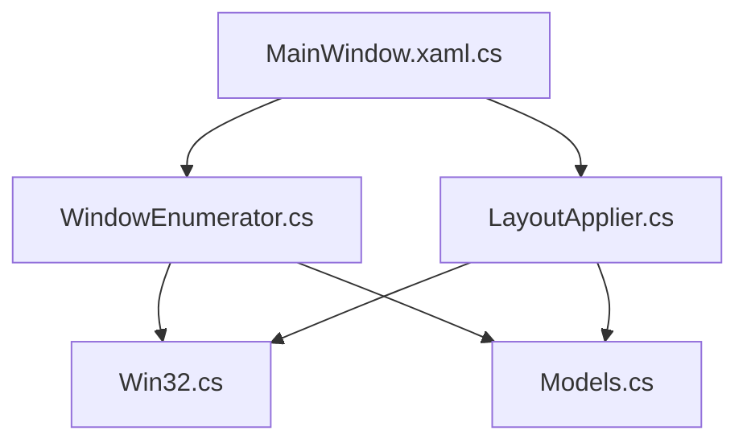
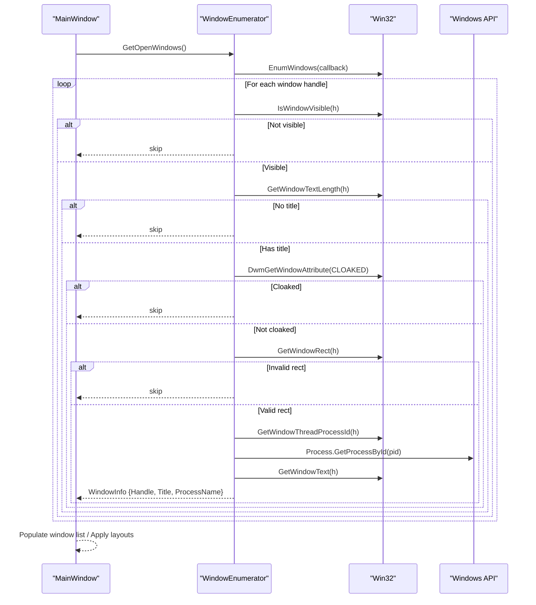
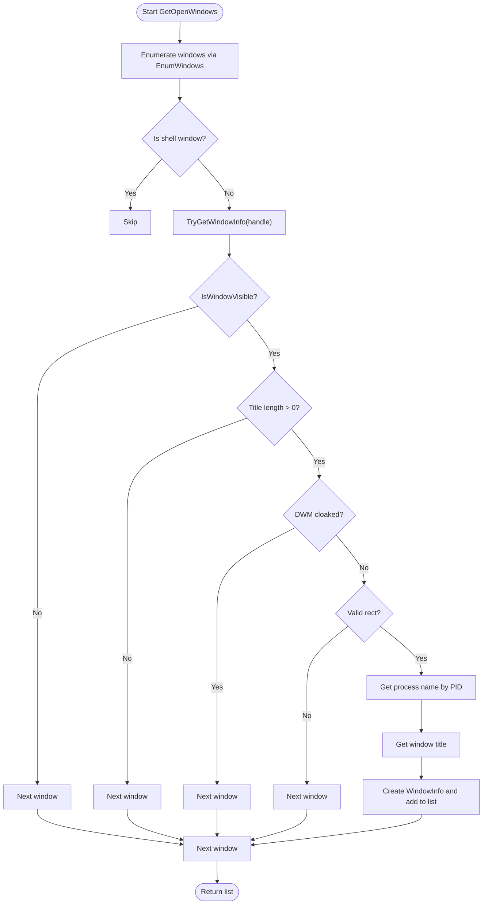
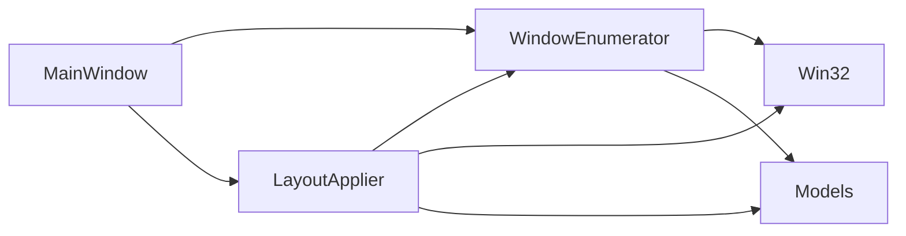

# Window Enumeration System

<cite>
**Referenced Files in This Document**
- [WindowEnumerator.cs](file://Vindows/Core/WindowEnumerator.cs)
- [Win32.cs](file://Vindows/Core/Win32.cs)
- [Models.cs](file://Vindows/Core/Models.cs)
- [LayoutApplier.cs](file://Vindows/Core/LayoutApplier.cs)
- [MainWindow.xaml.cs](file://Vindows/MainWindow.xaml.cs)
</cite>

## Table of Contents
1. [Introduction](#introduction)
2. [Project Structure](#project-structure)
3. [Core Components](#core-components)
4. [Architecture Overview](#architecture-overview)
5. [Detailed Component Analysis](#detailed-component-analysis)
6. [Dependency Analysis](#dependency-analysis)
7. [Performance Considerations](#performance-considerations)
8. [Troubleshooting Guide](#troubleshooting-guide)
9. [Conclusion](#conclusion)

## Introduction
This document explains the window enumeration system used to discover active top-level windows and filter them for layout operations. It focuses on:
- How GetOpenWindows enumerates visible windows across all monitors
- Filtering logic that excludes hidden, minimized, cloaked (virtual desktop/UWP), and titleless windows
- Integration with Windows APIs via a Win32 wrapper
- Collection of window metadata (handle, title, process name)
- Process name validation and UWP handling considerations
- Performance strategies when many windows are open
- Error handling strategies throughout the enumeration pipeline

## Project Structure
The window enumeration system is implemented in the Core namespace and integrated by the UI layer:
- WindowEnumerator orchestrates enumeration and filtering
- Win32 provides P/Invoke wrappers for user32 and dwmapi calls
- Models define data structures such as WindowInfo, MonitorInfo, Zone, etc.
- LayoutApplier consumes enumerated windows to apply layouts
- MainWindow uses WindowEnumerator to populate the UI and trigger layout application

**Diagram sources**
- [MainWindow.xaml.cs:71-89](file://Vindows/MainWindow.xaml.cs#L71-L89)
- [WindowEnumerator.cs:10-21](file://Vindows/Core/WindowEnumerator.cs#L10-L21)
- [Win32.cs:71-122](file://Vindows/Core/Win32.cs#L71-L122)
- [Models.cs:44-54](file://Vindows/Core/Models.cs#L44-L54)
- [LayoutApplier.cs:10-35](file://Vindows/Core/LayoutApplier.cs#L10-L35)

**Section sources**
- [WindowEnumerator.cs:10-21](file://Vindows/Core/WindowEnumerator.cs#L10-L21)
- [Win32.cs:71-122](file://Vindows/Core/Win32.cs#L71-L122)
- [Models.cs:44-54](file://Vindows/Core/Models.cs#L44-L54)
- [LayoutApplier.cs:10-35](file://Vindows/Core/LayoutApplier.cs#L10-L35)
- [MainWindow.xaml.cs:71-89](file://Vindows/MainWindow.xaml.cs#L71-L89)

## Core Components
- WindowEnumerator.GetOpenWindows: Enumerates top-level windows, filters out non-visible or cloaked windows, validates titles and rectangles, extracts process names, and returns WindowInfo objects.
- Win32: Provides P/Invoke declarations for EnumWindows, IsWindowVisible, GetWindowText, GetWindowThreadProcessId, GetWindowRect, DwmGetWindowAttribute, and others.
- Models: Defines WindowInfo (Handle, Title, ProcessName), MonitorInfo, Zone, MonitorLayout, and related types.
- LayoutApplier: Uses enumerated windows to match zones to processes and move windows into target positions; also builds grid zones and converts percentages to pixel coordinates.
- MainWindow: Integrates enumeration into the UI workflow, refreshing the list of windows and applying layouts.

**Section sources**
- [WindowEnumerator.cs:10-55](file://Vindows/Core/WindowEnumerator.cs#L10-L55)
- [Win32.cs:71-122](file://Vindows/Core/Win32.cs#L71-L122)
- [Models.cs:44-54](file://Vindows/Core/Models.cs#L44-L54)
- [LayoutApplier.cs:10-58](file://Vindows/Core/LayoutApplier.cs#L10-L58)
- [MainWindow.xaml.cs:71-89](file://Vindows/MainWindow.xaml.cs#L71-L89)

## Architecture Overview
The enumeration flow starts from the UI and delegates to WindowEnumerator, which iterates over all top-level windows using EnumWindows. For each handle, it applies visibility, title, rectangle, and cloaking checks, then resolves the owning process and collects metadata. The resulting list is consumed by the UI and by LayoutApplier for placement.

**Diagram sources**
- [WindowEnumerator.cs:10-55](file://Vindows/Core/WindowEnumerator.cs#L10-L55)
- [Win32.cs:71-122](file://Vindows/Core/Win32.cs#L71-L122)

## Detailed Component Analysis

### WindowEnumerator.GetOpenWindows Implementation
- Enumerates all top-level windows via EnumWindows callback
- Excludes the shell window to avoid including the desktop itself
- Filters windows based on:
  - Visibility: Must be visible
  - Title: Must have a non-empty title
  - Cloaking: Skips windows marked cloaked by DWM (covers virtual desktops and some UWP scenarios)
  - Rectangle: Must have a valid non-zero size
- Extracts process name using the thread/process ID associated with the window
- Collects metadata into WindowInfo objects

**Diagram sources**
- [WindowEnumerator.cs:10-55](file://Vindows/Core/WindowEnumerator.cs#L10-L55)

**Section sources**
- [WindowEnumerator.cs:10-55](file://Vindows/Core/WindowEnumerator.cs#L10-L55)

### Filtering Logic Details
- Excludes the application's own process during layout application:
  - LayoutApplier filters out windows whose process name matches the current process before matching zones to windows
- Virtual desktop and UWP handling:
  - DWM cloaking attribute is checked; cloaked windows are skipped, which effectively hides virtual desktop windows and certain UWP windows that are not currently visible

**Section sources**
- [LayoutApplier.cs:12-15](file://Vindows/Core/LayoutApplier.cs#L12-L15)
- [WindowEnumerator.cs:30-32](file://Vindows/Core/WindowEnumerator.cs#L30-L32)

### Integration with Windows APIs via Win32 Wrapper
- EnumWindows: Iterates top-level windows
- IsWindowVisible: Checks visibility
- GetWindowTextLength and GetWindowText: Retrieves window titles
- GetWindowThreadProcessId: Gets the owning process ID
- GetWindowRect: Validates window geometry
- DwmGetWindowAttribute: Checks DWM cloak status
- SetWindowPos, ShowWindow, IsIconic, IsZoomed: Used by LayoutApplier to position windows

**Section sources**
- [Win32.cs:71-122](file://Vindows/Core/Win32.cs#L71-L122)
- [LayoutApplier.cs:45-58](file://Vindows/Core/LayoutApplier.cs#L45-L58)

### Window Metadata Collection
- WindowInfo includes:
  - Handle: Native window handle
  - Title: Window caption text
  - ProcessName: Owning process executable name
- DisplayName combines title and process name for UI display

**Section sources**
- [Models.cs:44-54](file://Vindows/Core/Models.cs#L44-L54)

### Process Name Validation and UWP Handling
- Process name validation:
  - Process.GetProcessById is used to resolve the process name; exceptions are caught and the window is skipped
- UWP handling:
  - Cloaked windows are excluded via DWM attribute check, which handles cases where UWP apps are minimized or on other virtual desktops

**Section sources**
- [WindowEnumerator.cs:37-46](file://Vindows/Core/WindowEnumerator.cs#L37-L46)
- [WindowEnumerator.cs:30-32](file://Vindows/Core/WindowEnumerator.cs#L30-L32)

### Example Usage in UI
- MainWindow refreshes the window list by calling GetOpenWindows and populates an observable collection
- It also cleans up zone assignments if their processes are no longer present among open windows

**Section sources**
- [MainWindow.xaml.cs:71-89](file://Vindows/MainWindow.xaml.cs#L71-L89)

## Dependency Analysis
- WindowEnumerator depends on:
  - Win32 for low-level window and monitor APIs
  - System.Diagnostics.Process for resolving process names
  - Models for WindowInfo structure
- LayoutApplier depends on:
  - WindowEnumerator to get filtered windows
  - Win32 to move and resize windows
  - Models for Zone and MonitorInfo
- MainWindow depends on:
  - WindowEnumerator to populate UI
  - LayoutApplier to apply layouts
  - Win32 indirectly through LayoutApplier

**Diagram sources**
- [WindowEnumerator.cs:10-55](file://Vindows/Core/WindowEnumerator.cs#L10-L55)
- [LayoutApplier.cs:10-58](file://Vindows/Core/LayoutApplier.cs#L10-L58)
- [MainWindow.xaml.cs:71-89](file://Vindows/MainWindow.xaml.cs#L71-L89)

**Section sources**
- [WindowEnumerator.cs:10-55](file://Vindows/Core/WindowEnumerator.cs#L10-L55)
- [LayoutApplier.cs:10-58](file://Vindows/Core/LayoutApplier.cs#L10-L58)
- [MainWindow.xaml.cs:71-89](file://Vindows/MainWindow.xaml.cs#L71-L89)

## Performance Considerations
- Large number of open windows:
  - Enumeration iterates every top-level window; ensure callbacks are lightweight
  - Avoid heavy work inside the EnumWindows callback; collect minimal data and defer expensive operations
  - Reuse StringBuilder for title retrieval to reduce allocations
- Process resolution:
  - Process.GetProcessById can be costly; cache results if repeatedly querying the same PIDs within a short timeframe
- Geometry and visibility checks:
  - Early exits on invalid rects or missing titles reduce unnecessary work
- UI updates:
  - Batch UI updates after enumeration completes to prevent excessive re-renders
- Monitoring changes:
  - Consider debouncing refresh operations if windows change frequently

[No sources needed since this section provides general guidance]

## Troubleshooting Guide
- Windows not appearing in the list:
  - Check visibility and title presence; hidden or titleless windows are intentionally excluded
  - Verify DWM cloak status; cloaked windows are skipped (common for virtual desktops or minimized UWP)
- Process name resolution failures:
  - Exceptions during process lookup cause the window to be skipped; ensure the process still exists
- Incorrect window placement:
  - Validate zone-to-pixel conversion and monitor work area usage
  - Ensure windows are restored before moving (minimized or maximized states handled by LayoutApplier)
- Permission issues saving layouts:
  - Save operations silently fail if write permissions are insufficient; verify file path and permissions

**Section sources**
- [WindowEnumerator.cs:23-55](file://Vindows/Core/WindowEnumerator.cs#L23-L55)
- [LayoutApplier.cs:45-58](file://Vindows/Core/LayoutApplier.cs#L45-L58)
- [LayoutStore.cs:28-39](file://Vindows/Core/LayoutStore.cs#L28-L39)

## Conclusion
The window enumeration system provides a robust mechanism to discover and filter active windows across all monitors, integrating closely with Windows APIs via a focused Win32 wrapper. It ensures only relevant, visible, and uncloaked windows are considered, while collecting essential metadata for UI and layout operations. The design supports efficient processing even with many open windows and includes error handling to gracefully skip problematic windows. Integration points in the UI and layout application layers enable practical use cases such as multi-monitor window management and automated placement strategies.