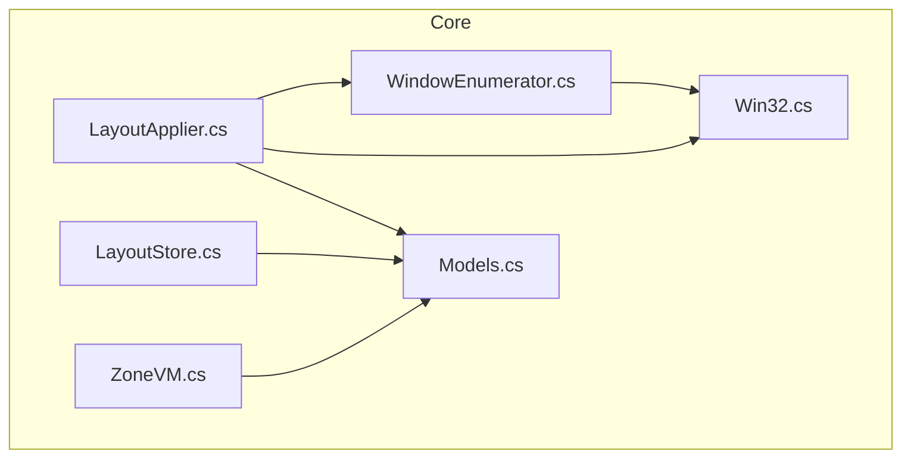
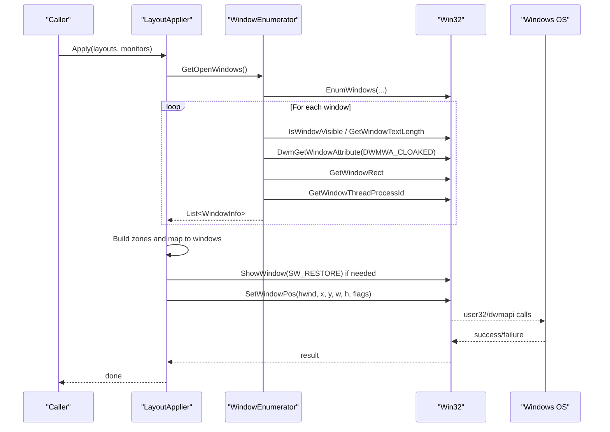
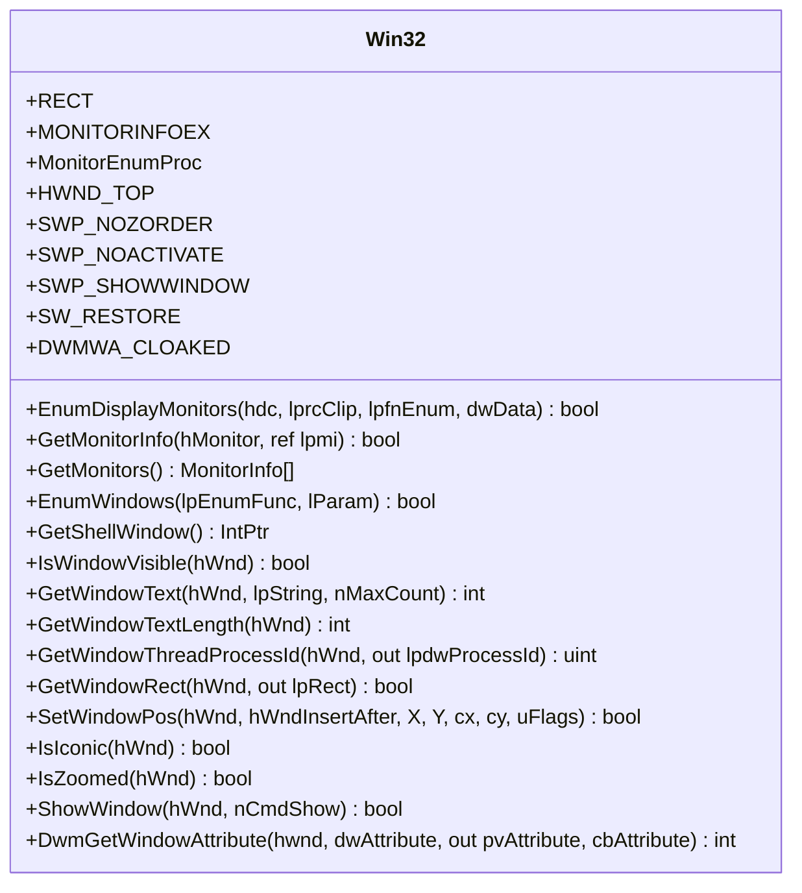
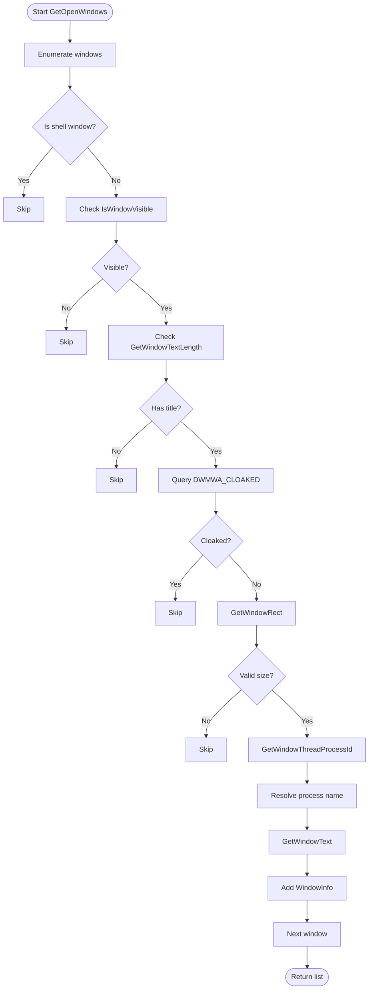
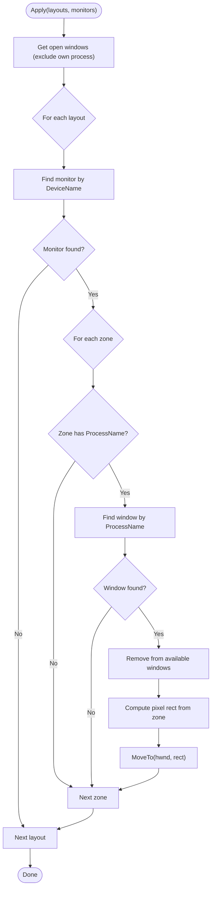
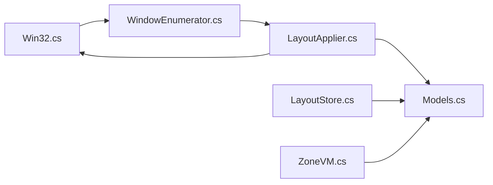

# Windows API Integration

<cite>
**Referenced Files in This Document**
- [Win32.cs](file://Vindows/Core/Win32.cs)
- [WindowEnumerator.cs](file://Vindows/Core/WindowEnumerator.cs)
- [LayoutApplier.cs](file://Vindows/Core/LayoutApplier.cs)
- [Models.cs](file://Vindows/Core/Models.cs)
- [LayoutStore.cs](file://Vindows/Core/LayoutStore.cs)
- [ZoneVM.cs](file://Vindows/ZoneVM.cs)
</cite>

## Table of Contents
1. [Introduction](#introduction)
2. [Project Structure](#project-structure)
3. [Core Components](#core-components)
4. [Architecture Overview](#architecture-overview)
5. [Detailed Component Analysis](#detailed-component-analysis)
6. [Dependency Analysis](#dependency-analysis)
7. [Performance Considerations](#performance-considerations)
8. [Troubleshooting Guide](#troubleshooting-guide)
9. [Conclusion](#conclusion)

## Introduction
This document explains the Windows API integration layer implemented in this project. It focuses on P/Invoke wrappers and system-level operations that enable cross-process window management and monitor enumeration. The central Win32 class provides a unified interface to user32.dll and dwmapi.dll functions, while higher-level components enumerate windows, compute zones, and apply layouts across monitors.

The key responsibilities include:
- Enumerating physical monitors and their work areas
- Enumerating visible top-level windows with process context
- Checking and manipulating window state (minimized, maximized, shown)
- Moving and resizing windows across processes using SetWindowPos
- Persisting layout definitions for reuse

## Project Structure
The integration layer is organized into focused modules under Vindows.Core:
- Win32.cs: P/Invoke declarations and helper constants for monitor and window APIs
- WindowEnumerator.cs: Enumerates open windows suitable for placement
- LayoutApplier.cs: Computes pixel rectangles from percentage-based zones and applies them to windows
- Models.cs: Data models for monitors, zones, layouts, and window info
- LayoutStore.cs: JSON persistence for layouts
- ZoneVM.cs: UI model binding for zone selection

**Diagram sources**
- [Win32.cs:1-123](file://Vindows/Core/Win32.cs#L1-L123)
- [WindowEnumerator.cs:1-57](file://Vindows/Core/WindowEnumerator.cs#L1-L57)
- [LayoutApplier.cs:1-92](file://Vindows/Core/LayoutApplier.cs#L1-L92)
- [Models.cs:1-61](file://Vindows/Core/Models.cs#L1-L61)
- [LayoutStore.cs:1-41](file://Vindows/Core/LayoutStore.cs#L1-L41)
- [ZoneVM.cs:1-31](file://Vindows/ZoneVM.cs#L1-L31)

**Section sources**
- [Win32.cs:1-123](file://Vindows/Core/Win32.cs#L1-L123)
- [WindowEnumerator.cs:1-57](file://Vindows/Core/WindowEnumerator.cs#L1-L57)
- [LayoutApplier.cs:1-92](file://Vindows/Core/LayoutApplier.cs#L1-L92)
- [Models.cs:1-61](file://Vindows/Core/Models.cs#L1-L61)
- [LayoutStore.cs:1-41](file://Vindows/Core/LayoutStore.cs#L1-L41)
- [ZoneVM.cs:1-31](file://Vindows/ZoneVM.cs#L1-L31)

## Core Components
- Win32: Centralized P/Invoke wrapper exposing monitor and window APIs, including GetMonitors, SetWindowPos, IsIconic, IsZoomed, ShowWindow, and DWM attribute queries.
- WindowEnumerator: Enumerates visible top-level windows, filters out shell and cloaked windows, and collects handle, title, and process name.
- LayoutApplier: Converts percentage-based zones to pixel coordinates and moves/resizes target windows; restores minimized or maximized windows before positioning.
- Models: Strongly typed data structures for MonitorInfo, Zone, MonitorLayout, WindowInfo, and LayoutFile.
- LayoutStore: Loads/saves layout definitions to JSON in the application data folder.
- ZoneVM: View-model wrapper around Zone for UI binding.

**Section sources**
- [Win32.cs:10-122](file://Vindows/Core/Win32.cs#L10-L122)
- [WindowEnumerator.cs:6-56](file://Vindows/Core/WindowEnumerator.cs#L6-L56)
- [LayoutApplier.cs:6-91](file://Vindows/Core/LayoutApplier.cs#L6-L91)
- [Models.cs:5-60](file://Vindows/Core/Models.cs#L5-L60)
- [LayoutStore.cs:6-40](file://Vindows/Core/LayoutStore.cs#L6-L40)
- [ZoneVM.cs:6-30](file://Vindows/ZoneVM.cs#L6-L30)

## Architecture Overview
The system composes low-level Win32 calls into safe, high-level operations:
- Monitor enumeration uses EnumDisplayMonitors and GetMonitorInfo to collect device names, bounds, and work areas.
- Window enumeration uses EnumWindows, visibility checks, DWM cloaking detection, and process identification to build a list of candidate windows.
- Layout application computes pixel rectangles from percentage-based zones and applies them via SetWindowPos, ensuring windows are restored if minimized or maximized.

**Diagram sources**
- [LayoutApplier.cs:9-58](file://Vindows/Core/LayoutApplier.cs#L9-L58)
- [WindowEnumerator.cs:10-55](file://Vindows/Core/WindowEnumerator.cs#L10-L55)
- [Win32.cs:31-114](file://Vindows/Core/Win32.cs#L31-L114)

## Detailed Component Analysis

### Win32 Class: P/Invoke Wrappers and System-Level Operations
The Win32 class encapsulates Win32 APIs for monitors and windows:
- Monitor enumeration:
  - RECT and MONITORINFOEX structs define memory layout for interop.
  - EnumDisplayMonitors enumerates monitors; GetMonitorInfo retrieves details.
  - GetMonitors aggregates results into MonitorInfo objects with device name, display name, bounds, and work area.
- Window manipulation:
  - EnumWindows enumerates top-level windows.
  - GetShellWindow, IsWindowVisible, GetWindowText, GetWindowTextLength, GetWindowThreadProcessId, GetWindowRect provide window metadata.
  - SetWindowPos positions and resizes windows with flags to avoid z-order changes, activation, and ensure visibility.
  - IsIconic and IsZoomed check window state; ShowWindow restores windows when necessary.
  - DwmGetWindowAttribute queries DWM attributes such as DWMWA_CLOAKED to filter virtual desktop or hidden UWP windows.
- Constants:
  - HWND_TOP, SWP_NOZORDER, SWP_NOACTIVATE, SWP_SHOWWINDOW, SW_RESTORE, DWMWA_CLOAKED.

Parameter marshaling and error handling:
- Structs use StructLayout and MarshalAs to match native layouts.
- Boolean return values are marshaled to bool.
- String buffers use StringBuilder with capacity limits for titles.
- Error handling relies on boolean returns and explicit checks; failures typically cause skipping of entries rather than exceptions.

Cross-process considerations:
- Cross-process window operations rely on handles obtained via EnumWindows and validated by visibility and size checks.
- Process names are resolved via .NET Process API; failures are ignored to keep enumeration robust.

Security and privileges:
- Reading window metadata and moving windows generally does not require elevation, but some scenarios may be restricted by UAC or session isolation.
- DWM attribute queries can reveal cloaked windows; filtering is used to avoid placing windows that are intentionally hidden.

Compatibility:
- User32 and DWM APIs are available across modern Windows versions.
- Behavior of cloaked windows and UWP apps may vary; the code explicitly filters cloaked windows to maintain consistent behavior.

**Section sources**
- [Win32.cs:12-122](file://Vindows/Core/Win32.cs#L12-L122)

#### Win32 Class Diagram

**Diagram sources**
- [Win32.cs:12-122](file://Vindows/Core/Win32.cs#L12-L122)

### WindowEnumerator: Open Window Discovery
Responsibilities:
- Enumerate all top-level windows using EnumWindows.
- Filter out the shell window and non-visible windows.
- Exclude cloaked windows using DWM attribute query.
- Validate window size to avoid zero-sized or invalid windows.
- Collect process name and window title for each candidate.

Error handling:
- Gracefully ignores errors when resolving process information.
- Skips windows without titles or invalid rectangles.

**Diagram sources**
- [WindowEnumerator.cs:10-55](file://Vindows/Core/WindowEnumerator.cs#L10-L55)
- [Win32.cs:73-114](file://Vindows/Core/Win32.cs#L73-L114)

**Section sources**
- [WindowEnumerator.cs:6-56](file://Vindows/Core/WindowEnumerator.cs#L6-L56)

### LayoutApplier: Zone Calculation and Window Placement
Responsibilities:
- Map percentage-based zones to pixel rectangles relative to monitor work areas.
- Match windows to zones by process name, excluding the current process.
- Restore windows if minimized or maximized before positioning.
- Apply SetWindowPos with flags to avoid z-order changes and activation.

Algorithm highlights:
- ZoneToPixelRect converts percentages to absolute coordinates based on work area.
- MoveTo ensures windows are restored and then positioned with calculated dimensions.
- BuildGridZones generates uniform grids with configurable columns, rows, and gaps.

**Diagram sources**
- [LayoutApplier.cs:9-58](file://Vindows/Core/LayoutApplier.cs#L9-L58)
- [Win32.cs:97-114](file://Vindows/Core/Win32.cs#L97-L114)

**Section sources**
- [LayoutApplier.cs:6-91](file://Vindows/Core/LayoutApplier.cs#L6-L91)

### Models: Data Structures
- MonitorInfo: Represents a physical monitor with device name, display name, bounds, and work area.
- Zone: Defines a screen region by percentage coordinates within a monitor’s work area, plus optional process assignment.
- MonitorLayout: Groups zones per monitor with grid parameters (columns, rows, gap).
- WindowInfo: Captures window handle, title, and process name for UI and matching.
- LayoutFile: Root container for serialized layouts.

These models support serialization and UI binding, enabling configuration-driven window placement.

**Section sources**
- [Models.cs:5-60](file://Vindows/Core/Models.cs#L5-L60)

### LayoutStore: Persistence
- Stores layouts in JSON under ApplicationData/Vindows/layout.json.
- Provides Load and Save methods with graceful fallbacks on errors (e.g., permission issues).
- Uses System.Text.Json with indented formatting for readability.

**Section sources**
- [LayoutStore.cs:6-40](file://Vindows/Core/LayoutStore.cs#L6-L40)

### ZoneVM: UI Binding
- Wraps Zone to expose Name, SizeText, and SelectedProcess for UI consumption.
- Implements INotifyPropertyChanged to update bindings when selections change.

**Section sources**
- [ZoneVM.cs:6-30](file://Vindows/ZoneVM.cs#L6-L30)

## Dependency Analysis
The integration layer exhibits clear separation of concerns:
- Win32 depends only on runtime interop and Windows APIs.
- WindowEnumerator depends on Win32 for enumeration and metadata.
- LayoutApplier depends on WindowEnumerator and Win32 for placement logic.
- Models are consumed by multiple layers for data exchange.
- LayoutStore depends on Models for serialization.
- ZoneVM depends on Models for UI binding.

**Diagram sources**
- [Win32.cs:1-123](file://Vindows/Core/Win32.cs#L1-L123)
- [WindowEnumerator.cs:1-57](file://Vindows/Core/WindowEnumerator.cs#L1-L57)
- [LayoutApplier.cs:1-92](file://Vindows/Core/LayoutApplier.cs#L1-L92)
- [Models.cs:1-61](file://Vindows/Core/Models.cs#L1-L61)
- [LayoutStore.cs:1-41](file://Vindows/Core/LayoutStore.cs#L1-L41)
- [ZoneVM.cs:1-31](file://Vindows/ZoneVM.cs#L1-L31)

**Section sources**
- [Win32.cs:1-123](file://Vindows/Core/Win32.cs#L1-L123)
- [WindowEnumerator.cs:1-57](file://Vindows/Core/WindowEnumerator.cs#L1-L57)
- [LayoutApplier.cs:1-92](file://Vindows/Core/LayoutApplier.cs#L1-L92)
- [Models.cs:1-61](file://Vindows/Core/Models.cs#L1-L61)
- [LayoutStore.cs:1-41](file://Vindows/Core/LayoutStore.cs#L1-L41)
- [ZoneVM.cs:1-31](file://Vindows/ZoneVM.cs#L1-L31)

## Performance Considerations
- Enumeration efficiency:
  - EnumDisplayMonitors and EnumWindows are called once per operation; avoid redundant calls in tight loops.
  - Filtering cloaked windows and checking visibility reduces unnecessary processing.
- Memory usage:
  - Reuse StringBuilder for window titles to minimize allocations.
  - Limit captured lists to necessary fields (handle, title, process name).
- Positioning performance:
  - Batch window movements where possible; SetWindowPos is efficient but frequent calls can cause flicker.
  - Use SWP_NOACTIVATE to avoid focus thrashing during bulk layout application.
- DWM queries:
  - DwmGetWindowAttribute is relatively expensive; call it selectively after initial visibility checks.

[No sources needed since this section provides general guidance]

## Troubleshooting Guide
Common issues and strategies:
- No windows enumerated:
  - Ensure the application runs in the same session as target windows.
  - Verify that windows are visible and have titles; cloaked or hidden windows are filtered.
- Windows not moving:
  - Check that windows are not minimized or maximized; the code restores them before positioning.
  - Confirm that SetWindowPos flags are appropriate (NOZORDER, NOACTIVATE, SHOWWINDOW).
- Permission errors on save:
  - LayoutStore silently ignores write failures; verify file path permissions and disk space.
- Cross-process access:
  - Some applications restrict window manipulation; ensure your process has sufficient rights.
  - UWP or sandboxed apps may be cloaked or protected; they will be excluded by design.

**Section sources**
- [WindowEnumerator.cs:23-55](file://Vindows/Core/WindowEnumerator.cs#L23-L55)
- [LayoutApplier.cs:45-58](file://Vindows/Core/LayoutApplier.cs#L45-L58)
- [LayoutStore.cs:28-39](file://Vindows/Core/LayoutStore.cs#L28-L39)

## Conclusion
The Windows API integration layer provides a robust foundation for cross-process window management and multi-monitor layout application. By centralizing P/Invoke calls in Win32 and building higher-level abstractions in WindowEnumerator and LayoutApplier, the system achieves clarity, reusability, and resilience against edge cases like cloaked windows and varying window states. The modular design supports future enhancements such as additional window attributes, improved error reporting, and more sophisticated layout algorithms.

[No sources needed since this section summarizes without analyzing specific files]