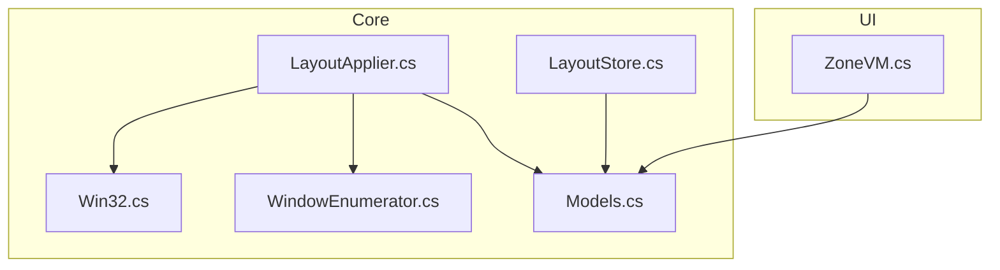
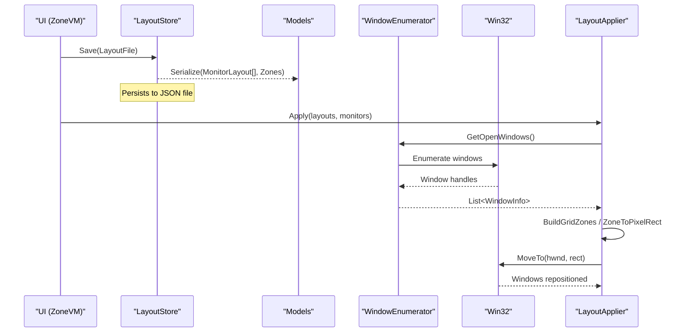
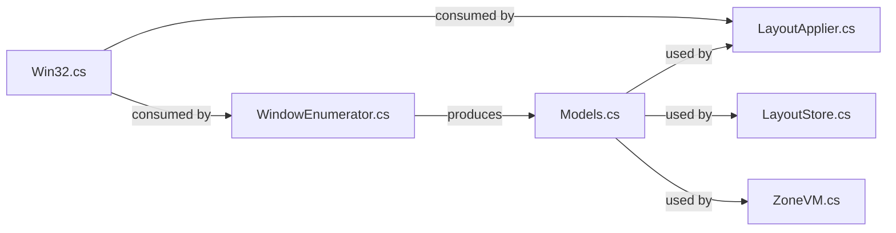

# Data Models

<cite>
**Referenced Files in This Document**
- [Models.cs](file://Vindows/Core/Models.cs)
- [LayoutApplier.cs](file://Vindows/Core/LayoutApplier.cs)
- [LayoutStore.cs](file://Vindows/Core/LayoutStore.cs)
- [WindowEnumerator.cs](file://Vindows/Core/WindowEnumerator.cs)
- [Win32.cs](file://Vindows/Core/Win32.cs)
- [ZoneVM.cs](file://Vindows/ZoneVM.cs)
</cite>

## Table of Contents
1. Introduction
2. Project Structure
3. Core Components
4. Architecture Overview
5. Detailed Component Analysis
6. Dependency Analysis
7. Performance Considerations
8. Troubleshooting Guide
9. Conclusion
10. Appendices

## Introduction
This document describes the core data models used by Vindows to represent monitors, screen zones, window metadata, and layout persistence. It explains field definitions, validation rules, business constraints, entity relationships, and how these models flow through application layers. It also covers JSON serialization considerations and versioning strategies for evolving the model over time.

## Project Structure
The data models live in the Core layer and are consumed by UI and service components:
- Domain models: MonitorInfo, Zone, MonitorLayout, WindowInfo, LayoutFile
- View model: ZoneVM (presentation wrapper around Zone)
- Services: LayoutApplier (applies layouts), LayoutStore (JSON persistence), WindowEnumerator (discovers open windows), Win32 (OS interop)

**Diagram sources**
- [Models.cs:5-60](file://Vindows/Core/Models.cs#L5-L60)
- [LayoutApplier.cs:6-91](file://Vindows/Core/LayoutApplier.cs#L6-L91)
- [LayoutStore.cs:6-40](file://Vindows/Core/LayoutStore.cs#L6-L40)
- [WindowEnumerator.cs:6-56](file://Vindows/Core/WindowEnumerator.cs#L6-L56)
- [Win32.cs:7-122](file://Vindows/Core/Win32.cs#L7-L122)
- [ZoneVM.cs:6-30](file://Vindows/ZoneVM.cs#L6-L30)

**Section sources**
- [Models.cs:5-60](file://Vindows/Core/Models.cs#L5-L60)
- [LayoutApplier.cs:6-91](file://Vindows/Core/LayoutApplier.cs#L6-L91)
- [LayoutStore.cs:6-40](file://Vindows/Core/LayoutStore.cs#L6-L40)
- [WindowEnumerator.cs:6-56](file://Vindows/Core/WindowEnumerator.cs#L6-L56)
- [Win32.cs:7-122](file://Vindows/Core/Win32.cs#L7-L122)
- [ZoneVM.cs:6-30](file://Vindows/ZoneVM.cs#L6-L30)

## Core Components
This section defines each domain model, its fields, constraints, and usage.

- MonitorInfo
  - Purpose: Represents a physical monitor with its bounds and work area.
  - Fields:
    - DeviceName: Unique identifier for the monitor device.
    - DisplayName: Human-readable name derived from system info.
    - Bounds: Full monitor rectangle in physical pixels.
    - WorkArea: Usable area excluding taskbar in physical pixels.
  - Constraints:
    - WorkArea must be within Bounds.
    - Width and Height must be positive.
  - Usage: Provides the coordinate space for zone calculations and window placement.

- Zone
  - Purpose: Percentage-based region within a monitor’s work area; optionally assigned to a process.
  - Fields:
    - Name: Label for the zone.
    - X, Y: Top-left position as percentage of work area.
    - Width, Height: Size as percentage of work area.
    - ProcessName: Optional process executable name to place in this zone.
  - Constraints:
    - Percentages should be in [0, 100].
    - Zones on the same monitor should not overlap unless intentionally designed.
    - ProcessName is case-insensitive when matched against running processes.
  - Usage: Defines where windows will be placed; converted to pixel rectangles during layout application.

- MonitorLayout
  - Purpose: Grid configuration for a single monitor including zones.
  - Fields:
    - DeviceName: Target monitor identity.
    - Columns, Rows: Grid dimensions.
    - Gap: Pixel gap between zones.
    - Zones: List of Zone objects describing the grid cells.
  - Constraints:
    - Columns and Rows must be at least 1.
    - Gap must be non-negative.
    - Zones list should match the grid size if generated automatically.
  - Usage: Describes a complete layout for one monitor; persisted via LayoutFile.

- WindowInfo
  - Purpose: Metadata for an open top-level window suitable for placement.
  - Fields:
    - Handle: OS handle to the window.
    - Title: Window title text.
    - ProcessName: Executable name of the owning process.
    - DisplayName: Computed string combining title and process name.
  - Constraints:
    - Must be visible and have a non-empty title.
    - Must not be cloaked or minimized beyond usability.
  - Usage: Enumerated at runtime to find candidate windows for placement into zones.

- LayoutFile
  - Purpose: Root object for JSON persistence representing all monitor layouts.
  - Fields:
    - Monitors: Collection of MonitorLayout entries.
  - Constraints:
    - Each MonitorLayout.DeviceName should correspond to a known monitor.
  - Usage: Serialized/deserialized by LayoutStore for saving/loading user configurations.

- ZoneVM
  - Purpose: Presentation wrapper around Zone for UI binding and editing.
  - Fields:
    - Name, SizeText: Derived from underlying Zone.
    - SelectedProcess: Binds to Zone.ProcessName with change notification.
  - Constraints:
    - Changes propagate back to the underlying Zone instance.
  - Usage: Used in UI lists to edit zone assignments.

**Section sources**
- [Models.cs:5-60](file://Vindows/Core/Models.cs#L5-L60)
- [ZoneVM.cs:6-30](file://Vindows/ZoneVM.cs#L6-L30)

## Architecture Overview
The data models flow through three primary layers:
- Discovery: Win32 and WindowEnumerator discover monitors and open windows, producing MonitorInfo and WindowInfo.
- Configuration: User edits MonitorLayout (including Zones) via UI bound to ZoneVM; changes persist to LayoutFile.
- Application: LayoutApplier reads MonitorLayout and applies it to matching MonitorInfo, moving WindowInfo instances into their target zones.

**Diagram sources**
- [LayoutStore.cs:15-39](file://Vindows/Core/LayoutStore.cs#L15-L39)
- [Models.cs:31-60](file://Vindows/Core/Models.cs#L31-L60)
- [WindowEnumerator.cs:9-21](file://Vindows/Core/WindowEnumerator.cs#L9-L21)
- [Win32.cs:40-67](file://Vindows/Core/Win32.cs#L40-L67)
- [LayoutApplier.cs:9-58](file://Vindows/Core/LayoutApplier.cs#L9-L58)

## Detailed Component Analysis

### MonitorInfo
- Role: Source of truth for monitor geometry.
- Key relationships:
  - Referenced by MonitorLayout via DeviceName to bind a layout to a specific monitor.
  - Consumed by LayoutApplier to compute pixel coordinates for zones.
- Validation notes:
  - Ensure WorkArea fits within Bounds.
  - Dimensions must be positive before use in calculations.

**Section sources**
- [Models.cs:5-16](file://Vindows/Core/Models.cs#L5-L16)
- [Win32.cs:40-67](file://Vindows/Core/Win32.cs#L40-L67)

### Zone
- Role: Percentage-based region definition with optional process assignment.
- Key relationships:
  - Owned by MonitorLayout.Zones.
  - Converted to pixel rectangles by LayoutApplier using MonitorInfo.WorkArea.
- Validation notes:
  - Percentages should remain within [0, 100].
  - Overlapping zones can cause conflicts; ensure unique assignments per process.

**Section sources**
- [Models.cs:18-29](file://Vindows/Core/Models.cs#L18-L29)
- [LayoutApplier.cs:37-43](file://Vindows/Core/LayoutApplier.cs#L37-L43)

### MonitorLayout
- Role: Grid configuration for a single monitor.
- Key relationships:
  - Contains multiple Zone instances.
  - Identified by DeviceName to match a MonitorInfo.
- Validation notes:
  - Columns and Rows must be >= 1.
  - Gap must be >= 0.
  - Generated zones should align with grid math.

**Section sources**
- [Models.cs:31-42](file://Vindows/Core/Models.cs#L31-L42)
- [LayoutApplier.cs:60-90](file://Vindows/Core/LayoutApplier.cs#L60-L90)

### WindowInfo
- Role: Runtime representation of an open window eligible for placement.
- Key relationships:
  - Produced by WindowEnumerator.
  - Consumed by LayoutApplier to move windows into zones.
- Validation notes:
  - Only visible, titled, uncloaked windows are included.
  - Non-zero window sizes required.

**Section sources**
- [Models.cs:44-54](file://Vindows/Core/Models.cs#L44-L54)
- [WindowEnumerator.cs:9-56](file://Vindows/Core/WindowEnumerator.cs#L9-L56)

### LayoutFile
- Role: Root container for JSON persistence of all monitor layouts.
- Key relationships:
  - Holds a list of MonitorLayout.
  - Serialized/deserialized by LayoutStore.
- Validation notes:
  - On load, missing files or invalid JSON yield an empty root to avoid crashes.

**Section sources**
- [Models.cs:56-60](file://Vindows/Core/Models.cs#L56-L60)
- [LayoutStore.cs:15-26](file://Vindows/Core/LayoutStore.cs#L15-L26)

### ZoneVM
- Role: UI-bound view model wrapping Zone.
- Key relationships:
  - Exposes SelectedProcess to update Zone.ProcessName.
  - Computes SizeText from Zone.Width/Height for display.
- Validation notes:
  - Property change notifications keep UI in sync with underlying model.

**Section sources**
- [ZoneVM.cs:6-30](file://Vindows/ZoneVM.cs#L6-L30)

## Dependency Analysis
- Models depend only on System.Windows types for Rect.
- LayoutApplier depends on:
  - Models (MonitorLayout, Zone, MonitorInfo)
  - WindowEnumerator (to collect WindowInfo)
  - Win32 (for window manipulation)
- LayoutStore depends on:
  - Models (LayoutFile, MonitorLayout)
  - System.Text.Json for serialization
- WindowEnumerator depends on:
  - Win32 (for enumeration and filtering)
- ZoneVM depends on:
  - Models (Zone)

**Diagram sources**
- [Models.cs:5-60](file://Vindows/Core/Models.cs#L5-L60)
- [LayoutApplier.cs:6-91](file://Vindows/Core/LayoutApplier.cs#L6-L91)
- [LayoutStore.cs:6-40](file://Vindows/Core/LayoutStore.cs#L6-L40)
- [WindowEnumerator.cs:6-56](file://Vindows/Core/WindowEnumerator.cs#L6-L56)
- [Win32.cs:7-122](file://Vindows/Core/Win32.cs#L7-L122)
- [ZoneVM.cs:6-30](file://Vindows/ZoneVM.cs#L6-L30)

**Section sources**
- [Models.cs:5-60](file://Vindows/Core/Models.cs#L5-L60)
- [LayoutApplier.cs:6-91](file://Vindows/Core/LayoutApplier.cs#L6-L91)
- [LayoutStore.cs:6-40](file://Vindows/Core/LayoutStore.cs#L6-L40)
- [WindowEnumerator.cs:6-56](file://Vindows/Core/WindowEnumerator.cs#L6-L56)
- [Win32.cs:7-122](file://Vindows/Core/Win32.cs#L7-L122)
- [ZoneVM.cs:6-30](file://Vindows/ZoneVM.cs#L6-L30)

## Performance Considerations
- Window enumeration filters out invisible, cloaked, or zero-size windows early to reduce overhead.
- Layout application iterates once per layout and zone; ensure zone lists are minimal and non-overlapping to minimize redundant moves.
- JSON persistence writes to disk only when explicitly saved; default options include indentation for readability but may increase file size.

[No sources needed since this section provides general guidance]

## Troubleshooting Guide
- No monitors detected:
  - Verify that monitor enumeration returns results; check Win32 calls and callback behavior.
- Windows not moved:
  - Confirm that Zone.ProcessName matches a running process name exactly (case-insensitive).
  - Ensure the target window is visible and has a valid size.
- Layout not persisted:
  - Check write permissions to the application data directory; errors are silently ignored to preserve in-memory state.
- Invalid JSON:
  - Load falls back to an empty LayoutFile; inspect the stored file for corruption.

**Section sources**
- [Win32.cs:40-67](file://Vindows/Core/Win32.cs#L40-L67)
- [WindowEnumerator.cs:23-56](file://Vindows/Core/WindowEnumerator.cs#L23-L56)
- [LayoutStore.cs:15-39](file://Vindows/Core/LayoutStore.cs#L15-L39)

## Conclusion
Vindows’ data models provide a clear separation between monitor geometry, percentage-based zones, window metadata, and layout persistence. The flow from discovery to configuration to application ensures predictable window placement. Robust error handling and simple JSON storage make the system resilient and easy to evolve.

[No sources needed since this section summarizes without analyzing specific files]

## Appendices

### Serialization and Versioning
- JSON format:
  - Root object: LayoutFile containing a list of MonitorLayout.
  - Each MonitorLayout includes DeviceName, Columns, Rows, Gap, and Zones.
  - Each Zone includes Name, X, Y, Width, Height, and optional ProcessName.
- Backward compatibility:
  - Missing fields deserialize to defaults or nullables; code should tolerate unknown future fields.
  - When adding new properties, consider version tags in LayoutFile to support migration logic.
- Migration strategy:
  - On load, detect version and transform older schemas to current model structure.
  - Validate percentages and grid dimensions after migration.

**Section sources**
- [Models.cs:31-60](file://Vindows/Core/Models.cs#L31-L60)
- [LayoutStore.cs:15-39](file://Vindows/Core/LayoutStore.cs#L15-L39)

### Typical Usage Patterns
- Create a grid layout:
  - Use LayoutApplier.BuildGridZones to generate zones based on Columns, Rows, and Gap for a given monitor’s WorkArea.
- Assign processes to zones:
  - Set Zone.ProcessName to the desired executable name; UI binds via ZoneVM.SelectedProcess.
- Apply layouts:
  - Call LayoutApplier.Apply with a list of MonitorLayout and discovered MonitorInfo to move matching windows into their zones.

**Section sources**
- [LayoutApplier.cs:60-90](file://Vindows/Core/LayoutApplier.cs#L60-L90)
- [ZoneVM.cs:17-27](file://Vindows/ZoneVM.cs#L17-L27)
- [LayoutApplier.cs:9-35](file://Vindows/Core/LayoutApplier.cs#L9-L35)