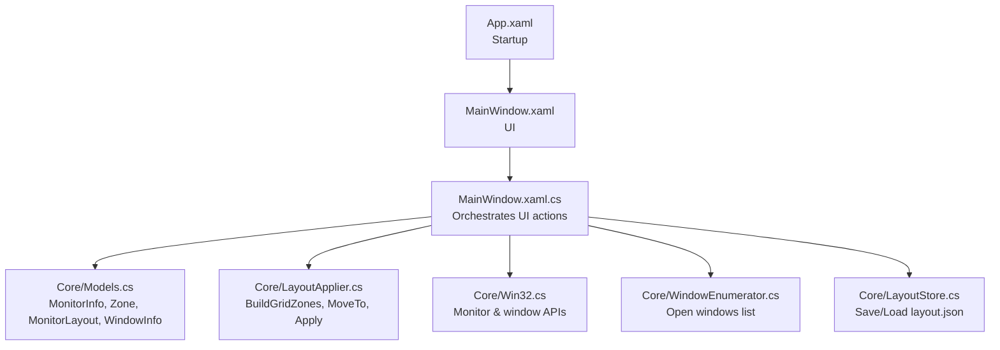
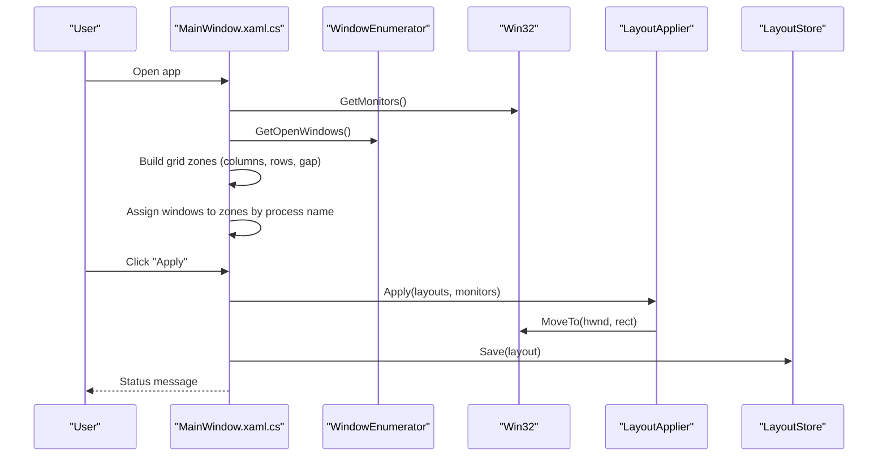
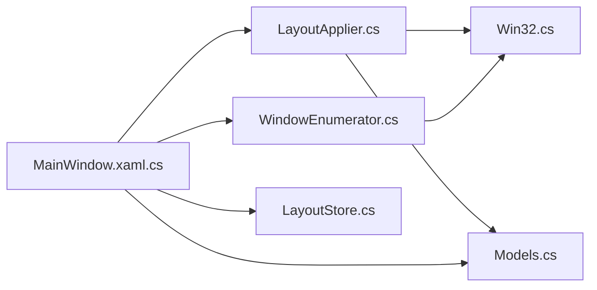
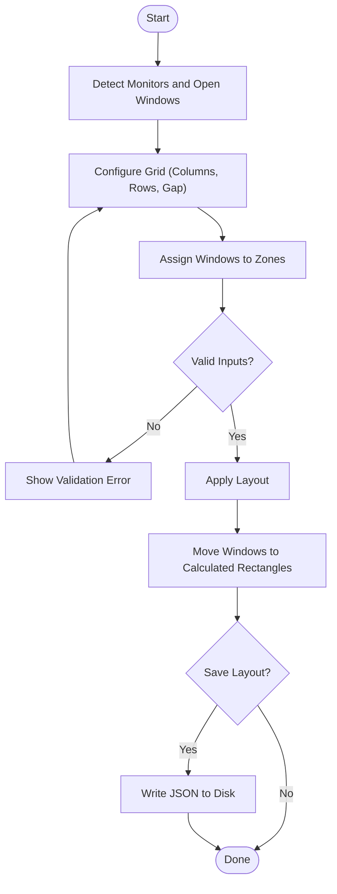

# Getting Started

<cite>
**Referenced Files in This Document**
- [Vindows.csproj](file://Vindows/Vindows.csproj)
- [App.xaml](file://Vindows/App.xaml)
- [MainWindow.xaml](file://Vindows/MainWindow.xaml)
- [MainWindow.xaml.cs](file://Vindows/MainWindow.xaml.cs)
- [ZoneVM.cs](file://Vindows/ZoneVM.cs)
- [Models.cs](file://Vindows/Core/Models.cs)
- [LayoutApplier.cs](file://Vindows/Core/LayoutApplier.cs)
- [Win32.cs](file://Vindows/Core/Win32.cs)
- [WindowEnumerator.cs](file://Vindows/Core/WindowEnumerator.cs)
- [LayoutStore.cs](file://Vindows/Core/LayoutStore.cs)
</cite>

## Table of Contents
1. Introduction
2. Project Structure
3. Core Components
4. Architecture Overview
5. Detailed Component Analysis
6. Dependency Analysis
7. Performance Considerations
8. Troubleshooting Guide
9. Conclusion
10. Appendices

## Introduction
This guide helps you install, build, and run Vindows for the first time, then create your initial layout. Vindows is a WPF application that organizes windows into zones on one or more monitors using configurable grids. You define how many columns and rows to split each monitor into, assign open windows to specific zones, and apply the layout with one click. Your layouts are saved to disk so you can reuse them later.

## Project Structure
Vindows is a .NET 10 WPF desktop app. The project targets net10.0-windows and enables nullable reference types and implicit usings. It uses WPF for the UI and calls Win32 APIs to enumerate monitors and move windows.

Key files:
- App entry point and startup configuration
- Main window UI and interaction logic
- Core models for monitors, zones, and layouts
- Layout builder and window mover
- Win32 interop for system integration
- Window enumeration helper
- JSON-based layout persistence

**Diagram sources**
- [App.xaml:1-10](file://Vindows/App.xaml#L1-L10)
- [MainWindow.xaml:1-96](file://Vindows/MainWindow.xaml#L1-L96)
- [MainWindow.xaml.cs:1-205](file://Vindows/MainWindow.xaml.cs#L1-L205)
- [Models.cs:1-61](file://Vindows/Core/Models.cs#L1-L61)
- [LayoutApplier.cs:1-92](file://Vindows/Core/LayoutApplier.cs#L1-L92)
- [Win32.cs:1-123](file://Vindows/Core/Win32.cs#L1-L123)
- [WindowEnumerator.cs:1-57](file://Vindows/Core/WindowEnumerator.cs#L1-L57)
- [LayoutStore.cs:1-41](file://Vindows/Core/LayoutStore.cs#L1-L41)

**Section sources**
- [Vindows.csproj:1-13](file://Vindows/Vindows.csproj#L1-L13)
- [App.xaml:1-10](file://Vindows/App.xaml#L1-L10)
- [MainWindow.xaml:1-96](file://Vindows/MainWindow.xaml#L1-L96)

## Core Components
- Models: Represent monitors, zones (percentage-based rectangles), per-monitor layouts, and open windows.
- LayoutApplier: Builds grid zones from columns/rows/gap, converts percentages to pixel coordinates, and moves windows to those coordinates.
- Win32: Wraps user32/dwmapi functions to enumerate monitors, enumerate visible windows, and move/resize windows.
- WindowEnumerator: Filters visible top-level windows suitable for placement.
- LayoutStore: Persists layouts to a JSON file under the user’s ApplicationData folder.
- MainWindow: WPF UI that lists monitors, lets you configure grid size and gaps, assigns windows to zones, previews the layout, applies it, and saves/loads configurations.

**Section sources**
- [Models.cs:1-61](file://Vindows/Core/Models.cs#L1-L61)
- [LayoutApplier.cs:1-92](file://Vindows/Core/LayoutApplier.cs#L1-L92)
- [Win32.cs:1-123](file://Vindows/Core/Win32.cs#L1-L123)
- [WindowEnumerator.cs:1-57](file://Vindows/Core/WindowEnumerator.cs#L1-L57)
- [LayoutStore.cs:1-41](file://Vindows/Core/LayoutStore.cs#L1-L41)
- [MainWindow.xaml.cs:1-205](file://Vindows/MainWindow.xaml.cs#L1-L205)

## Architecture Overview
At runtime, the app enumerates monitors and open windows, builds zone grids per monitor, maps windows to zones by process name, and moves windows to their assigned positions. Layouts are persisted as JSON and reloaded on start.

**Diagram sources**
- [MainWindow.xaml.cs:27-38](file://Vindows/MainWindow.xaml.cs#L27-L38)
- [MainWindow.xaml.cs:148-183](file://Vindows/MainWindow.xaml.cs#L148-L183)
- [LayoutApplier.cs:9-35](file://Vindows/Core/LayoutApplier.cs#L9-L35)
- [LayoutApplier.cs:45-58](file://Vindows/Core/LayoutApplier.cs#L45-L58)
- [Win32.cs:39-67](file://Vindows/Core/Win32.cs#L39-L67)
- [WindowEnumerator.cs:9-21](file://Vindows/Core/WindowEnumerator.cs#L9-L21)
- [LayoutStore.cs:15-39](file://Vindows/Core/LayoutStore.cs#L15-L39)

## Detailed Component Analysis

### Installation and Build Setup
Requirements:
- Windows operating system
- .NET 10 SDK or Visual Studio with support for .NET 10 targeting net10.0-windows
- WPF enabled (the project sets UseWPF=true)

Steps:
1. Clone the repository to your local machine.
2. Open the solution or project in Visual Studio or use the dotnet CLI.
3. Restore packages and build the project.
4. Run the application.

Notes:
- The project outputs a Windows executable and targets net10.0-windows with WPF enabled.
- If building via CLI, ensure your environment has the .NET 10 SDK installed.

**Section sources**
- [Vindows.csproj:1-13](file://Vindows/Vindows.csproj#L1-L13)

### First Launch and Initial Usage
What happens on start:
- The main window loads and enumerates all monitors and open windows.
- For each monitor, a default grid layout is created if none exists yet.
- The UI shows a list of monitors, a preview canvas, and controls to adjust the grid and assign windows.

Basic workflow:
1. Select a monitor from the left panel.
2. Set Columns, Rows, and Gap (pixels) for the selected monitor.
3. Click “Apply Grid” to generate zones and see them in the preview.
4. In the middle panel, choose an open window for each zone.
5. Click “Apply” to move windows into their assigned zones.
6. Optionally save the layout for future use.

Concepts:
- Zones: Percentage-based rectangular areas within a monitor’s work area. They are computed from the grid settings and gap.
- Grids: Defined by columns and rows; the app calculates equal-sized cells and adjusts for gaps between them.
- Process assignments: Each zone can be bound to a process name. When applying, the app finds a visible window belonging to that process and moves it to the zone.

Practical examples:
- Two-column, one-row grid: Split the screen into left and right halves. Assign your browser to the left zone and your IDE to the right zone.
- Three-by-two grid: Create six zones. Assign email, chat, browser, code editor, documentation, and terminal to different zones.
- Adjusting gaps: Increase the gap value to add spacing between zones; decrease to pack windows closer.

How it works under the hood:
- Grid generation computes cell sizes based on the monitor’s work area and the configured gap.
- Applying the layout iterates through zones, finds matching windows by process name, restores minimized or maximized windows if needed, and moves them to the calculated pixel rectangle.

**Section sources**
- [MainWindow.xaml.cs:27-38](file://Vindows/MainWindow.xaml.cs#L27-L38)
- [MainWindow.xaml.cs:40-69](file://Vindows/MainWindow.xaml.cs#L40-L69)
- [MainWindow.xaml.cs:71-89](file://Vindows/MainWindow.xaml.cs#L71-L89)
- [MainWindow.xaml.cs:148-183](file://Vindows/MainWindow.xaml.cs#L148-L183)
- [LayoutApplier.cs:60-90](file://Vindows/Core/LayoutApplier.cs#L60-L90)
- [LayoutApplier.cs:9-35](file://Vindows/Core/LayoutApplier.cs#L9-L35)
- [Models.cs:5-61](file://Vindows/Core/Models.cs#L5-L61)

### Saving and Loading Layouts
- Save: Writes the current layouts to a JSON file in the user’s ApplicationData folder under a dedicated directory.
- Load: Reads the JSON file and restores monitor layouts and zone assignments.

Behavior:
- On load, existing layouts are cleared and replaced with the saved ones.
- If the file does not exist or cannot be read, the app starts with empty layouts.
- If saving fails due to permissions, the app continues without persisting changes.

**Section sources**
- [LayoutStore.cs:6-39](file://Vindows/Core/LayoutStore.cs#L6-L39)
- [MainWindow.xaml.cs:185-201](file://Vindows/MainWindow.xaml.cs#L185-L201)

### Preview and Visualization
The preview canvas draws the monitor’s work area and overlays rectangles representing zones. Labels indicate zone numbers. The preview scales to fit the canvas while preserving aspect ratio.

**Section sources**
- [MainWindow.xaml.cs:91-138](file://Vindows/MainWindow.xaml.cs#L91-L138)
- [MainWindow.xaml:88-90](file://Vindows/MainWindow.xaml#L88-L90)

## Dependency Analysis
High-level dependencies:
- MainWindow depends on Core components for data and operations.
- LayoutApplier depends on Win32 for moving windows and on WindowEnumerator for discovering windows.
- Win32 provides low-level access to monitor and window APIs.
- LayoutStore persists data to JSON.

**Diagram sources**
- [MainWindow.xaml.cs:1-205](file://Vindows/MainWindow.xaml.cs#L1-L205)
- [LayoutApplier.cs:1-92](file://Vindows/Core/LayoutApplier.cs#L1-L92)
- [WindowEnumerator.cs:1-57](file://Vindows/Core/WindowEnumerator.cs#L1-L57)
- [LayoutStore.cs:1-41](file://Vindows/Core/LayoutStore.cs#L1-L41)
- [Win32.cs:1-123](file://Vindows/Core/Win32.cs#L1-L123)
- [Models.cs:1-61](file://Vindows/Core/Models.cs#L1-L61)

**Section sources**
- [MainWindow.xaml.cs:1-205](file://Vindows/MainWindow.xaml.cs#L1-L205)
- [LayoutApplier.cs:1-92](file://Vindows/Core/LayoutApplier.cs#L1-L92)
- [WindowEnumerator.cs:1-57](file://Vindows/Core/WindowEnumerator.cs#L1-L57)
- [LayoutStore.cs:1-41](file://Vindows/Core/LayoutStore.cs#L1-L41)
- [Win32.cs:1-123](file://Vindows/Core/Win32.cs#L1-L123)
- [Models.cs:1-61](file://Vindows/Core/Models.cs#L1-L61)

## Performance Considerations
- Window enumeration filters out hidden or cloaked windows to reduce overhead.
- Grid calculations are simple arithmetic and scale linearly with the number of zones.
- Applying layouts moves only windows explicitly assigned to zones, minimizing unnecessary operations.
- Preview rendering updates only when the canvas size changes or when zones change.

[No sources needed since this section provides general guidance]

## Troubleshooting Guide
Common issues and tips:
- No monitors detected: Ensure your display configuration is active and the app has permission to query monitor information. The app enumerates monitors via system APIs.
- Windows not moving:
  - Make sure you have selected at least one open window for each zone.
  - Verify that the process names match the target applications.
  - Some windows may be hidden or cloaked; the enumerator excludes such windows.
- Invalid grid values:
  - Columns must be greater than zero.
  - Rows must be greater than zero.
  - Gap must be between 0 and 100 pixels.
- Save failures:
  - If saving fails due to permissions, check the ApplicationData path and folder permissions. The app will continue running without persisting changes.
- Preview not updating:
  - Resize the preview canvas or change grid settings to trigger a redraw.

Where to look in the code:
- Monitor enumeration and work area retrieval
- Window filtering and visibility checks
- Grid validation and error messages
- Save/load behavior and exception handling

**Section sources**
- [Win32.cs:39-67](file://Vindows/Core/Win32.cs#L39-L67)
- [WindowEnumerator.cs:9-57](file://Vindows/Core/WindowEnumerator.cs#L9-L57)
- [MainWindow.xaml.cs:148-183](file://Vindows/MainWindow.xaml.cs#L148-L183)
- [LayoutStore.cs:15-39](file://Vindows/Core/LayoutStore.cs#L15-L39)

## Conclusion
You now have everything you need to set up Vindows, build it, and create your first layout. Start by selecting a monitor, defining a simple grid, assigning a couple of windows, and applying the layout. Save your configuration for reuse. As you become comfortable, experiment with more complex grids and multiple monitors to streamline your workflow.

[No sources needed since this section summarizes without analyzing specific files]

## Appendices

### Quick Reference: Key Concepts
- Zone: A percentage-based rectangle within a monitor’s work area.
- Grid: A uniform arrangement of zones defined by columns, rows, and gap.
- Process assignment: Binding a zone to a process name so the app can find and move a matching window.

**Section sources**
- [Models.cs:18-42](file://Vindows/Core/Models.cs#L18-L42)
- [LayoutApplier.cs:60-90](file://Vindows/Core/LayoutApplier.cs#L60-L90)

### End-to-End Flowchart: Applying a Layout

**Diagram sources**
- [MainWindow.xaml.cs:27-38](file://Vindows/MainWindow.xaml.cs#L27-L38)
- [MainWindow.xaml.cs:148-183](file://Vindows/MainWindow.xaml.cs#L148-L183)
- [LayoutApplier.cs:9-35](file://Vindows/Core/LayoutApplier.cs#L9-L35)
- [LayoutStore.cs:15-39](file://Vindows/Core/LayoutStore.cs#L15-L39)