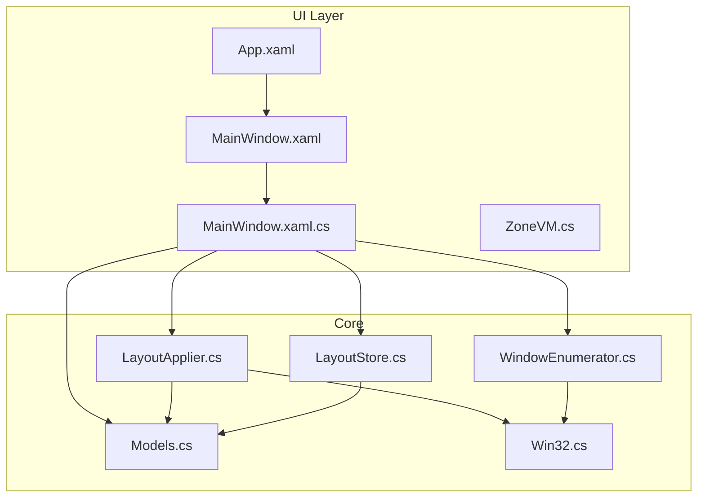
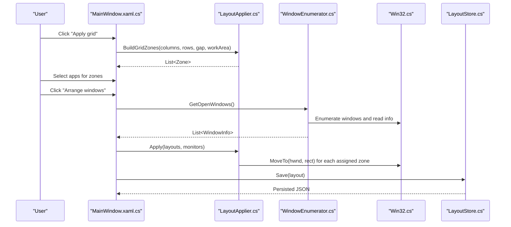
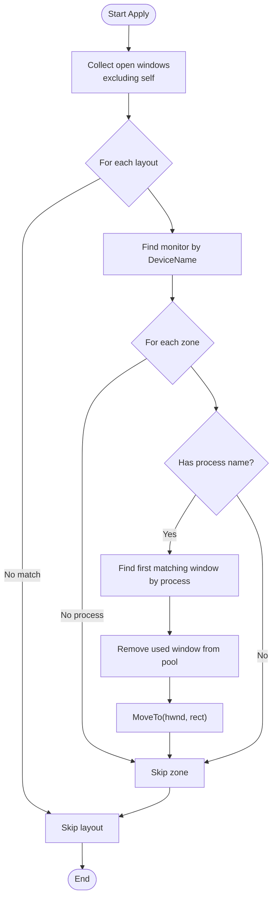
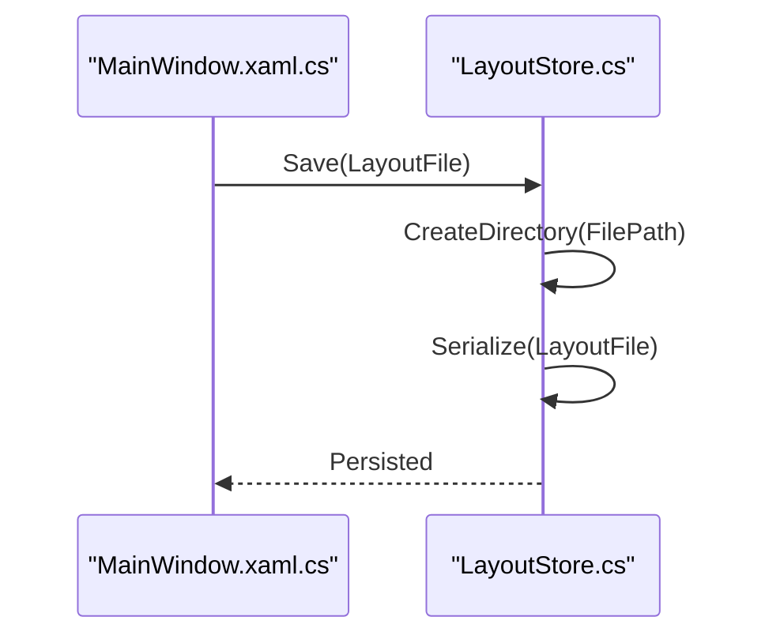
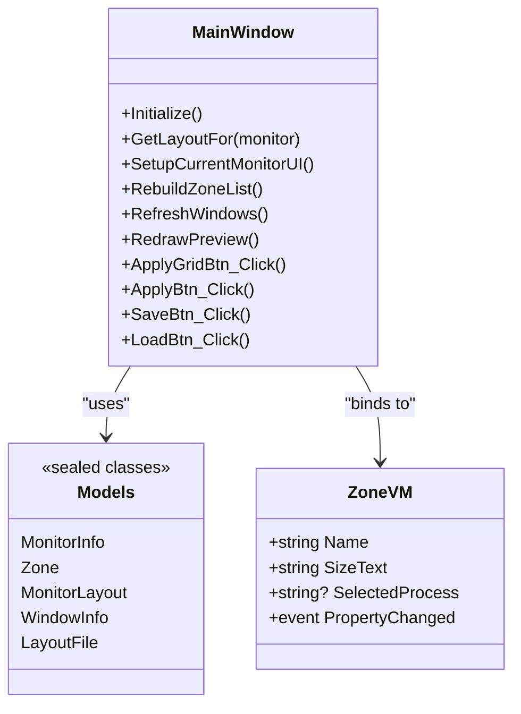
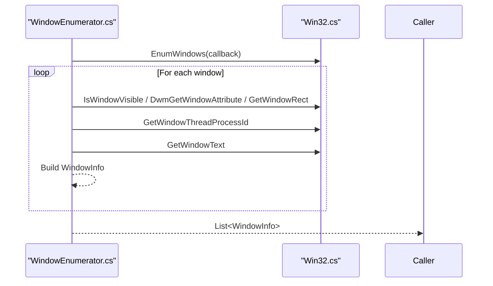
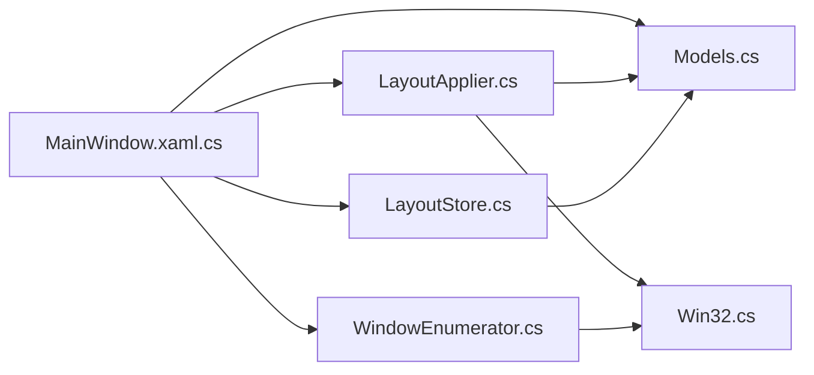

# Project Overview

<cite>
**Referenced Files in This Document**
- [Windows.csproj](file://Windows/Vindows.csproj)
- [App.xaml](file://Windows/App.xaml)
- [MainWindow.xaml](file://Windows/MainWindow.xaml)
- [MainWindow.xaml.cs](file://Windows/MainWindow.xaml.cs)
- [ZoneVM.cs](file://Windows/ZoneVM.cs)
- [Models.cs](file://Windows/Core/Models.cs)
- [LayoutApplier.cs](file://Windows/Core/LayoutApplier.cs)
- [LayoutStore.cs](file://Windows/Core/LayoutStore.cs)
- [Win32.cs](file://Windows/Core/Win32.cs)
- [WindowEnumerator.cs](file://Windows/Core/WindowEnumerator.cs)
</cite>

## Table of Contents
1. Introduction
2. Project Structure
3. Core Components
4. Architecture Overview
5. Detailed Component Analysis
6. Dependency Analysis
7. Performance Considerations
8. Troubleshooting Guide
9. Conclusion

## Introduction
Vindows is a desktop application for multi-monitor window layout management. It helps power users organize their workspace by automatically positioning and resizing windows across multiple displays using grid-based layouts. Users define zones per monitor, assign applications to zones by process name, and apply or persist layouts for quick reuse. The app targets productivity workflows where consistent, repeatable window arrangements improve focus and efficiency.

Key capabilities:
- Monitor detection and work area calculation
- Grid-based zone creation with configurable columns, rows, and gaps
- Process-based window assignment to zones
- JSON persistence of layouts under the user’s Application Data folder
- Live preview of zones on the selected monitor

Target audience:
- Power users who frequently switch between monitors and need consistent, keyboard-friendly workspace organization
- Professionals managing complex multi-window tasks (development, research, trading, content creation)

Technology stack and architecture:
- .NET 10 with WPF for the UI
- Windows APIs via P/Invoke for monitor enumeration and window manipulation
- MVVM-inspired separation: UI code-behind coordinates data models and core services; view models expose properties for binding

How it solves common challenges:
- Eliminates manual drag-and-resize routines across monitors
- Provides predictable, shareable layouts saved as JSON
- Reduces context switching friction by assigning apps to fixed zones

## Project Structure
The project is organized into a thin UI layer (WPF) and a Core library containing domain models, layout computation, persistence, and OS integration.

**Diagram sources**
- [App.xaml:1-10](file://Windows/App.xaml#L1-L10)
- [MainWindow.xaml:1-96](file://Windows/MainWindow.xaml#L1-L96)
- [MainWindow.xaml.cs:1-205](file://Windows/MainWindow.xaml.cs#L1-L205)
- [ZoneVM.cs:1-31](file://Windows/ZoneVM.cs#L1-L31)
- [Models.cs:1-61](file://Windows/Core/Models.cs#L1-L61)
- [LayoutApplier.cs:1-92](file://Windows/Core/LayoutApplier.cs#L1-L92)
- [LayoutStore.cs:1-41](file://Windows/Core/LayoutStore.cs#L1-L41)
- [Win32.cs:1-123](file://Windows/Core/Win32.cs#L1-L123)
- [WindowEnumerator.cs:1-57](file://Windows/Core/WindowEnumerator.cs#L1-L57)

**Section sources**
- [Windows.csproj:1-13](file://Windows/Vindows.csproj#L1-L13)
- [App.xaml:1-10](file://Windows/App.xaml#L1-L10)
- [MainWindow.xaml:1-96](file://Windows/MainWindow.xaml#L1-L96)
- [MainWindow.xaml.cs:1-205](file://Windows/MainWindow.xaml.cs#L1-L205)

## Core Components
- Models: Define monitors, zones, layouts, and open windows. Zones store relative percentages within a monitor’s work area and an optional process name for assignment.
- LayoutApplier: Computes pixel rectangles from percentage zones, builds uniform grids, and moves windows to target positions while avoiding the app’s own process.
- LayoutStore: Persists layouts to a JSON file under %APPDATA%\Vindows\layout.json with graceful error handling.
- Win32: P/Invoke wrappers for enumerating monitors, enumerating top-level windows, reading titles, and moving/resizing windows.
- WindowEnumerator: Filters visible, non-cloaked windows with titles and extracts process names.
- UI: MainWindow orchestrates initialization, preview rendering, grid application, and applying/saving layouts. ZoneVM exposes zone data for binding.

**Section sources**
- [Models.cs:1-61](file://Windows/Core/Models.cs#L1-L61)
- [LayoutApplier.cs:1-92](file://Windows/Core/LayoutApplier.cs#L1-L92)
- [LayoutStore.cs:1-41](file://Windows/Core/LayoutStore.cs#L1-L41)
- [Win32.cs:1-123](file://Windows/Core/Win32.cs#L1-L123)
- [WindowEnumerator.cs:1-57](file://Windows/Core/WindowEnumerator.cs#L1-L57)
- [MainWindow.xaml.cs:1-205](file://Windows/MainWindow.xaml.cs#L1-L205)
- [ZoneVM.cs:1-31](file://Windows/ZoneVM.cs#L1-L31)

## Architecture Overview
Vindows follows a layered approach:
- UI layer (WPF): Displays monitors, zones, and previews; binds to view models; triggers actions.
- Core layer: Encapsulates domain logic (models), layout computation, persistence, and OS integration.
- OS integration: Uses Win32 APIs to enumerate monitors and windows and to move/resize windows.

**Diagram sources**
- [MainWindow.xaml.cs:148-183](file://Windows/MainWindow.xaml.cs#L148-L183)
- [LayoutApplier.cs:10-35](file://Windows/Core/LayoutApplier.cs#L10-L35)
- [LayoutApplier.cs:60-90](file://Windows/Core/LayoutApplier.cs#L60-L90)
- [WindowEnumerator.cs:10-21](file://Windows/Core/WindowEnumerator.cs#L10-L21)
- [Win32.cs:40-67](file://Windows/Core/Win32.cs#L40-L67)
- [LayoutStore.cs:15-39](file://Windows/Core/LayoutStore.cs#L15-L39)

## Detailed Component Analysis

### Models and Data Flow
- MonitorInfo: Captures device name, display name, bounds, and work area.
- Zone: Stores percentage-based position and size within a monitor’s work area, plus an optional process name for assignment.
- MonitorLayout: Groups Columns, Rows, Gap, and a list of Zones for a specific monitor.
- WindowInfo: Represents an open window with handle, title, and process name.
- LayoutFile: Root object for JSON persistence containing a list of MonitorLayout.

Data flow:
- UI loads monitors and existing layouts, creates default grids if missing, and renders a preview.
- User assigns processes to zones; changes propagate through ZoneVM to underlying Zone objects.
- Applying layouts converts percentage zones to pixel rectangles and moves matching windows.

**Section sources**
- [Models.cs:5-61](file://Windows/Core/Models.cs#L5-L61)
- [MainWindow.xaml.cs:27-50](file://Windows/MainWindow.xaml.cs#L27-L50)
- [MainWindow.xaml.cs:71-89](file://Windows/MainWindow.xaml.cs#L71-L89)

### Layout Calculation and Application
- BuildGridZones: Generates a uniform grid of zones based on columns, rows, and gap, expressed as percentages of the monitor’s work area.
- ZoneToPixelRect: Converts percentage-based zones to absolute pixel rectangles relative to the monitor’s work area.
- MoveTo: Restores minimized/maximized windows and sets their position and size using SetWindowPos with flags to avoid reordering or activation side effects.
- Apply: Iterates all layouts and zones, finds a matching open window by process name, and moves it to the computed rectangle.

**Diagram sources**
- [LayoutApplier.cs:10-35](file://Windows/Core/LayoutApplier.cs#L10-L35)
- [LayoutApplier.cs:37-58](file://Windows/Core/LayoutApplier.cs#L37-L58)
- [LayoutApplier.cs:60-90](file://Windows/Core/LayoutApplier.cs#L60-L90)

**Section sources**
- [LayoutApplier.cs:10-90](file://Windows/Core/LayoutApplier.cs#L10-L90)

### Persistence (JSON)
- FilePath: Resolves to %APPDATA%\Vindows\layout.json.
- Load: Reads and deserializes JSON; returns an empty layout if missing or corrupted.
- Save: Creates directory if needed and writes indented JSON; silently ignores write errors to keep the app responsive.

**Diagram sources**
- [LayoutStore.cs:9-39](file://Windows/Core/LayoutStore.cs#L9-L39)
- [MainWindow.xaml.cs:177-188](file://Windows/MainWindow.xaml.cs#L177-L188)

**Section sources**
- [LayoutStore.cs:1-41](file://Windows/Core/LayoutStore.cs#L1-L41)
- [MainWindow.xaml.cs:177-188](file://Windows/MainWindow.xaml.cs#L177-L188)

### UI and View Model
- MainWindow initializes monitors and layouts, builds default grids, refreshes open windows, and redraws the preview canvas scaled to the work area.
- ZoneVM wraps a Zone and exposes SelectedProcess with property change notifications for two-way binding.
- XAML defines controls for monitor selection, grid parameters, zone assignments, and a preview canvas.

**Diagram sources**
- [MainWindow.xaml.cs:21-205](file://Windows/MainWindow.xaml.cs#L21-L205)
- [ZoneVM.cs:6-31](file://Windows/ZoneVM.cs#L6-L31)
- [Models.cs:5-61](file://Windows/Core/Models.cs#L5-L61)

**Section sources**
- [MainWindow.xaml.cs:21-205](file://Windows/MainWindow.xaml.cs#L21-L205)
- [ZoneVM.cs:1-31](file://Windows/ZoneVM.cs#L1-L31)
- [MainWindow.xaml:1-96](file://Windows/MainWindow.xaml#L1-L96)

### OS Integration (Monitors and Windows)
- Win32.GetMonitors: Enumerates system monitors and returns bounds/work areas.
- WindowEnumerator.GetOpenWindows: Enumerates top-level windows, filters invisible/cloaked/empty-title windows, and collects process names.
- MoveTo uses SetWindowPos with flags to avoid changing z-order or activating windows during batch operations.

**Diagram sources**
- [WindowEnumerator.cs:10-57](file://Windows/Core/WindowEnumerator.cs#L10-L57)
- [Win32.cs:40-67](file://Windows/Core/Win32.cs#L40-L67)
- [Win32.cs:71-123](file://Windows/Core/Win32.cs#L71-L123)

**Section sources**
- [Win32.cs:1-123](file://Windows/Core/Win32.cs#L1-L123)
- [WindowEnumerator.cs:1-57](file://Windows/Core/WindowEnumerator.cs#L1-L57)

## Dependency Analysis
- UI depends on Core models and services for data and behavior.
- LayoutApplier depends on Win32 for window manipulation and on Models for geometry.
- WindowEnumerator depends on Win32 for enumeration and metadata.
- LayoutStore depends on Models for serialization.

**Diagram sources**
- [MainWindow.xaml.cs:1-205](file://Windows/MainWindow.xaml.cs#L1-L205)
- [LayoutApplier.cs:1-92](file://Windows/Core/LayoutApplier.cs#L1-L92)
- [WindowEnumerator.cs:1-57](file://Windows/Core/WindowEnumerator.cs#L1-L57)
- [LayoutStore.cs:1-41](file://Windows/Core/LayoutStore.cs#L1-L41)
- [Models.cs:1-61](file://Windows/Core/Models.cs#L1-L61)
- [Win32.cs:1-123](file://Windows/Core/Win32.cs#L1-L123)

**Section sources**
- [Windows.csproj:1-13](file://Windows/Vindows.csproj#L1-L13)
- [MainWindow.xaml.cs:1-205](file://Windows/MainWindow.xaml.cs#L1-L205)

## Performance Considerations
- Batch window moves: Apply iterates layouts and zones once, minimizing repeated calls to OS APIs.
- Percentage-based zones: Avoids recalculating absolute pixels until necessary; conversion happens only when applying.
- Filtering windows: Early checks for visibility, cloaking, and empty titles reduce overhead.
- Preview scaling: Scales drawing to fit the preview canvas without heavy layout passes.

[No sources needed since this section provides general guidance]

## Troubleshooting Guide
- No monitors detected: Ensure the app has permissions to enumerate displays; check that at least one monitor is connected and active.
- Windows not moved: Verify that the assigned process name matches an open window; ensure the window is not hidden or cloaked.
- Layout not saved: Check write permissions to %APPDATA%\Vindows; the app will continue running even if saving fails.
- Preview does not update: Resize the preview canvas or select a different monitor to trigger redraw.

**Section sources**
- [LayoutStore.cs:15-39](file://Windows/Core/LayoutStore.cs#L15-L39)
- [WindowEnumerator.cs:23-57](file://Windows/Core/WindowEnumerator.cs#L23-L57)
- [MainWindow.xaml.cs:171-188](file://Windows/MainWindow.xaml.cs#L171-L188)

## Conclusion
Vindows provides a focused, efficient solution for multi-monitor window layout management. By combining grid-based zone planning, process-based assignment, and JSON persistence, it enables power users to create and reuse consistent workspace configurations across sessions. Built on .NET 10 and WPF with targeted Windows API usage, it balances simplicity with robust OS integration, making it a practical tool for productivity-focused workflows.

[No sources needed since this section summarizes without analyzing specific files]