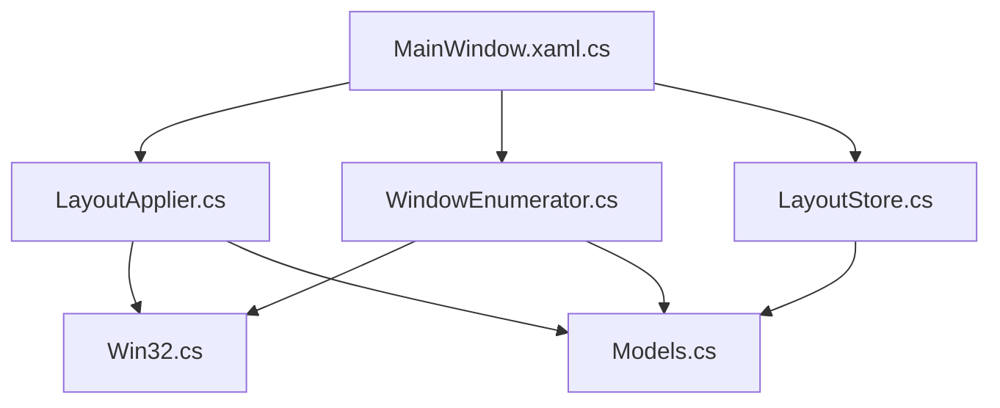
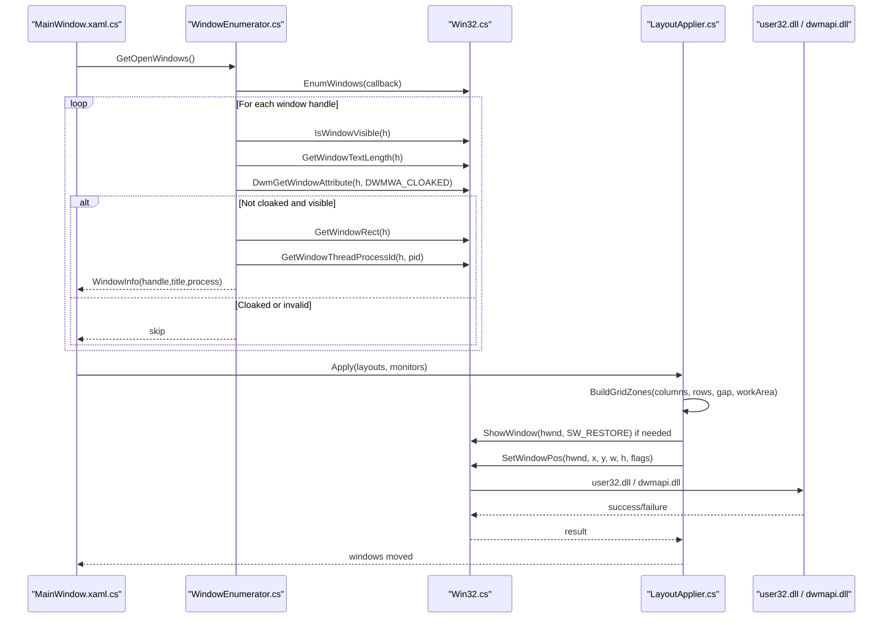
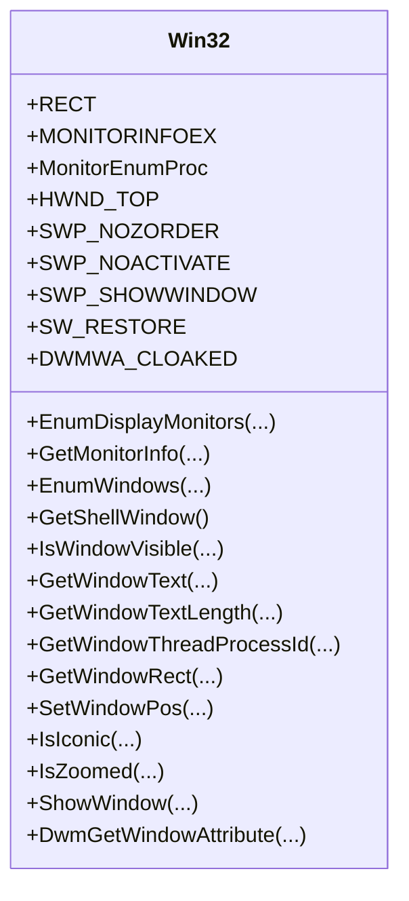
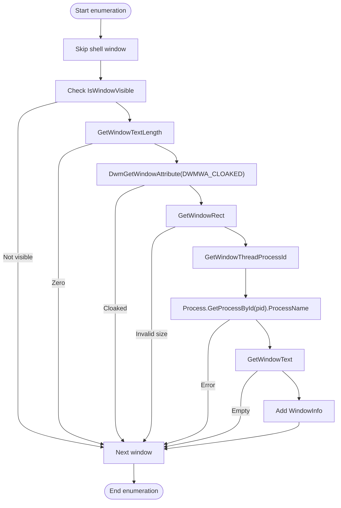
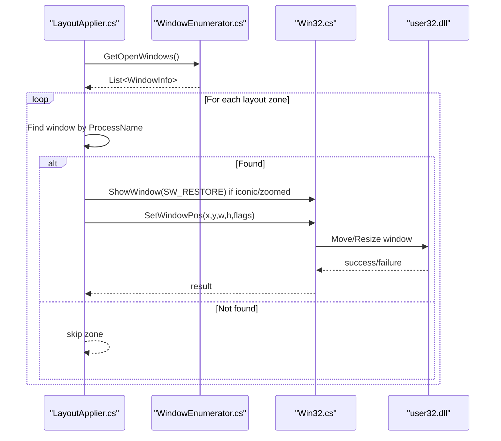
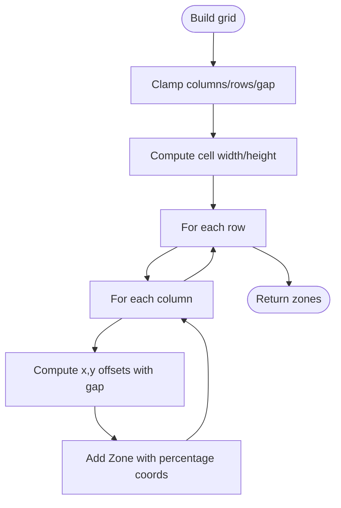
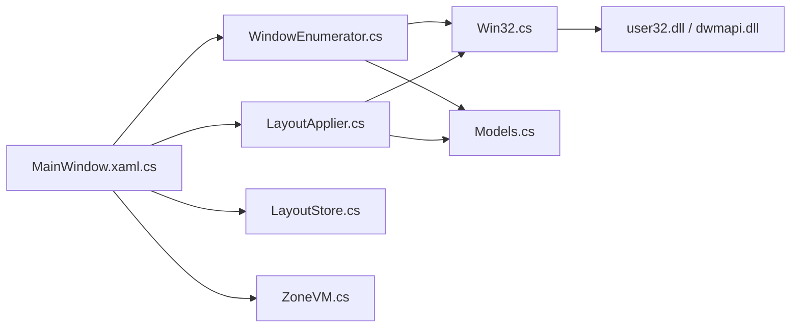

# System Integration

<cite>
**Referenced Files in This Document**
- [Win32.cs](file://Vindows/Core/Win32.cs)
- [WindowEnumerator.cs](file://Vindows/Core/WindowEnumerator.cs)
- [LayoutApplier.cs](file://Vindows/Core/LayoutApplier.cs)
- [Models.cs](file://Vindows/Core/Models.cs)
- [LayoutStore.cs](file://Vindows/Core/LayoutStore.cs)
- [MainWindow.xaml.cs](file://Vindows/MainWindow.xaml.cs)
- [ZoneVM.cs](file://Vindows/ZoneVM.cs)
</cite>

## Table of Contents
1. [Introduction](#introduction)
2. [Project Structure](#project-structure)
3. [Core Components](#core-components)
4. [Architecture Overview](#architecture-overview)
5. [Detailed Component Analysis](#detailed-component-analysis)
6. [Dependency Analysis](#dependency-analysis)
7. [Performance Considerations](#performance-considerations)
8. [Troubleshooting Guide](#troubleshooting-guide)
9. [Conclusion](#conclusion)

## Introduction
This document explains the system integration layer of Vindows, focusing on Windows API interactions and cross-process operations. It details P/Invoke wrappers around user32.dll and dwmapi.dll for monitor enumeration, window discovery, geometry queries, and window manipulation. It also documents the sophisticated window discovery system that filters out virtual desktop windows and UWP applications, process-based window matching algorithms, handle management strategies, error handling for system calls, privilege requirements, compatibility considerations across Windows versions, and performance optimization techniques for large numbers of windows and monitors.

## Project Structure
The system integration is implemented under the Core namespace with a clear separation of concerns:
- Win32.cs: P/Invoke declarations and constants for user32.dll and dwmapi.dll
- WindowEnumerator.cs: Enumerates visible top-level windows and applies filtering logic
- LayoutApplier.cs: Computes zones and moves windows to target rectangles
- Models.cs: Data models for monitors, zones, layouts, and windows
- LayoutStore.cs: Persists layout configuration to JSON
- MainWindow.xaml.cs: UI orchestration that uses Core components
- ZoneVM.cs: View model binding for zone assignments

**Diagram sources**
- [MainWindow.xaml.cs:27-38](file://Vindows/MainWindow.xaml.cs#L27-L38)
- [WindowEnumerator.cs:10-21](file://Vindows/Core/WindowEnumerator.cs#L10-L21)
- [LayoutApplier.cs:10-35](file://Vindows/Core/LayoutApplier.cs#L10-L35)
- [Win32.cs:31-121](file://Vindows/Core/Win32.cs#L31-L121)
- [Models.cs:6-60](file://Vindows/Core/Models.cs#L6-L60)
- [LayoutStore.cs:15-39](file://Vindows/Core/LayoutStore.cs#L15-L39)

**Section sources**
- [MainWindow.xaml.cs:27-38](file://Vindows/MainWindow.xaml.cs#L27-L38)
- [Win32.cs:31-121](file://Vindows/Core/Win32.cs#L31-L121)
- [WindowEnumerator.cs:10-56](file://Vindows/Core/WindowEnumerator.cs#L10-L56)
- [LayoutApplier.cs:10-92](file://Vindows/Core/LayoutApplier.cs#L10-L92)
- [Models.cs:6-60](file://Vindows/Core/Models.cs#L6-L60)
- [LayoutStore.cs:15-39](file://Vindows/Core/LayoutStore.cs#L15-L39)

## Core Components
- Win32.cs: Provides P/Invoke wrappers for monitor enumeration (EnumDisplayMonitors, GetMonitorInfo), window enumeration and manipulation (EnumWindows, GetWindowRect, SetWindowPos, ShowWindow, IsIconic, IsZoomed), text retrieval (GetWindowText, GetWindowTextLength), thread/process association (GetWindowThreadProcessId), and DWM attribute queries (DwmGetWindowAttribute). Also defines RECT, MONITORINFOEX, and relevant constants.
- WindowEnumerator.cs: Enumerates top-level windows, excludes shell window, checks visibility, title presence, DWM cloaking (virtual desktops/UWP), validates non-zero geometry, resolves process name via PID, and returns WindowInfo objects.
- LayoutApplier.cs: Builds grid zones from percentage coordinates relative to work area, converts percentages to pixel rectangles, and moves windows using SetWindowPos with flags to avoid activation and z-order changes. Excludes the current process from placement.
- Models.cs: Defines MonitorInfo (device name, display name, bounds, work area), Zone (percentage-based region with optional process assignment), MonitorLayout (grid dimensions, gap, zones), WindowInfo (handle, title, process name), and LayoutFile (list of monitor layouts).
- LayoutStore.cs: Loads/saves layout configuration to JSON in %APPDATA%\Vindows\layout.json with graceful fallbacks on errors.
- MainWindow.xaml.cs: Initializes monitors/layouts, refreshes window lists, builds UI preview, applies layouts, and persists them.

**Section sources**
- [Win32.cs:12-121](file://Vindows/Core/Win32.cs#L12-L121)
- [WindowEnumerator.cs:10-56](file://Vindows/Core/WindowEnumerator.cs#L10-L56)
- [LayoutApplier.cs:10-92](file://Vindows/Core/LayoutApplier.cs#L10-L92)
- [Models.cs:6-60](file://Vindows/Core/Models.cs#L6-L60)
- [LayoutStore.cs:15-39](file://Vindows/Core/LayoutStore.cs#L15-L39)
- [MainWindow.xaml.cs:27-38](file://Vindows/MainWindow.xaml.cs#L27-L38)

## Architecture Overview
The system integrates with Windows through a thin P/Invoke layer and orchestrates window placement based on per-monitor layouts. The flow spans UI actions to low-level OS calls:

**Diagram sources**
- [MainWindow.xaml.cs:71-89](file://Vindows/MainWindow.xaml.cs#L71-L89)
- [WindowEnumerator.cs:10-56](file://Vindows/Core/WindowEnumerator.cs#L10-L56)
- [Win32.cs:31-121](file://Vindows/Core/Win32.cs#L31-L121)
- [LayoutApplier.cs:10-58](file://Vindows/Core/LayoutApplier.cs#L10-L58)

## Detailed Component Analysis

### Win32 P/Invoke Wrappers
- Monitor enumeration:
  - EnumDisplayMonitors enumerates all monitors; callback retrieves MONITORINFOEX via GetMonitorInfo to extract device name, physical bounds, and work area.
- Window enumeration and manipulation:
  - EnumWindows iterates top-level windows; GetWindowRect retrieves geometry; GetWindowThreadProcessId associates handles with processes; GetWindowText/GetWindowTextLength retrieve titles; ShowWindow restores minimized/maximized windows; SetWindowPos moves/resizes windows with flags to avoid activation/z-order changes.
- DWM integration:
  - DwmGetWindowAttribute with DWMWA_CLOAKED detects virtual desktop windows and hidden UWP apps by checking cloaking state.

**Diagram sources**
- [Win32.cs:12-121](file://Vindows/Core/Win32.cs#L12-L121)

**Section sources**
- [Win32.cs:31-121](file://Vindows/Core/Win32.cs#L31-L121)

### Window Discovery and Filtering
- Filters applied:
  - Skips shell window (desktop background).
  - Requires visible windows with non-empty titles.
  - Uses DWM cloaking to exclude virtual desktop windows and minimized UWP apps.
  - Validates non-zero rectangle sizes.
  - Resolves process name via PID; skips if process info unavailable.
- Output:
  - Returns WindowInfo objects containing handle, title, and process name for further matching.

**Diagram sources**
- [WindowEnumerator.cs:10-56](file://Vindows/Core/WindowEnumerator.cs#L10-L56)
- [Win32.cs:31-121](file://Vindows/Core/Win32.cs#L31-L121)

**Section sources**
- [WindowEnumerator.cs:10-56](file://Vindows/Core/WindowEnumerator.cs#L10-L56)

### Process-Based Window Matching and Placement
- Matching algorithm:
  - Collects open windows excluding the current process.
  - For each zone with an assigned process name, finds the first matching window by process name (case-insensitive).
  - Removes matched windows to prevent duplicate placements.
- Placement strategy:
  - Converts zone percentage coordinates to pixel rectangles relative to monitor work area.
  - Restores windows if minimized or maximized before moving.
  - Uses SetWindowPos with NOZORDER, NOACTIVATE, SHOWWINDOW to move without disrupting focus or z-order.

**Diagram sources**
- [LayoutApplier.cs:10-58](file://Vindows/Core/LayoutApplier.cs#L10-L58)
- [WindowEnumerator.cs:10-21](file://Vindows/Core/WindowEnumerator.cs#L10-L21)
- [Win32.cs:97-121](file://Vindows/Core/Win32.cs#L97-L121)

**Section sources**
- [LayoutApplier.cs:10-58](file://Vindows/Core/LayoutApplier.cs#L10-L58)

### Geometry and Zones
- Zone representation:
  - Percentage-based X, Y, Width, Height relative to monitor work area.
  - Optional ProcessName assignment for automatic placement.
- Grid generation:
  - Calculates cell dimensions considering gaps and computes percentage positions for each zone.
- Conversion:
  - ZoneToPixelRect maps percentages to absolute pixel coordinates within the work area.

**Diagram sources**
- [LayoutApplier.cs:60-90](file://Vindows/Core/LayoutApplier.cs#L60-L90)
- [Models.cs:18-42](file://Vindows/Core/Models.cs#L18-L42)

**Section sources**
- [LayoutApplier.cs:60-90](file://Vindows/Core/LayoutApplier.cs#L60-L90)
- [Models.cs:18-42](file://Vindows/Core/Models.cs#L18-L42)

### Persistence and UI Orchestration
- LayoutStore:
  - Reads/writes JSON to %APPDATA%\Vindows\layout.json with safe defaults on errors.
- MainWindow:
  - Initializes monitors and layouts, refreshes window list, updates UI preview, applies layouts, and saves configurations.

**Section sources**
- [LayoutStore.cs:15-39](file://Vindows/Core/LayoutStore.cs#L15-L39)
- [MainWindow.xaml.cs:27-38](file://Vindows/MainWindow.xaml.cs#L27-L38)
- [MainWindow.xaml.cs:177-188](file://Vindows/MainWindow.xaml.cs#L177-L188)

## Dependency Analysis
- Low-level dependencies:
  - user32.dll: Monitor/window enumeration, geometry queries, window manipulation.
  - dwmapi.dll: DWM attributes for cloaking detection.
- Internal dependencies:
  - WindowEnumerator depends on Win32 for OS calls and Models for data structures.
  - LayoutApplier depends on Win32 for window manipulation and Models for geometry calculations.
  - MainWindow depends on Core components for functionality and binds UI to ZoneVM.

**Diagram sources**
- [Win32.cs:31-121](file://Vindows/Core/Win32.cs#L31-L121)
- [WindowEnumerator.cs:10-56](file://Vindows/Core/WindowEnumerator.cs#L10-L56)
- [LayoutApplier.cs:10-92](file://Vindows/Core/LayoutApplier.cs#L10-L92)
- [MainWindow.xaml.cs:27-38](file://Vindows/MainWindow.xaml.cs#L27-L38)
- [LayoutStore.cs:15-39](file://Vindows/Core/LayoutStore.cs#L15-L39)
- [Models.cs:6-60](file://Vindows/Core/Models.cs#L6-L60)
- [ZoneVM.cs:7-31](file://Vindows/ZoneVM.cs#L7-L31)

**Section sources**
- [Win32.cs:31-121](file://Vindows/Core/Win32.cs#L31-L121)
- [WindowEnumerator.cs:10-56](file://Vindows/Core/WindowEnumerator.cs#L10-L56)
- [LayoutApplier.cs:10-92](file://Vindows/Core/LayoutApplier.cs#L10-L92)
- [MainWindow.xaml.cs:27-38](file://Vindows/MainWindow.xaml.cs#L27-L38)
- [LayoutStore.cs:15-39](file://Vindows/Core/LayoutStore.cs#L15-L39)
- [Models.cs:6-60](file://Vindows/Core/Models.cs#L6-L60)
- [ZoneVM.cs:7-31](file://Vindows/ZoneVM.cs#L7-L31)

## Performance Considerations
- Efficient window enumeration:
  - Use EnumWindows with a callback to avoid repeated queries; filter early (visibility, title length, cloaking) to reduce overhead.
- Minimize interop calls:
  - Batch geometry and process resolution; avoid redundant calls per window where possible.
- Handle large monitor setups:
  - Calculate grid zones once per monitor; reuse computed zones for previews and application.
- Avoid unnecessary window activations:
  - Use SetWindowPos flags (NOACTIVATE, NOZORDER) to prevent focus thrashing when placing many windows.
- Robust process resolution:
  - Cache process names per PID during enumeration to reduce repeated Process.GetProcessById calls.
- Graceful degradation:
  - On missing processes or invalid handles, skip windows to maintain throughput.

[No sources needed since this section provides general guidance]

## Troubleshooting Guide
- Common issues:
  - Missing windows: Ensure windows are visible and have titles; check DWM cloaking for virtual desktops/UWP apps.
  - Permission errors: Some windows may require elevated privileges to manipulate; run with appropriate rights if needed.
  - Invalid geometry: Validate GetWindowRect results; skip windows with zero-size rectangles.
  - Process not found: Handle exceptions when resolving process names; skip such windows.
  - Save failures: LayoutStore.Save catches exceptions; ensure write permissions to %APPDATA%\Vindows.
- Diagnostics:
  - Log skipped windows with reasons (not visible, cloaked, invalid rect, process error).
  - Verify monitor work areas via GetMonitorInfo to ensure correct placement targets.

**Section sources**
- [WindowEnumerator.cs:23-56](file://Vindows/Core/WindowEnumerator.cs#L23-L56)
- [LayoutStore.cs:15-39](file://Vindows/Core/LayoutStore.cs#L15-L39)

## Conclusion
Vindows integrates tightly with Windows through targeted P/Invoke calls to user32.dll and dwmapi.dll, enabling robust monitor enumeration, window discovery with advanced filtering, and precise window placement. The design separates concerns across Core components, providing a scalable foundation for managing complex multi-monitor layouts. Error handling and performance optimizations ensure reliability and responsiveness even with large numbers of windows and monitors.

[No sources needed since this section summarizes without analyzing specific files]