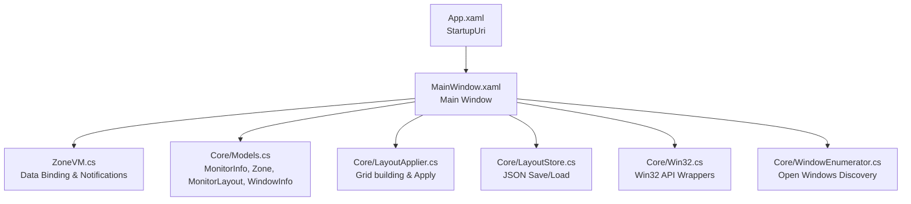
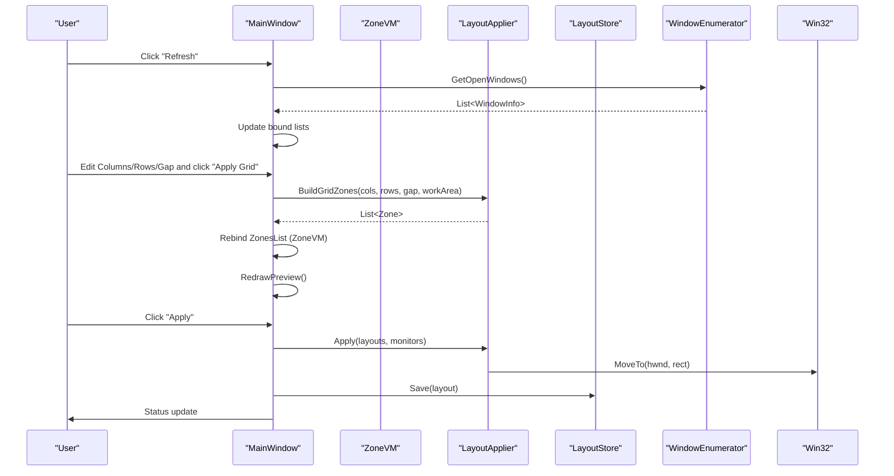
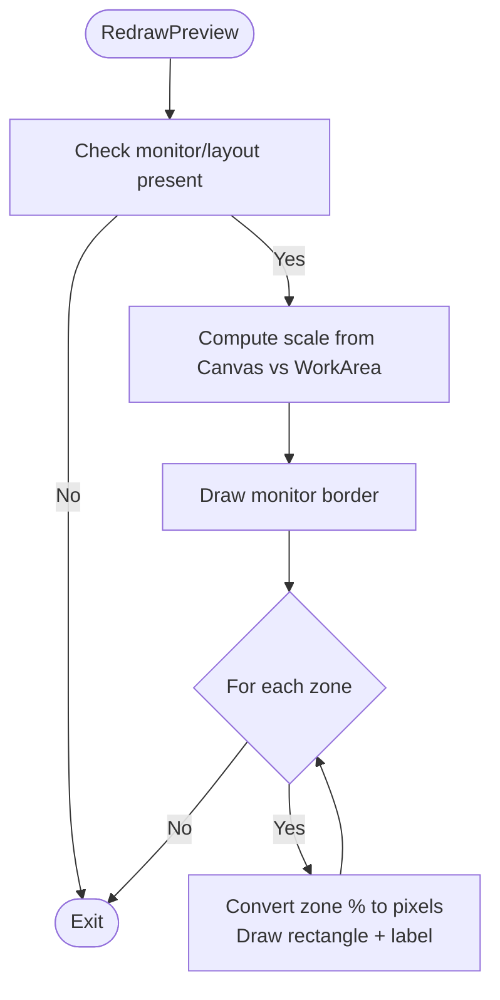
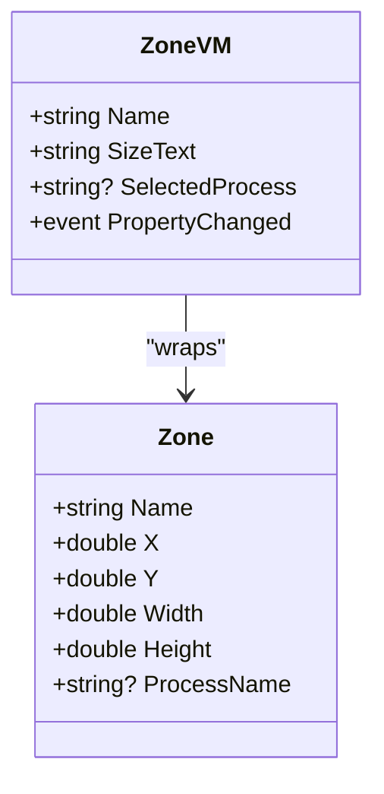
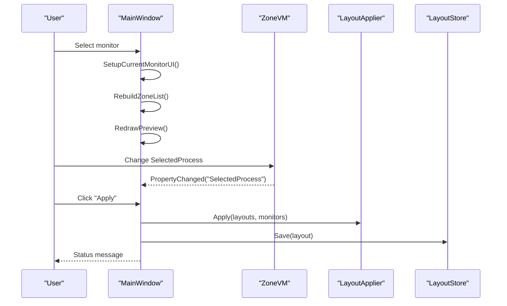
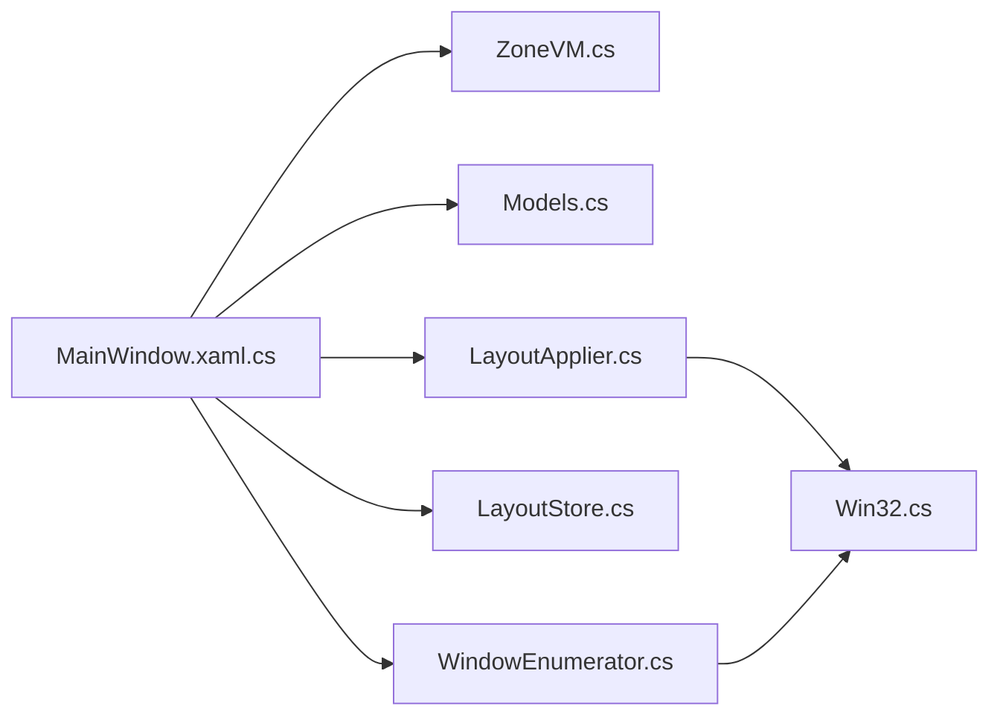

# User Interface

<cite>
**Referenced Files in This Document**
- [MainWindow.xaml](file://Vindows/MainWindow.xaml)
- [MainWindow.xaml.cs](file://Vindows/MainWindow.xaml.cs)
- [ZoneVM.cs](file://Vindows/ZoneVM.cs)
- [App.xaml](file://Vindows/App.xaml)
- [Models.cs](file://Vindows/Core/Models.cs)
- [LayoutApplier.cs](file://Vindows/Core/LayoutApplier.cs)
- [LayoutStore.cs](file://Vindows/Core/LayoutStore.cs)
- [Win32.cs](file://Vindows/Core/Win32.cs)
- [WindowEnumerator.cs](file://Vindows/Core/WindowEnumerator.cs)
</cite>

## Table of Contents
1. Introduction
2. Project Structure
3. Core Components
4. Architecture Overview
5. Detailed Component Analysis
6. Dependency Analysis
7. Performance Considerations
8. Troubleshooting Guide
9. Conclusion

## Introduction
This document describes the user interface of Vindows, a WPF desktop application that helps users arrange open windows into grid-based zones across multiple monitors. It explains the main window layout, interactive controls for configuring grids and assigning processes to zones, and the real-time preview system. It also documents the MVVM implementation centered on ZoneVM for data binding and property change notifications, outlines user interaction patterns (zone selection, process assignment, layout application), and covers UI customization, responsive behavior, accessibility considerations, visual feedback, and error handling at the UI layer.

## Project Structure
The UI is implemented as a standard WPF application:
- Application entry point defines the startup window.
- MainWindow contains the primary UI with three columns: monitor list, zone configuration and assignment, and a live preview canvas.
- The Core layer provides models, Win32 interop, window enumeration, layout calculation, and JSON persistence.

**Diagram sources**
- [App.xaml:1-10](file://Vindows/App.xaml#L1-L10)
- [MainWindow.xaml:1-96](file://Vindows/MainWindow.xaml#L1-L96)
- [ZoneVM.cs:1-31](file://Vindows/ZoneVM.cs#L1-L31)
- [Models.cs:1-61](file://Vindows/Core/Models.cs#L1-L61)
- [LayoutApplier.cs:1-92](file://Vindows/Core/LayoutApplier.cs#L1-L92)
- [LayoutStore.cs:1-41](file://Vindows/Core/LayoutStore.cs#L1-L41)
- [Win32.cs:1-123](file://Vindows/Core/Win32.cs#L1-L123)
- [WindowEnumerator.cs:1-57](file://Vindows/Core/WindowEnumerator.cs#L1-L57)

**Section sources**
- [App.xaml:1-10](file://Vindows/App.xaml#L1-L10)
- [MainWindow.xaml:1-96](file://Vindows/MainWindow.xaml#L1-L96)

## Core Components
- MainWindow: Hosts the UI, manages state for monitors, layouts, and open windows, and coordinates actions like applying grids, refreshing windows, saving/loading layouts, and rendering the preview.
- ZoneVM: A view model representing a single zone with name, size text, and selected process; implements INotifyPropertyChanged to keep the UI in sync when assignments change.
- Models: Data structures for monitors, zones, per-monitor layouts, open windows, and the root layout file.
- LayoutApplier: Computes grid zones from columns/rows/gap and applies them by moving matching windows to calculated pixel rectangles.
- LayoutStore: Persists layouts to a JSON file under the user’s ApplicationData folder.
- Win32: P/Invoke wrappers for enumerating monitors and manipulating windows.
- WindowEnumerator: Enumerates visible top-level windows suitable for placement, filtering out hidden or cloaked windows.

**Section sources**
- [MainWindow.xaml.cs:1-205](file://Vindows/MainWindow.xaml.cs#L1-L205)
- [ZoneVM.cs:1-31](file://Vindows/ZoneVM.cs#L1-L31)
- [Models.cs:1-61](file://Vindows/Core/Models.cs#L1-L61)
- [LayoutApplier.cs:1-92](file://Vindows/Core/LayoutApplier.cs#L1-L92)
- [LayoutStore.cs:1-41](file://Vindows/Core/LayoutStore.cs#L1-L41)
- [Win32.cs:1-123](file://Vindows/Core/Win32.cs#L1-L123)
- [WindowEnumerator.cs:1-57](file://Vindows/Core/WindowEnumerator.cs#L1-L57)

## Architecture Overview
The UI follows an MVVM-like pattern where the View (MainWindow) binds to ViewModel objects (ZoneVM) and orchestrates calls to Core services. The flow is:
- On load, discover monitors and existing layouts, then build default grids if needed.
- Populate the open windows list and bind it to each zone’s ComboBox.
- When the user edits grid parameters, rebuild zones and redraw the preview.
- When applying, move windows according to assigned processes and persist the layout.

**Diagram sources**
- [MainWindow.xaml.cs:27-38](file://Vindows/MainWindow.xaml.cs#L27-L38)
- [MainWindow.xaml.cs:148-169](file://Vindows/MainWindow.xaml.cs#L148-L169)
- [MainWindow.xaml.cs:177-183](file://Vindows/MainWindow.xaml.cs#L177-L183)
- [LayoutApplier.cs:10-35](file://Vindows/Core/LayoutApplier.cs#L10-L35)
- [LayoutApplier.cs:61-90](file://Vindows/Core/LayoutApplier.cs#L61-L90)
- [LayoutStore.cs:28-39](file://Vindows/Core/LayoutStore.cs#L28-L39)
- [WindowEnumerator.cs:10-21](file://Vindows/Core/WindowEnumerator.cs#L10-L21)
- [Win32.cs:46-58](file://Vindows/Core/Win32.cs#L46-L58)

## Detailed Component Analysis

### Main Window Layout and Controls
- Top toolbar: Refresh windows, Apply layout, Save layout, Load layout buttons.
- Left panel: Monitors list to select the active monitor.
- Center panel: Grid configuration (columns, rows, gap) and a scrollable list of zones. Each zone row shows its name and size percentage, plus a ComboBox to assign an open window by process name.
- Right panel: Live preview Canvas showing the monitor work area and numbered zones scaled to fit the Canvas size.
- Bottom status bar: Displays contextual messages such as counts, applied grid info, save/load confirmations, and timestamps.

Key bindings and interactions:
- Selecting a monitor updates the current layout and refreshes the zone list and preview.
- Changing grid parameters validates inputs and rebuilds zones while preserving assignments by index.
- Assigning a process to a zone triggers property change notifications to keep the UI consistent.
- Applying the layout moves windows and saves the configuration.

**Section sources**
- [MainWindow.xaml:9-94](file://Vindows/MainWindow.xaml#L9-L94)
- [MainWindow.xaml.cs:52-69](file://Vindows/MainWindow.xaml.cs#L52-L69)
- [MainWindow.xaml.cs:142-169](file://Vindows/MainWindow.xaml.cs#L142-L169)

### Real-Time Preview System
- The preview scales the monitor’s work area to fit the Canvas while maintaining aspect ratio.
- For each zone, a colored rectangle is drawn with a numeric label indicating zone order.
- The preview redraws automatically when the Canvas size changes or when zones are rebuilt.

**Diagram sources**
- [MainWindow.xaml.cs:91-138](file://Vindows/MainWindow.xaml.cs#L91-L138)

**Section sources**
- [MainWindow.xaml.cs:91-138](file://Vindows/MainWindow.xaml.cs#L91-L138)

### MVVM Implementation with ZoneVM
- ZoneVM wraps a core Zone object and exposes Name, SizeText, and SelectedProcess.
- SelectedProcess raises PropertyChanged when changed, enabling two-way binding to the ComboBox in the UI.
- The UI binds ItemsSource to the current layout’s zones mapped to ZoneVM instances.

**Diagram sources**
- [ZoneVM.cs:6-30](file://Vindows/ZoneVM.cs#L6-L30)
- [Models.cs:18-29](file://Vindows/Core/Models.cs#L18-L29)

**Section sources**
- [ZoneVM.cs:1-31](file://Vindows/ZoneVM.cs#L1-L31)
- [MainWindow.xaml.cs:65-69](file://Vindows/MainWindow.xaml.cs#L65-L69)

### User Interaction Patterns
- Zone selection: Users pick a monitor from the left list; the center panel updates to show that monitor’s grid and zones.
- Process assignment: In the zone list, each row has a ComboBox bound to the open windows list; selecting a process assigns it to that zone.
- Layout application: Clicking “Apply” moves windows to their assigned zones and persists the layout.

**Diagram sources**
- [MainWindow.xaml.cs:52-69](file://Vindows/MainWindow.xaml.cs#L52-L69)
- [ZoneVM.cs:17-29](file://Vindows/ZoneVM.cs#L17-L29)
- [MainWindow.xaml.cs:177-183](file://Vindows/MainWindow.xaml.cs#L177-L183)

**Section sources**
- [MainWindow.xaml.cs:52-69](file://Vindows/MainWindow.xaml.cs#L52-L69)
- [ZoneVM.cs:17-29](file://Vindows/ZoneVM.cs#L17-L29)
- [MainWindow.xaml.cs:177-183](file://Vindows/MainWindow.xaml.cs#L177-L183)

### UI Customization Options
- Grid configuration:
  - Columns: Number of vertical divisions.
  - Rows: Number of horizontal divisions.
  - Gap: Pixel spacing between zones.
- Per-zone assignment: Choose any open window by process name for each zone.
- Persistence: Save and load layouts to/from a JSON file in the user’s ApplicationData directory.

**Section sources**
- [MainWindow.xaml:42-84](file://Vindows/MainWindow.xaml#L42-L84)
- [MainWindow.xaml.cs:148-169](file://Vindows/MainWindow.xaml.cs#L148-L169)
- [LayoutStore.cs:6-13](file://Vindows/Core/LayoutStore.cs#L6-L13)

### Responsive Behavior Across Screen Configurations
- The preview scales dynamically based on the Canvas size and the monitor’s work area dimensions, ensuring accurate visualization regardless of window resizing.
- Grid calculations use percentages relative to the work area, making layouts robust to different resolutions and DPI settings.

**Section sources**
- [MainWindow.xaml.cs:91-138](file://Vindows/MainWindow.xaml.cs#L91-L138)
- [LayoutApplier.cs:61-90](file://Vindows/Core/LayoutApplier.cs#L61-L90)

### Accessibility Considerations
- Keyboard navigation: All controls are standard WPF elements and support focus traversal via Tab.
- Text labels: Buttons and headers provide clear textual descriptions.
- Color contrast: Preview uses distinct colors for borders and fills; consider adding high-contrast themes in future iterations.
- Tooltips and status: StatusText provides contextual feedback; additional tooltips could enhance discoverability.

[No sources needed since this section provides general guidance]

### Visual Feedback Mechanisms
- StatusText displays operation results, counts, and timestamps.
- PreviewCanvas visually represents zones with numbered labels and color-coded rectangles.
- Input validation for grid parameters shows immediate feedback in the status bar when invalid values are entered.

**Section sources**
- [MainWindow.xaml.cs:148-169](file://Vindows/MainWindow.xaml.cs#L148-L169)
- [MainWindow.xaml.cs:171-183](file://Vindows/MainWindow.xaml.cs#L171-L183)

### Error Handling in the Interface Layer
- Invalid grid inputs: Validates columns ≥ 1, rows ≥ 1, and gap within 0..100; sets a descriptive status message.
- File I/O: LayoutStore silently handles read/write errors to avoid crashes; layout remains valid in memory even if persistence fails.
- Window operations: Applies only to visible, non-cloaked windows; ignores the application’s own process to prevent self-placement.

**Section sources**
- [MainWindow.xaml.cs:148-169](file://Vindows/MainWindow.xaml.cs#L148-L169)
- [LayoutStore.cs:15-39](file://Vindows/Core/LayoutStore.cs#L15-L39)
- [LayoutApplier.cs:10-15](file://Vindows/Core/LayoutApplier.cs#L10-L15)
- [WindowEnumerator.cs:23-55](file://Vindows/Core/WindowEnumerator.cs#L23-L55)

## Dependency Analysis
The UI depends on Core services for data and system integration:

**Diagram sources**
- [MainWindow.xaml.cs:1-205](file://Vindows/MainWindow.xaml.cs#L1-L205)
- [ZoneVM.cs:1-31](file://Vindows/ZoneVM.cs#L1-L31)
- [Models.cs:1-61](file://Vindows/Core/Models.cs#L1-L61)
- [LayoutApplier.cs:1-92](file://Vindows/Core/LayoutApplier.cs#L1-L92)
- [LayoutStore.cs:1-41](file://Vindows/Core/LayoutStore.cs#L1-L41)
- [WindowEnumerator.cs:1-57](file://Vindows/Core/WindowEnumerator.cs#L1-L57)
- [Win32.cs:1-123](file://Vindows/Core/Win32.cs#L1-L123)

**Section sources**
- [MainWindow.xaml.cs:1-205](file://Vindows/MainWindow.xaml.cs#L1-L205)
- [LayoutApplier.cs:1-92](file://Vindows/Core/LayoutApplier.cs#L1-L92)
- [WindowEnumerator.cs:1-57](file://Vindows/Core/WindowEnumerator.cs#L1-L57)
- [Win32.cs:1-123](file://Vindows/Core/Win32.cs#L1-L123)

## Performance Considerations
- Preview redraws occur on every Canvas size change; consider debouncing large resize events if performance becomes an issue.
- Zone rebuilding happens on grid changes; keeping zone count reasonable ensures smooth UI responsiveness.
- Window enumeration runs on refresh; caching results between refreshes can reduce overhead.

[No sources needed since this section provides general guidance]

## Troubleshooting Guide
- No zones appear in preview: Ensure a monitor is selected and grid parameters are valid; verify that the current monitor has a layout and zones.
- Windows not moved after Apply: Confirm that processes are assigned to zones and that target windows are visible and not cloaked; check that the process names match exactly.
- Save/Load issues: Verify write permissions to the ApplicationData folder; if saving fails, the layout remains in memory until a successful save.

**Section sources**
- [MainWindow.xaml.cs:148-169](file://Vindows/MainWindow.xaml.cs#L148-L169)
- [LayoutStore.cs:15-39](file://Vindows/Core/LayoutStore.cs#L15-L39)
- [WindowEnumerator.cs:23-55](file://Vindows/Core/WindowEnumerator.cs#L23-L55)

## Conclusion
Vindows provides a straightforward, MVVM-inspired WPF interface for managing multi-monitor window layouts through grid-based zones. The main window offers intuitive controls for configuring grids, assigning processes to zones, and applying layouts with immediate visual feedback. The architecture cleanly separates UI concerns from system integration and persistence, enabling responsive behavior and robust error handling. Future enhancements may include advanced accessibility features, theme support, and more granular control over zone shapes beyond uniform grids.